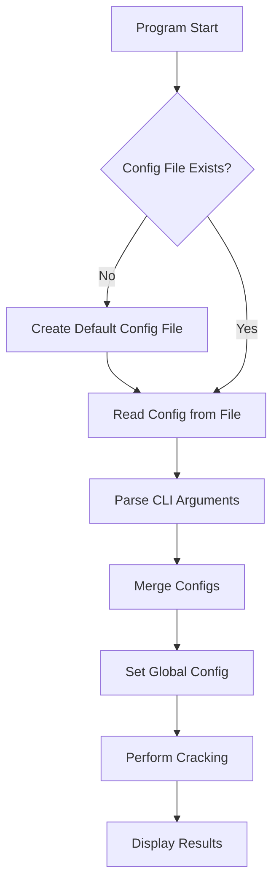

# ciphey Configuration File Implementation Plan

## Overview

This document outlines the plan for implementing a configuration file feature in ciphey. The configuration file will be located at `HOME/ciphey/config.toml` and will be created automatically on the first run of the program if it doesn't exist. The configuration values from the file will be merged with the command-line arguments, with the command-line arguments taking precedence.

## Implementation Plan

### 1. Add Required Dependencies

Add the following dependencies to `Cargo.toml`:
- `dirs`: For getting the home directory (replacing the deprecated `std::env::home_dir()`)
- `toml`: For parsing TOML files
- `serde` and `serde_derive`: For serialization/deserialization of the Config struct

### 2. Update Config Struct

Modify the `Config` struct in `src/config/mod.rs` to:
- Derive `Serialize` and `Deserialize` traits from serde
- Ensure all fields have appropriate serde attributes for TOML serialization

### 3. Implement Config File Functions

Create the following functions in `src/config/mod.rs`:

- `get_config_file_path()`: Returns the path to the config file (`HOME/ciphey/config.toml`)
- `create_default_config_file()`: Creates a default config file if it doesn't exist
- `get_config_file_into_struct()`: Reads the config file and returns a Config struct
- `merge_configs(file_config, cli_config)`: Merges the config from the file with the config from CLI args

### 4. Add Warning Function

Create a new function in `src/cli_pretty_printing/mod.rs`:
- `warning_unknown_config_key(key: &str)`: Prints a warning when an unknown key is found in the config file

### 5. Update CLI Argument Parsing

Modify the `parse_cli_args()` function in `src/cli/mod.rs` to:
- First get the configuration from the config file
- Then merge it with the CLI arguments, prioritizing the CLI arguments
- Return the merged configuration

### 6. Update Main Function

Update the `main.rs` file to use the new configuration system.

## Flow Diagram



## Detailed Implementation Steps

### 1. Add Dependencies to Cargo.toml

```toml
[dependencies]
# Existing dependencies...
dirs = "5.0.1"
toml = "0.8.10"
serde = { version = "1.0.197", features = ["derive"] }
```

### 2. Update Config Struct

```rust
use serde::{Deserialize, Serialize};

#[derive(Serialize, Deserialize)]
pub struct Config {
    // Existing fields...
}
```

### 3. Implement Config File Functions

```rust
use std::fs::{self, File};
use std::io::{Read, Write};
use std::path::{Path, PathBuf};
use dirs::home_dir;
use toml::{from_str, to_string_pretty};

// Get the path to the config file
pub fn get_config_file_path() -> PathBuf {
    let mut path = home_dir().expect("Could not find home directory");
    path.push("ciphey");
    fs::create_dir_all(&path).expect("Could not create ciphey directory");
    path.push("config.toml");
    path
}

// Create a default config file
pub fn create_default_config_file() -> Result<(), std::io::Error> {
    let config = Config::default();
    let toml_string = to_string_pretty(&config).expect("Could not serialize config");
    let path = get_config_file_path();
    let mut file = File::create(path)?;
    file.write_all(toml_string.as_bytes())?;
    Ok(())
}

// Read the config file and return a Config struct
pub fn get_config_file_into_struct() -> Config {
    let path = get_config_file_path();
    
    // If the file doesn't exist, create it with default values
    if !path.exists() {
        create_default_config_file().expect("Could not create default config file");
        return Config::default();
    }
    
    // Read the file
    let mut file = File::open(&path).expect("Could not open config file");
    let mut contents = String::new();
    file.read_to_string(&mut contents).expect("Could not read config file");
    
    // Parse the TOML
    let config: Config = match from_str(&contents) {
        Ok(config) => config,
        Err(e) => {
            eprintln!("Error parsing config file: {}", e);
            Config::default()
        }
    };
    
    config
}

// Merge the config from the file with the config from CLI args
pub fn merge_configs(file_config: Config, cli_config: Config) -> Config {
    // Start with the file config
    let mut merged_config = file_config;
    
    // Override with CLI config values that are explicitly set
    // (Implementation details will depend on how CLI args are parsed)
    
    merged_config
}
```

### 4. Add Warning Function

```rust
// Add to src/cli_pretty_printing/mod.rs
pub fn warning_unknown_config_key(key: &str) {
    let config = crate::config::get_config();
    if config.api_mode {
        return;
    }
    println!("{}", warning(&format!("Unknown configuration key: {}", key)));
}
```

### 5. Update CLI Argument Parsing

```rust
// Modify src/cli/mod.rs
pub fn parse_cli_args() -> (String, Config) {
    let mut opts: Opts = Opts::parse();
    // ... existing code ...
    
    // Get config from file
    let file_config = config::get_config_file_into_struct();
    
    // Get config from CLI args
    let cli_config = cli_args_into_config_struct(opts);
    
    // Merge configs, prioritizing CLI args
    let merged_config = config::merge_configs(file_config, cli_config);
    
    (text, merged_config)
}
```

## Testing Plan

1. Test creating a default config file when one doesn't exist
2. Test reading an existing config file
3. Test merging config values from file and CLI args
4. Test handling of unknown keys in the config file
5. Test the complete flow from program start to using the configuration