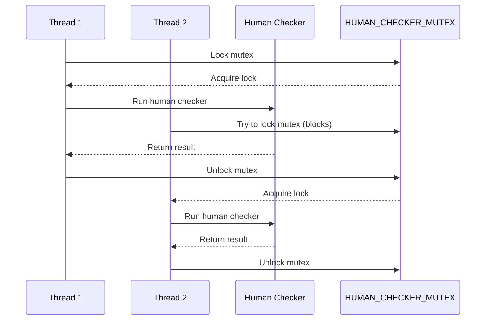
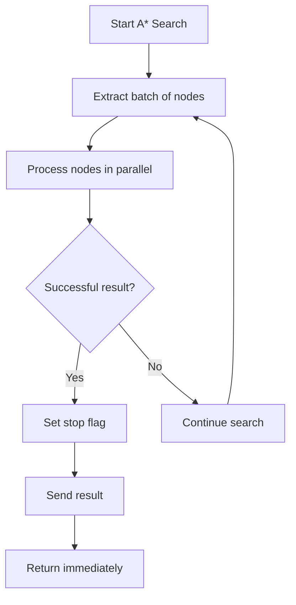

# Plan: Enhancements to ciphey's A* Search Algorithm

## Overview

This plan outlines the implementation steps for two key enhancements to the A* search algorithm in ciphey:

1. **Ensure mutual exclusion for the Human Checker**: Implement a mechanism where threads wait for the current human checker to complete before running their own.
2. **Terminate search on successful node expansion**: Immediately interrupt the entire search process as soon as a successful result is found, rather than waiting for all decoders in the current batch to finish.

## Implementation Details

### 1. Mutual Exclusion for Human Checker (`src/checkers/human_checker.rs`)

We'll implement a global atomic flag and a mutex to ensure that only one thread can run the human checker at a time, with others waiting for it to complete.



#### Implementation Steps:

1. Add necessary imports for atomic operations and mutex:
   ```rust
   use std::sync::{Mutex, MutexGuard};
   use once_cell::sync::Lazy;
   ```

2. Create a global mutex to ensure mutual exclusion:
   ```rust
   // Global mutex to ensure only one thread runs the human checker at a time
   static HUMAN_CHECKER_MUTEX: Lazy<Mutex<()>> = Lazy::new(|| Mutex::new(()));
   ```

3. Modify the `human_checker` function to use the mutex:
   ```rust
   pub fn human_checker(input: &CheckResult) -> bool {
       timer::pause();
       // wait instead of get so it waits for config being set
       let config = get_config();
       // We still call human checker, just if config is false we return True
       if !config.human_checker_on || config.api_mode {
           timer::resume();
           return true;
       }
       
       // Acquire the mutex to ensure only one thread runs the human checker at a time
       let _guard = HUMAN_CHECKER_MUTEX.lock().unwrap();
       
       human_checker_check(&input.description, &input.text);
   
       let reply: String = read!("{}\n");
       cli_pretty_printing::success(&format!("DEBUG: Human checker received reply: '{}'", reply));
       let result = reply.to_ascii_lowercase().starts_with('y');
       timer::resume();
   
       cli_pretty_printing::success(&format!("DEBUG: Human checker returning: {}", result));
   
       if !result {
           return false;
       }
       true
   }
   ```

### 2. Immediate Search Termination (`src/searchers/astar.rs`)

We need to modify the A* search algorithm to immediately terminate when a successful result is found, rather than waiting for all decoders in the current batch to finish.



#### Implementation Steps:

1. Modify the `expand_node` function to return a special result when a successful decoding is found:
   ```rust
   fn expand_node(
       current_node: &AStarNode,
       seen_strings: &DashSet<String>,
       stop: &Arc<AtomicBool>,
       _prune_threshold: usize,
   ) -> Vec<AStarNode> {
       // ... existing code ...
       
       match decoder_results {
           MyResults::Break(res) => {
               // Handle successful decoding
               if res.success {
                   // ... existing code ...
                   
                   // Set the stop flag immediately
                   stop.store(true, AtomicOrdering::Relaxed);
                   
                   // ... rest of the code ...
               }
           }
           // ... rest of the code ...
       }
       
       // ... rest of the code ...
   }
   ```

2. Modify the main A* loop to check the stop flag after each node expansion and return immediately if set:
   ```rust
   // Process nodes in parallel
   let new_nodes: Vec<AStarNode> = batch
       .par_iter()
       .flat_map(|node| {
           // Check if stop flag is set before processing
           if stop.load(AtomicOrdering::Relaxed) {
               return Vec::new();
           }
           
           let nodes = expand_node(
               node,
               &seen_strings,
               &stop,
               prune_threshold.load(AtomicOrdering::Relaxed),
           );
           
           // Check if stop flag was set during expansion
           if stop.load(AtomicOrdering::Relaxed) {
               // If we're here, this node might have found a solution
               // Return only this node's results to process any potential solution
               return nodes;
           }
           
           nodes
       })
       .collect();
   
   // Check stop flag again before processing new nodes
   if stop.load(AtomicOrdering::Relaxed) {
       // Find any result nodes and send them
       for node in &new_nodes {
           if let Some(decoder_name) = &node.next_decoder_name {
               if decoder_name == "__RESULT__" {
                   // Process and send the result
                   // ... existing result processing code ...
                   
                   // Return immediately
                   return;
               }
           }
       }
       
       // If we're here, the stop flag was set but we didn't find a result node
       // This could happen if another thread found a solution
       return;
   }
   ```

3. Modify the code that processes result nodes to return immediately after sending the result:
   ```rust
   // Check for result nodes
   for node in &new_nodes {
       if let Some(decoder_name) = &node.next_decoder_name {
           if decoder_name == "__RESULT__" {
               // ... existing result processing code ...
               
               // Only stop if not in top_results mode
               if !get_config().top_results {
                   // Stop further iterations
                   stop.store(true, AtomicOrdering::Relaxed);
                   return;
               }
               // In top_results mode, continue searching
           }
       }
   }
   ```

## Testing

### 1. Testing Human Checker Mutual Exclusion

Create a test that simulates multiple threads trying to use the human checker simultaneously:

```rust
#[cfg(test)]
mod tests {
    use super::*;
    use std::thread;
    use std::time::Duration;

    #[test]
    fn test_human_checker_mutual_exclusion() {
        // Create multiple threads that try to use the human checker
        let mut handles = vec![];
        for i in 0..5 {
            handles.push(thread::spawn(move || {
                // Create a dummy CheckResult
                let check_result = CheckResult {
                    is_identified: true,
                    text: format!("Test {}", i),
                    description: format!("Test {}", i),
                    checker_name: "Test",
                    checker_description: "Test",
                    link: "Test",
                };
                
                // Call the human checker
                let result = human_checker(&check_result);
                
                // Return the result
                result
            }));
        }
        
        // Wait for all threads to complete
        for handle in handles {
            let _ = handle.join();
        }
    }
}
```

### 2. Testing Immediate Search Termination

Modify the existing A* search tests to verify that the search terminates immediately when a successful result is found:

```rust
#[test]
fn test_astar_immediate_termination() {
    // Create channels for result communication
    let (sender, receiver) = bounded::<Option<DecoderResult>>(1);
    
    // Create stop signal
    let stop = Arc::new(AtomicBool::new(false));
    
    // Run A* in a separate thread with Base64 encoded "Hello World"
    let input = "SGVsbG8gV29ybGQ=".to_string();
    let stop_clone = stop.clone();
    
    let start_time = std::time::Instant::now();
    
    std::thread::spawn(move || {
        astar(input, sender, stop_clone);
    });
    
    // Wait for result
    let result = receiver.recv().unwrap();
    
    // Verify we got a result
    assert!(result.is_some());
    
    // Verify the search terminated quickly
    assert!(start_time.elapsed() < std::time::Duration::from_secs(2));
}
```

## Implementation Challenges and Considerations

### 1. Human Checker Mutual Exclusion

- **Thread Safety**: Ensure that the mutex is properly implemented to avoid deadlocks or race conditions.
- **Error Handling**: Properly handle cases where the mutex lock fails.
- **User Experience**: Consider adding a message to inform the user that the human checker is already active and their input will be processed after the current check completes.

### 2. Immediate Search Termination

- **Race Conditions**: Be careful about race conditions when checking and setting the stop flag.
- **Resource Cleanup**: Ensure that all resources are properly cleaned up when the search terminates early.
- **Completeness**: Make sure that all threads are properly notified when the search terminates.

## Conclusion

These enhancements will improve the A* search algorithm in ciphey by:

1. Ensuring that only one human checker prompt appears at a time, improving the user experience.
2. Terminating the search immediately when a successful result is found, improving performance.

The implementation is straightforward and should not require significant changes to the existing codebase. The main challenges are ensuring thread safety and proper handling of race conditions.