# Plan: A* Search Algorithm Heuristic Rewrite for Ciphey

## Overview

This document outlines the plan to rewrite the heuristic function in the A* search algorithm for ciphey. The goal is to improve the algorithm's efficiency by focusing on more promising decoding paths through:

1. Using a positive heuristic for decoder popularity
2. Adding a penalty for search depth
3. Maintaining the penalty for uncommon decoder sequences
4. Removing the CipherIdentifier dependency

## Current Implementation Analysis

The current heuristic function in `src/searchers/helper_functions.rs` uses a complex system of multipliers:
- Gets a base score from the cipher identifier
- Applies penalties for uncommon sequences (1.75x multiplier)
- Applies penalties for low success rates
- Applies penalties for low popularity
- Applies penalties for low quality strings
- Applies penalties for non-printable characters

This approach has several drawbacks:
- The multipliers compound, leading to exponential growth in the heuristic value
- It's difficult to understand the contribution of each component
- It doesn't explicitly account for search depth
- It relies on CipherIdentifier, which adds complexity

## Proposed Heuristic Function

We'll simplify the heuristic to focus on three key components:

```rust
fn generate_heuristic(text: &str, path: &[CrackResult], next_decoder: &Option<Box<dyn Crack + Sync>>) -> f32 {
    let mut base_score = 0.0;

    // 1. Popularity component - directly use (1.0 - popularity)
    if let Some(decoder) = next_decoder {
        base_score += (1.0 - decoder.popularity);
    } else {
        // If next decoder is None, add a moderate penalty
        base_score += 0.5;
    }

    // 2. Depth penalty - exponential growth but not too aggressive
    base_score += (0.05 * path.len() as f32).powi(2);

    // 3. Penalty for uncommon pairings
    if path.len() > 1 {
        if let Some(previous_decoder) = path.last() {
            if let Some(next_decoder) = next_decoder {
                if !is_common_sequence(previous_decoder.decoder, next_decoder.get_name()) {
                    base_score += 0.25;
                }
            }
        }
    }

    base_score
}
```

## Component Analysis

### 1. Popularity Component

We'll use `(1.0 - decoder.popularity)` directly:
- A decoder with popularity 1.0 (most popular) would add 0.0 to the heuristic
- A decoder with popularity 0.0 (least popular) would add 1.0 to the heuristic

This makes more popular decoders more likely to be explored first.

### 2. Depth Penalty

We'll use a moderate exponential function: `(0.05 * path.len() as f32).powi(2)`

This results in:
- Depth 5: 0.0625 penalty
- Depth 10: 0.25 penalty
- Depth 20: 1.0 penalty
- Depth 30: 2.25 penalty

This exponential growth ensures that very deep paths are significantly penalized, but it's not so aggressive that it prevents exploring moderately deep paths that might be valid solutions.

### 3. Uncommon Sequence Penalty

We'll maintain the existing penalty approach, adding 0.25 to the heuristic for uncommon sequences:
- This makes common sequences relatively more attractive
- It maintains non-negative heuristic values (important for A* correctness)
- It's consistent with the rest of the heuristic design

## Visual Representation

```mermaid
graph TD
    A[Heuristic Score] --> B[Popularity Component]
    A --> C[Depth Penalty]
    A --> D[Uncommon Sequence Penalty]
    
    B --> B1[1.0 - decoder.popularity]
    B --> B2[No decoder: +0.5 penalty]
    
    C --> C1["(0.05 * depth)²"]
    
    D --> D1[Common sequence: No penalty]
    D --> D2[Uncommon sequence: +0.25]
```



## Implementation Steps

1. Update the `generate_heuristic` function signature to include the `next_decoder` parameter:
   ```rust
   fn generate_heuristic(text: &str, path: &[CrackResult], next_decoder: &Option<Box<dyn Crack + Sync>>) -> f32
   ```

2. Implement the simplified heuristic logic as outlined above

3. Update all calls to `generate_heuristic` in `src/searchers/astar.rs` to pass the appropriate `next_decoder` parameter

4. Remove any CipherIdentifier-related code that's no longer needed

5. Update tests to reflect the new heuristic behavior

## Expected Benefits

1. **Improved Efficiency**: By prioritizing more popular decoders, we'll likely find solutions faster in common cases

2. **Better Path Exploration**: The depth penalty will prevent the algorithm from going too deep in unproductive paths

3. **Simplified Logic**: The new heuristic is more straightforward and easier to understand/maintain

4. **More Predictable Behavior**: The additive approach makes it easier to understand how each component affects the overall heuristic

## Potential Risks and Mitigations

1. **Risk**: The depth penalty might be too aggressive or too lenient
   **Mitigation**: The coefficient (0.05) can be adjusted based on testing

2. **Risk**: Removing CipherIdentifier might reduce accuracy for certain cipher types
   **Mitigation**: The popularity-based approach should still work well for most cases, and we can revisit if needed

3. **Risk**: The penalty for uncommon sequences might be too high or too low
   **Mitigation**: The value (0.25) can be adjusted based on testing

## Conclusion

This simplified heuristic approach focuses on the most important factors for efficient A* search in the context of decoding:
- Popularity of decoders
- Depth of the search tree
- Common decoder sequences

By removing the complexity of the current implementation and focusing on these key factors, we expect to improve both the efficiency and maintainability of the A* search algorithm in ciphey.