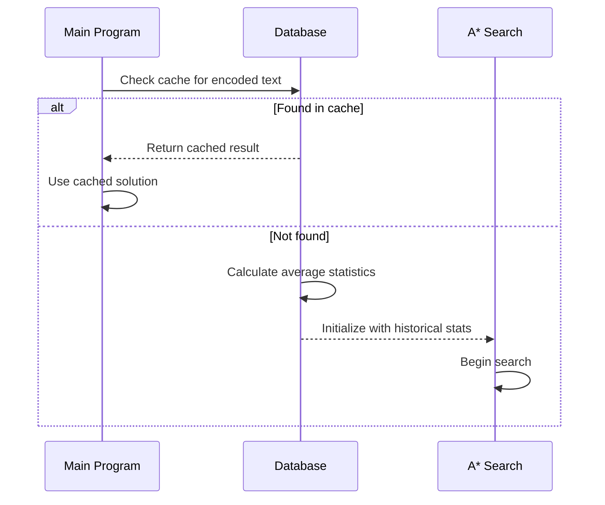
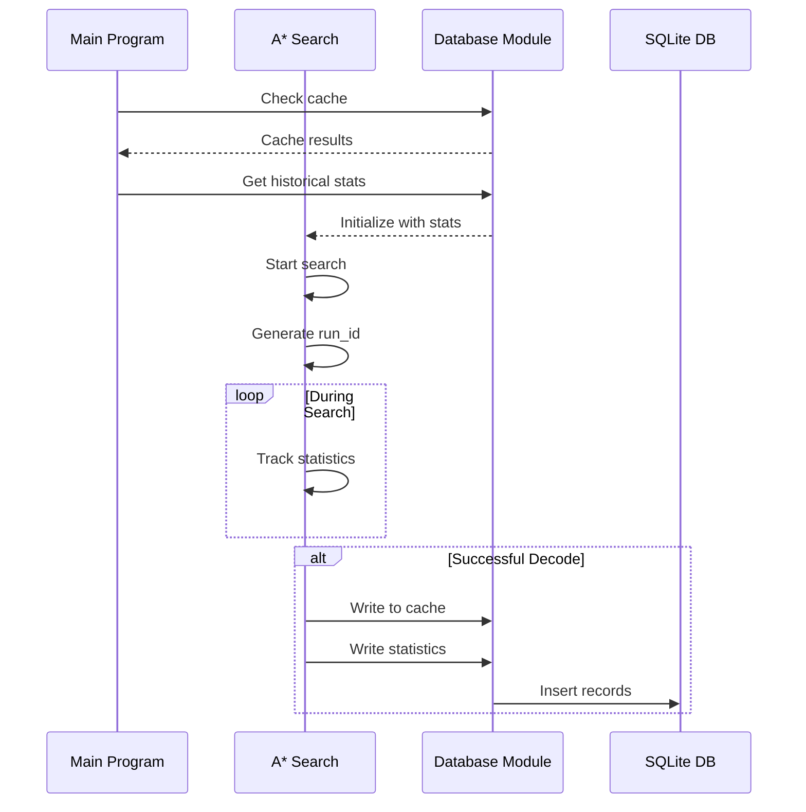

# SQLite Database Implementation for Ares

## Database Location

The SQLite database will be stored at: `$HOME_DIR/ares/database.sqlite`

```rust
use std::env;
use std::path::PathBuf;

fn get_database_path() -> PathBuf {
    let mut path = env::home_dir().expect("Could not find home directory");
    path.push("ares");
    path.push("database.sqlite");
    path
}
```

## Schema Design

### Cache Table
```sql
CREATE TABLE IF NOT EXISTS cache (
    id INTEGER PRIMARY KEY AUTOINCREMENT,
    encoded_text TEXT NOT NULL,
    decoded_text TEXT NOT NULL,
    path JSON NOT NULL,        -- Stores Vec<CrackResult> as JSON
    successful BOOLEAN NOT NULL DEFAULT true,
    execution_time_ms INTEGER NOT NULL,
    timestamp DATETIME DEFAULT CURRENT_TIMESTAMP
);

CREATE INDEX IF NOT EXISTS idx_cache_encoded_text ON cache(encoded_text);
```

### Statistics Table
```sql
CREATE TABLE IF NOT EXISTS statistics (
    id INTEGER PRIMARY KEY AUTOINCREMENT,
    run_id TEXT NOT NULL,      -- UUID for grouping stats from same run
    decoder_name TEXT NOT NULL,
    success_count INTEGER NOT NULL,
    total_attempts INTEGER NOT NULL,
    search_depth INTEGER NOT NULL,
    seen_strings_count INTEGER NOT NULL,
    prune_threshold INTEGER NOT NULL,
    max_memory_kb INTEGER NOT NULL,
    timestamp DATETIME DEFAULT CURRENT_TIMESTAMP
);

CREATE INDEX IF NOT EXISTS idx_stats_run_id ON statistics(run_id);
CREATE INDEX IF NOT EXISTS idx_stats_decoder ON statistics(decoder_name);
```

## Operation Flow

### 1. Startup Operations



The program performs two important database operations at startup:
1. Cache lookup to check if we've seen this encoded string before
2. Statistics calculation to inform A* search parameters:
   - Average success rates per decoder
   - Typical search depths
   - Common successful decoder sequences

### 2. Database Writes

Database writes occur only after A* search completes successfully:
1. When `astar()` returns with a successful result
2. Before the program exits
3. Inside a transaction to ensure both cache and statistics are written atomically
4. Only successful runs are recorded to maintain data quality

## Implementation Steps

### 1. Add Dependencies
```toml
[dependencies]
rusqlite = { version = "0.29", features = ["bundled"] }
serde_json = "1.0"
uuid = { version = "1.0", features = ["v4"] }
directories = "5.0"        # For managing app directories
```

### 2. Create Database Module
- Location: `src/storage/database.rs`
- Responsibilities:
  * Database initialization
  * Connection management
  * Schema creation
  * CRUD operations

### 3. Modify Main Program
- Add startup database operations
- Add run_id generation
- Add JSON serialization for paths
- Write results only after successful completion

### 4. Database Operations Flow



### 5. Error Handling

```rust
#[derive(Debug, thiserror::Error)]
pub enum DatabaseError {
    #[error("Failed to initialize database: {0}")]
    InitializationError(#[from] rusqlite::Error),
    
    #[error("Failed to serialize path: {0}")]
    SerializationError(#[from] serde_json::Error),
    
    #[error("Database operation failed: {0}")]
    OperationError(String),
}
```

### 6. Testing Strategy

1. Unit Tests
   - Database connection
   - Schema creation 
   - CRUD operations
   - Error handling

2. Integration Tests
   - Full A* search with database writes
   - Data persistence verification
   - Concurrent access handling

### 7. Migration Plan

1. Create database directory if not exists
2. Initialize schema on first run
3. Add version table for future schema migrations

## Usage Example

```rust
// In main.rs

let run_id = Uuid::new_v4().to_string();
let db = Database::new()?;

// After successful decode
if let Some(result) = final_result {
    db.insert_cache(&CacheEntry {
        encoded_text: input,
        decoded_text: result.text,
        path: serde_json::to_string(&result.path)?,
        execution_time_ms: duration.as_millis() as i64,
    })?;

    db.insert_statistics(&StatisticsEntry {
        run_id: &run_id,
        decoder_stats: &decoder_stats,
        search_depth: curr_depth,
        seen_strings_count: seen_count,
        prune_threshold,
        max_memory_kb: get_memory_usage()?,
    })?;
}