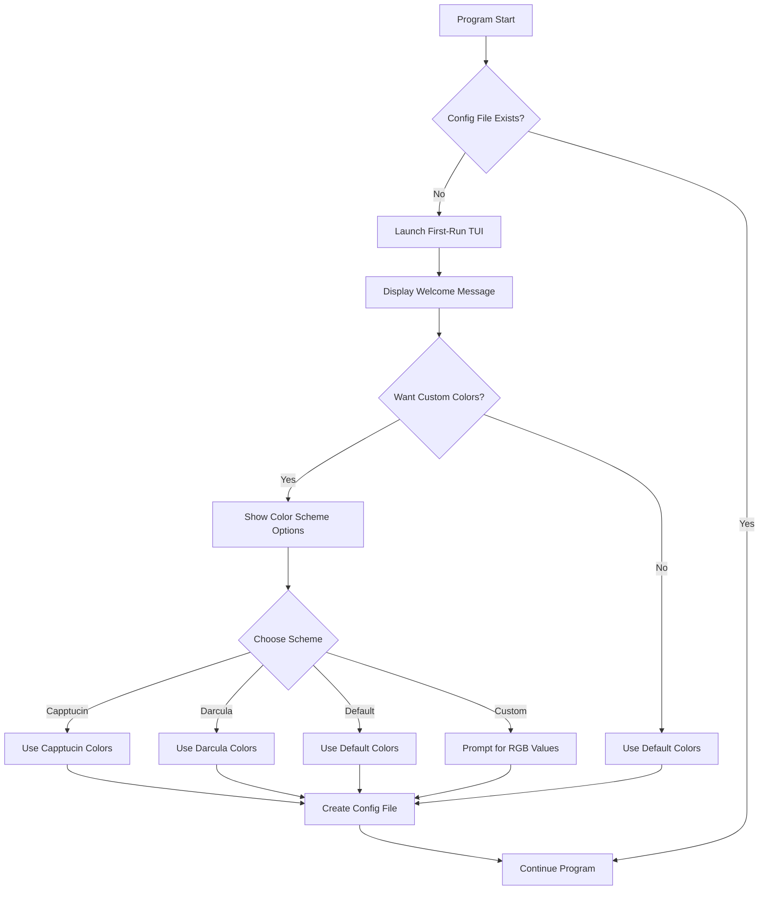

# Ares First-Run Configuration Experience Implementation Plan

## Overview

When a user runs Ares for the first time (detected by the absence of a config file), the program will display a TUI (Text User Interface) that:
1. Welcomes the user
2. Asks if they want a custom color scheme
3. Offers predefined color schemes (Capptucin, Darcula, Default) or a custom option
4. Updates the config file with the user's choices

## Implementation Plan

### 1. Add Required Dependencies

Add the following dependencies to `Cargo.toml`:
- `ratatui`: For creating the TUI
- `crossterm`: For terminal handling (required by Ratatui)

```toml
[dependencies]
# Existing dependencies...
ratatui = "0.26.1"
crossterm = "0.27.0"
```

### 2. Create First-Run Module

Create a new file `first_run.rs` in the `src/cli` directory that will contain the TUI implementation for the first-run experience.

### 3. Update Config Module

Modify the `get_config_file_into_struct()` function in `src/config/mod.rs` to call the first-run function when the config file doesn't exist.

### 4. Implement Color Scheme Definitions

Define the color schemes mentioned in the requirements:
- Capptucin
- Darcula
- Default (already implemented)

### 5. Implement First-Run TUI

Implement the TUI with the following components:
- Welcome screen
- Color scheme selection
- Custom RGB input (if selected)

## Detailed Implementation Steps

### 1. First-Run Module Structure

```rust
// src/cli/first_run.rs
pub struct ColorScheme {
    informational: String, // RGB format "r,g,b"
    warning: String,
    success: String,
    question: String,
    statement: String,
}

pub enum PredefinedColorScheme {
    Capptucin,
    Darcula,
    Default,
    Custom,
}

pub fn run_first_time_setup() -> std::collections::HashMap<String, String> {
    // TUI implementation
}

fn get_capptucin_scheme() -> ColorScheme {
    // Return Capptucin color scheme
}

fn get_darcula_scheme() -> ColorScheme {
    // Return Darcula color scheme
}

fn get_default_scheme() -> ColorScheme {
    // Return Default color scheme
}

fn get_custom_scheme() -> ColorScheme {
    // Prompt user for custom RGB values
}

fn color_scheme_to_hashmap(scheme: ColorScheme) -> std::collections::HashMap<String, String> {
    // Convert ColorScheme to HashMap for Config
}
```

### 2. Config Module Updates

```rust
// Modify in src/config/mod.rs
pub fn get_config_file_into_struct() -> Config {
    let path = get_config_file_path();
    if !path.exists() {
        // This is the first run, show the TUI
        let colors = crate::cli::first_run::run_first_time_setup();
        
        // Create a default config with the selected colors
        let mut config = Config::default();
        config.colourscheme = colors;
        
        // Save the config to file
        let toml_string = toml::to_string_pretty(&config).expect("Could not serialize config");
        let mut file = File::create(&path).expect("Could not create config file");
        file.write_all(toml_string.as_bytes()).expect("Could not write to config file");
        
        return config;
    }

    // Existing code for reading config file...
}
```

### 3. CLI Module Updates

Update `mod.rs` to include the new first_run module:

```rust
// src/cli/mod.rs
mod first_run;
pub use first_run::run_first_time_setup;
```

## Flow Diagram



## TUI Design

The TUI will have the following screens:

1. **Welcome Screen**:
   ```
   🤠 Howdy! This is your first time running Ares.
   
   I need to ask you some questions to make it work better for you.
   
   Do you want a custom colour scheme? (y/N)
   ```

2. **Color Scheme Selection Screen** (if user wants custom colors):
   ```
   What colour scheme looks best to you?
   PS: Please think about how this will look with your Terminal background 🙈
   
   1. Capptucin
   Informational Alert Success Questions Statements
   
   2. Darcula
   Informational Alert Success Questions Statements
   
   3. Default
   Informational Alert Success Questions Statements
   
   4. Custom
   ```

3. **Custom RGB Input Screen** (if user selects Custom):
   ```
   Enter 5 RGB values, space seperated. An example is 255,0,0 0,255,0.
   Informational Alert Success Questions Statements
   ```

## Color Scheme Definitions

1. **Capptucin**:
   - Informational: rgb(238, 212, 159)
   - Alert/Warning: rgb(237, 135, 150)
   - Success: rgb(166, 218, 149)
   - Questions: rgb(244, 219, 214)
   - Statements: rgb(202, 211, 245)

2. **Darcula**:
   - Informational: rgb(241, 250, 140)
   - Alert/Warning: rgb(255, 85, 85)
   - Success: rgb(80, 250, 123)
   - Questions: rgb(139, 233, 253)
   - Statements: rgb(248, 248, 242)

3. **Default**: The existing default color scheme in the Config struct.

## Testing Plan

1. Test the TUI interface with different terminal sizes
2. Test color scheme selection and application
3. Test custom RGB input validation
4. Test the complete flow from first run to using the configuration