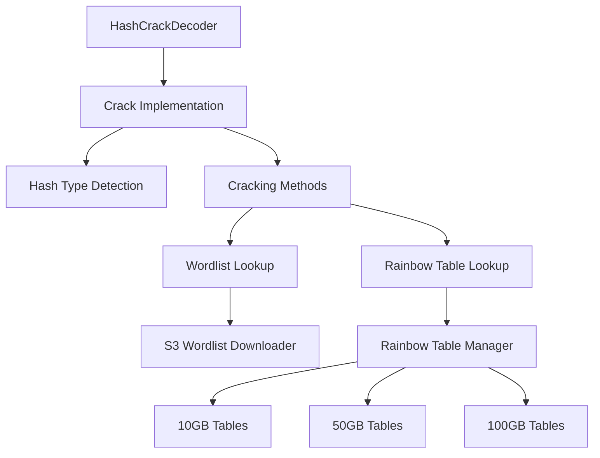
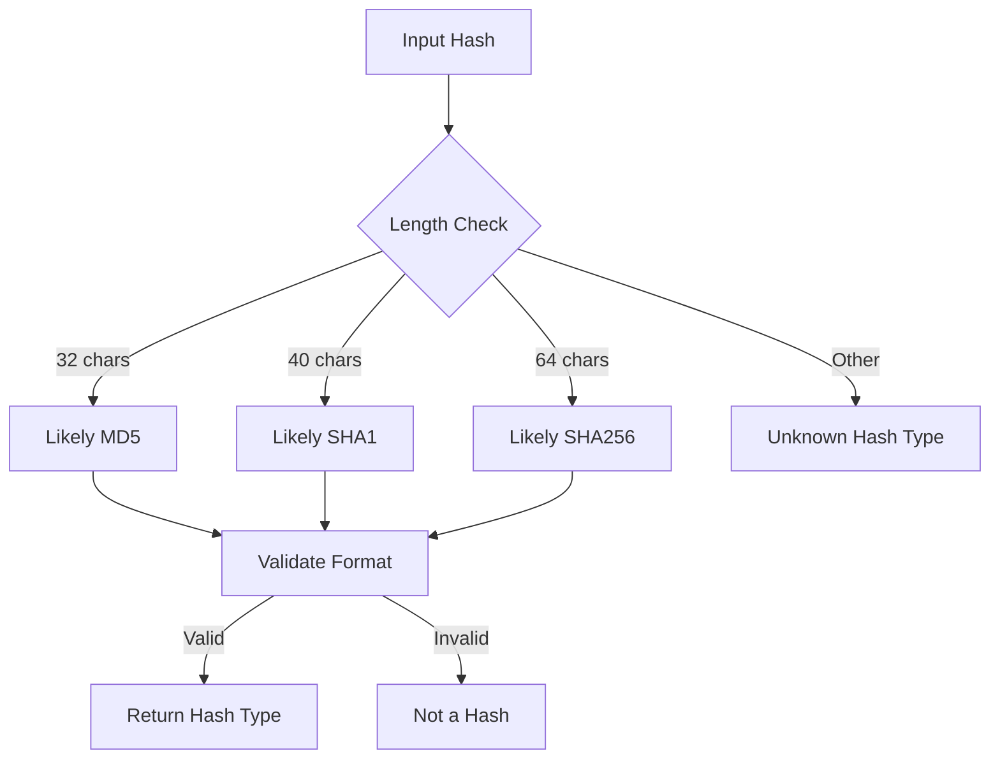
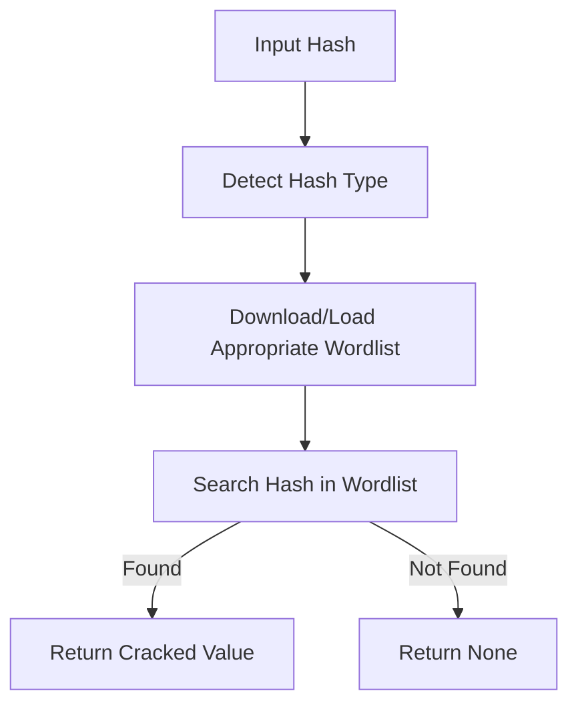
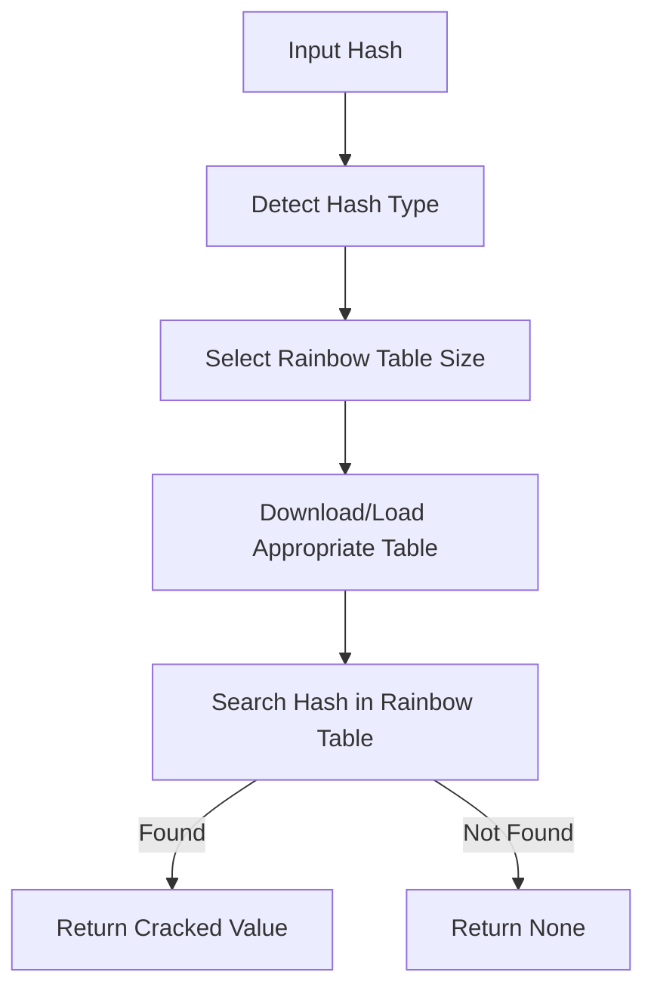

# Hash Cracking Decoder Implementation Plan

## Overview

This document outlines the implementation plan for a new decoder called `HashCrackDecoder` that will be integrated into the Ares project. The decoder will support:

- Three hash algorithms: MD5, SHA1, and SHA256
- Two cracking methods:
  1. Wordlist lookup (downloading wordlists from S3)
  2. Rainbow tables (with size options: 10GB, 50GB, 100GB)

## Architecture



## Implementation Steps

### 1. Create the HashCrackDecoder Module

Create a new file `src/decoders/hash_crack_decoder.rs` with the following structure:

```rust
//! Decode a hash using wordlist lookup or rainbow tables
//! Supports MD5, SHA1, and SHA256 hash algorithms
//! Call hash_crack_decoder.crack to use. It returns option<String> and check with
//! `result.is_some()` to see if it returned okay.

use crate::checkers::CheckerTypes;
use crate::decoders::interface::check_string_success;
use crate::decoders::crack_results::CrackResult;
use crate::decoders::interface::{Crack, Decoder};

use log::{debug, info, trace};
use std::path::PathBuf;
use std::fs;
use std::collections::HashMap;
use std::io::{BufRead, BufReader};

// Add AWS SDK dependencies for S3 access
use rusoto_core::{Region, RusotoError};
use rusoto_s3::{GetObjectRequest, S3Client, S3};

/// The HashCrackDecoder, call:
/// `let hash_crack_decoder = Decoder::<HashCrackDecoder>::new()` to create a new instance
/// And then call:
/// `result = hash_crack_decoder.crack(input)` to decode a hash
pub struct HashCrackDecoder;

// Enum to represent supported hash types
enum HashType {
    MD5,
    SHA1,
    SHA256,
    Unknown,
}

// Enum to represent cracking methods
enum CrackMethod {
    Wordlist,
    RainbowTable(usize), // Size in GB
}

impl Crack for Decoder<HashCrackDecoder> {
    fn new() -> Decoder<HashCrackDecoder> {
        Decoder {
            name: "HashCrack",
            description: "Cracks hashes using wordlist lookup or rainbow tables. Supports MD5, SHA1, and SHA256.",
            link: "https://en.wikipedia.org/wiki/Password_cracking",
            tags: vec!["hash", "decoder", "md5", "sha1", "sha256", "wordlist", "rainbow"],
            popularity: 0.9,
            phantom: std::marker::PhantomData,
        }
    }

    fn crack(&self, text: &str, checker: &CheckerTypes) -> CrackResult {
        trace!("Trying HashCrack with text {:?}", text);
        let mut results = CrackResult::new(self, text.to_string());
        
        // Detect hash type
        let hash_type = detect_hash_type(text);
        if let HashType::Unknown = hash_type {
            debug!("Failed to crack hash because hash type is unknown");
            return results;
        }
        
        // Try wordlist lookup first (faster)
        if let Some(cracked) = crack_with_wordlist(text, &hash_type) {
            if check_string_success(&cracked, text) {
                let checker_result = checker.check(&cracked);
                results.unencrypted_text = Some(vec![cracked]);
                results.update_checker(&checker_result);
                return results;
            }
        }
        
        // If wordlist fails, try rainbow tables
        // Start with smaller tables first for efficiency
        for size in &[10, 50, 100] {
            if let Some(cracked) = crack_with_rainbow_table(text, &hash_type, *size) {
                if check_string_success(&cracked, text) {
                    let checker_result = checker.check(&cracked);
                    results.unencrypted_text = Some(vec![cracked]);
                    results.update_checker(&checker_result);
                    return results;
                }
            }
        }
        
        // If all methods fail, return the empty result
        results
    }
    
    fn get_tags(&self) -> &Vec<&str> {
        &self.tags
    }
    
    fn get_name(&self) -> &str {
        self.name
    }
}

// Helper function to detect hash type based on length and format
fn detect_hash_type(hash: &str) -> HashType {
    // Check if the hash consists only of hexadecimal characters
    if !hash.chars().all(|c| c.is_ascii_hexdigit()) {
        return HashType::Unknown;
    }
    
    match hash.len() {
        32 => HashType::MD5,
        40 => HashType::SHA1,
        64 => HashType::SHA256,
        _ => HashType::Unknown,
    }
}

// Helper function to crack hash using wordlist lookup
fn crack_with_wordlist(hash: &str, hash_type: &HashType) -> Option<String> {
    // Get the appropriate wordlist for the hash type
    let wordlist_path = get_or_download_wordlist(hash_type)?;
    
    // Open the wordlist file
    let file = fs::File::open(wordlist_path).ok()?;
    let reader = BufReader::new(file);
    
    // Search for the hash in the wordlist
    for line in reader.lines() {
        if let Ok(line) = line {
            if let Some((stored_hash, plaintext)) = line.split_once(':') {
                if stored_hash == hash {
                    return Some(plaintext.to_string());
                }
            }
        }
    }
    
    None
}

// Helper function to get or download wordlist
fn get_or_download_wordlist(hash_type: &HashType) -> Option<PathBuf> {
    let cache_dir = PathBuf::from("cache/wordlists");
    fs::create_dir_all(&cache_dir).ok()?;
    
    let filename = match hash_type {
        HashType::MD5 => "md5_wordlist.txt",
        HashType::SHA1 => "sha1_wordlist.txt",
        HashType::SHA256 => "sha256_wordlist.txt",
        HashType::Unknown => return None,
    };
    
    let local_path = cache_dir.join(filename);
    
    // If the wordlist exists locally, return its path
    if local_path.exists() {
        return Some(local_path);
    }
    
    // Otherwise, download it from S3
    download_wordlist_from_s3(filename, &local_path).map(|_| local_path)
}

// Helper function to download wordlist from S3
fn download_wordlist_from_s3(filename: &str, local_path: &PathBuf) -> Option<()> {
    // Initialize S3 client
    let s3_client = S3Client::new(Region::UsEast1); // Adjust region as needed
    
    // Define S3 bucket and key
    let bucket = "your-wordlist-bucket"; // Replace with actual bucket name
    let key = format!("wordlists/{}", filename);
    
    // Create GetObjectRequest
    let request = GetObjectRequest {
        bucket: bucket.to_string(),
        key,
        ..Default::default()
    };
    
    // Download the file
    let result = s3_client.get_object(request).sync().ok()?;
    let body = result.body.unwrap();
    let mut bytes = body.into_blocking_read();
    
    // Write to local file
    let mut file = fs::File::create(local_path).ok()?;
    std::io::copy(&mut bytes, &mut file).ok()?;
    
    Some(())
}

// Helper function to crack hash using rainbow tables
fn crack_with_rainbow_table(hash: &str, hash_type: &HashType, size_gb: usize) -> Option<String> {
    // Get the appropriate rainbow table for the hash type and size
    let table_path = get_or_download_rainbow_table(hash_type, size_gb)?;
    
    // Implement rainbow table lookup
    // This is a simplified implementation - actual rainbow table lookup is more complex
    
    // For demonstration purposes, we'll use a basic approach:
    // 1. Load the rainbow table endpoints
    let endpoints = load_rainbow_table_endpoints(&table_path)?;
    
    // 2. Check if the hash exists in the endpoints
    if let Some(endpoint_index) = find_hash_in_endpoints(hash, &endpoints) {
        // 3. Regenerate the chain to find the plaintext
        return regenerate_chain(endpoint_index, hash, &table_path);
    }
    
    None
}

// Helper function to get or download rainbow table
fn get_or_download_rainbow_table(hash_type: &HashType, size_gb: usize) -> Option<PathBuf> {
    let cache_dir = PathBuf::from("cache/rainbow_tables");
    fs::create_dir_all(&cache_dir).ok()?;
    
    let dirname = match hash_type {
        HashType::MD5 => format!("md5_{}gb", size_gb),
        HashType::SHA1 => format!("sha1_{}gb", size_gb),
        HashType::SHA256 => format!("sha256_{}gb", size_gb),
        HashType::Unknown => return None,
    };
    
    let local_path = cache_dir.join(&dirname);
    
    // If the rainbow table exists locally, return its path
    if local_path.exists() {
        return Some(local_path);
    }
    
    // Otherwise, download it
    download_rainbow_table(hash_type, size_gb, &local_path).map(|_| local_path)
}

// Helper function to download rainbow table
fn download_rainbow_table(hash_type: &HashType, size_gb: usize, local_path: &PathBuf) -> Option<()> {
    // This would be a complex operation to download large files
    // For now, we'll just create a placeholder
    fs::create_dir_all(local_path).ok()?;
    
    // In a real implementation, you would:
    // 1. Download the rainbow table files from a server
    // 2. Extract them if needed
    // 3. Verify their integrity
    
    Some(())
}

// Helper function to load rainbow table endpoints
fn load_rainbow_table_endpoints(table_path: &PathBuf) -> Option<HashMap<String, usize>> {
    // In a real implementation, this would load the endpoints from the rainbow table files
    // For now, we'll return an empty HashMap
    Some(HashMap::new())
}

// Helper function to find hash in endpoints
fn find_hash_in_endpoints(hash: &str, endpoints: &HashMap<String, usize>) -> Option<usize> {
    endpoints.get(hash).copied()
}

// Helper function to regenerate chain
fn regenerate_chain(endpoint_index: usize, target_hash: &str, table_path: &PathBuf) -> Option<String> {
    // In a real implementation, this would:
    // 1. Load the starting plaintext for the chain
    // 2. Apply hash and reduction functions repeatedly
    // 3. Find the point that generates the target hash
    // 4. Return the plaintext that generated the target hash
    
    // For now, we'll return None
    None
}
```

### 2. Update Module Declarations

Add the new module to `src/decoders/mod.rs`:

```rust
/// The hash_crack_decoder module cracks hashes using wordlist lookup or rainbow tables
pub mod hash_crack_decoder;
```

### 3. Register the Decoder in the Filtration System

Update `src/filtration_system/mod.rs` to include the new decoder:

```rust
use crate::decoders::hash_crack_decoder::HashCrackDecoder;

// In the filter_and_get_decoders function, add:
let hash_crack = Decoder::<HashCrackDecoder>::new();

// And add it to the components vector:
Box::new(hash_crack),
```

### 4. Add Dependencies to Cargo.toml

Add the necessary dependencies to `Cargo.toml`:

```toml
[dependencies]
# Existing dependencies...

# For S3 access
rusoto_core = "0.47.0"
rusoto_s3 = "0.47.0"
```

## Hash Type Detection

The decoder will detect hash types based on their length and format:



- MD5 hashes are 32 hexadecimal characters
- SHA1 hashes are 40 hexadecimal characters
- SHA256 hashes are 64 hexadecimal characters

## Wordlist Lookup Method



The wordlist lookup method will:
1. Detect the hash type
2. Check if the appropriate wordlist is cached locally
3. If not, download it from S3
4. Search for the hash in the wordlist
5. Return the cracked value if found

Wordlists will be stored in a format where each line contains a hash and its corresponding plaintext, separated by a colon:
```
5f4dcc3b5aa765d61d8327deb882cf99:password
e10adc3949ba59abbe56e057f20f883e:123456
```

## Rainbow Table Method



The rainbow table method will:
1. Detect the hash type
2. Try different rainbow table sizes (10GB, 50GB, 100GB) in order of increasing size
3. Check if the appropriate rainbow table is cached locally
4. If not, download it
5. Search for the hash in the rainbow table
6. Return the cracked value if found

## Rainbow Tables Technical Details

Rainbow tables are precomputed tables for reversing cryptographic hash functions. They use a time-memory tradeoff to store precomputed hash chains.

### Chain Generation

1. Start with a plaintext (P1)
2. Hash it to get H1 = hash(P1)
3. Apply a reduction function to get a new plaintext P2 = R(H1)
4. Hash P2 to get H2 = hash(P2)
5. Apply the reduction function again to get P3 = R(H2)
6. Repeat for a specified chain length
7. Store only the first plaintext (P1) and final hash (Hn)

### Using the Table

1. For a given hash H to crack:
2. Apply the reduction function to get P' = R(H)
3. Hash P' to get H' = hash(P')
4. Check if H' is in the table as an endpoint
5. If not, apply the reduction function again and repeat
6. If found, regenerate the chain from the starting plaintext
7. Check each hash in the chain to find the one that matches H
8. The plaintext that generated H is the cracked value

### Size Options

- 10GB: Smaller tables with shorter chains or fewer entries
- 50GB: Medium-sized tables with a balance of coverage and size
- 100GB: Larger tables with better coverage but requiring more storage

## Testing

Add tests to verify the functionality of the hash cracking decoder:

```rust
#[cfg(test)]
mod tests {
    use super::HashCrackDecoder;
    use crate::{
        checkers::{
            athena::Athena,
            checker_type::{Check, Checker},
            CheckerTypes,
        },
        decoders::interface::{Crack, Decoder},
    };

    // Helper for tests
    fn get_athena_checker() -> CheckerTypes {
        let athena_checker = Checker::<Athena>::new();
        CheckerTypes::CheckAthena(athena_checker)
    }

    #[test]
    fn test_md5_hash_crack() {
        let hash_crack_decoder = Decoder::<HashCrackDecoder>::new();
        
        // MD5 hash for "password"
        let result = hash_crack_decoder.crack("5f4dcc3b5aa765d61d8327deb882cf99", &get_athena_checker());
        
        if let Some(cracked) = result.unencrypted_text {
            assert_eq!(cracked[0], "password");
        } else {
            panic!("Failed to crack MD5 hash");
        }
    }

    #[test]
    fn test_sha1_hash_crack() {
        let hash_crack_decoder = Decoder::<HashCrackDecoder>::new();
        
        // SHA1 hash for "password"
        let result = hash_crack_decoder.crack("5baa61e4c9b93f3f0682250b6cf8331b7ee68fd8", &get_athena_checker());
        
        if let Some(cracked) = result.unencrypted_text {
            assert_eq!(cracked[0], "password");
        } else {
            panic!("Failed to crack SHA1 hash");
        }
    }

    #[test]
    fn test_sha256_hash_crack() {
        let hash_crack_decoder = Decoder::<HashCrackDecoder>::new();
        
        // SHA256 hash for "password"
        let result = hash_crack_decoder.crack("5e884898da28047151d0e56f8dc6292773603d0d6aabbdd62a11ef721d1542d8", &get_athena_checker());
        
        if let Some(cracked) = result.unencrypted_text {
            assert_eq!(cracked[0], "password");
        } else {
            panic!("Failed to crack SHA256 hash");
        }
    }

    #[test]
    fn test_invalid_hash() {
        let hash_crack_decoder = Decoder::<HashCrackDecoder>::new();
        
        // Invalid hash (not hexadecimal)
        let result = hash_crack_decoder.crack("not_a_hash", &get_athena_checker());
        
        assert!(result.unencrypted_text.is_none());
    }
}
```

## Implementation Considerations

1. **Storage Management**: 
   - Create a cache directory for wordlists and rainbow tables
   - Implement a cache management system to avoid filling up disk space
   - Consider adding configuration options for cache location and size limits

2. **Performance**: 
   - Use efficient data structures for lookups (HashMap, BTreeMap)
   - Implement parallel processing for rainbow table lookups
   - Consider memory-mapping large files for better performance

3. **Error Handling**: 
   - Implement robust error handling for network issues during downloads
   - Add retry logic for failed downloads
   - Provide clear error messages for debugging

4. **Security**: 
   - Verify the integrity of downloaded files using checksums
   - Implement proper permissions for cache directories
   - Consider encryption for sensitive data

## Conclusion

This implementation plan provides a detailed roadmap for creating a hash cracking decoder that integrates with the Ares project. The decoder will support both wordlist lookup and rainbow table methods for cracking MD5, SHA1, and SHA256 hashes.

The implementation follows the existing decoder pattern in the project, making it easy to integrate with the filtration system. The modular design allows for future extensions to support additional hash algorithms or cracking methods.