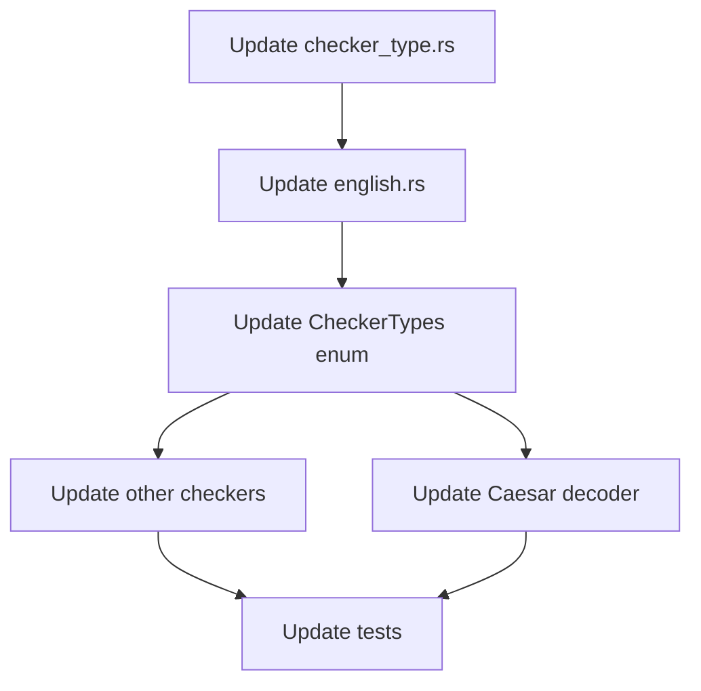

# Implementation Plan for Adding Sensitivity to Gibberish Detection

## Overview

We need to modify the codebase to support the new sensitivity feature in the `gibberish_or_not` library. The key requirements are:

1. Caesar cipher should use Low Sensitivity by default
2. All other checkers should use Medium Sensitivity by default
3. Decoders should be able to specify what sensitivity they want (with a default that can be overridden)

## Detailed Steps

### 1. Update `checker_type.rs`

First, we need to modify the `Checker` struct in `checker_type.rs` to include a sensitivity field:

```rust
// Add this import at the top
use gibberish_or_not::Sensitivity;

pub struct Checker<Type> {
    // Existing fields...
    
    /// The sensitivity level for gibberish detection
    pub sensitivity: Sensitivity,
    
    // Existing fields...
}
```

We'll also need to update the `Check` trait to allow setting and getting the sensitivity:

```rust
pub trait Check {
    // Existing methods...
    
    /// Sets the sensitivity level for gibberish detection
    fn with_sensitivity(self, sensitivity: Sensitivity) -> Self where Self: Sized;
    
    /// Gets the current sensitivity level
    fn get_sensitivity(&self) -> Sensitivity;
}
```

### 2. Update `english.rs`

Next, we need to modify the `EnglishChecker` implementation to use the sensitivity level when calling `is_gibberish`:

```rust
impl Check for Checker<EnglishChecker> {
    fn new() -> Self {
        Checker {
            name: "English Checker",
            description: "Uses gibberish detection to check if text is meaningful English",
            link: "https://crates.io/crates/gibberish-or-not",
            tags: vec!["english", "nlp"],
            expected_runtime: 0.01,
            popularity: 1.0,
            lemmeknow_config: Identifier::default(),
            sensitivity: Sensitivity::Medium, // Default to Medium sensitivity
            _phantom: std::marker::PhantomData,
        }
    }

    fn check(&self, text: &str) -> CheckResult {
        // Normalize before checking
        let text = normalise_string(text);

        let mut result = CheckResult {
            is_identified: !is_gibberish(&text, self.sensitivity), // Use the sensitivity
            text: text.to_string(),
            checker_name: self.name,
            checker_description: self.description,
            description: "Gibberish detection".to_string(),
            link: self.link,
        };

        // Handle edge case of very short strings after normalization
        if text.len() < 2 {
            // Reduced from 3 since normalization may remove punctuation
            result.is_identified = false;
        }

        result
    }
    
    fn with_sensitivity(mut self, sensitivity: Sensitivity) -> Self {
        self.sensitivity = sensitivity;
        self
    }
    
    fn get_sensitivity(&self) -> Sensitivity {
        self.sensitivity
    }
}
```

### 3. Update Caesar Decoder

We need to update the Caesar decoder to use Low sensitivity by default. This can be done by modifying how it uses the checker in its `crack` method:

```rust
fn crack(&self, text: &str, checker: &CheckerTypes) -> CrackResult {
    trace!("Trying Caesar Cipher with text {:?}", text);
    let mut results = CrackResult::new(self, text.to_string());
    let mut decoded_strings = Vec::new();
    
    // Use the checker with Low sensitivity
    let checker_with_sensitivity = checker.with_sensitivity(Sensitivity::Low);
    
    for shift in 1..=25 {
        let decoded_text = caesar(text, shift);
        decoded_strings.push(decoded_text);
        let borrowed_decoded_text = &decoded_strings[decoded_strings.len() - 1];
        if !check_string_success(borrowed_decoded_text, text) {
            info!(
                "Failed to decode caesar because check_string_success returned false on string {}. This means the string is 'funny' as it wasn't modified.",
                borrowed_decoded_text
            );
            return results;
        }
        let checker_result = checker_with_sensitivity.check(borrowed_decoded_text);
        // If checkers return true, exit early with the correct result
        if checker_result.is_identified {
            trace!("Found a match with caesar shift {}", shift);
            results.unencrypted_text = Some(vec![borrowed_decoded_text.to_string()]);
            results.update_checker(&checker_result);
            return results;
        }
    }
    results.unencrypted_text = Some(decoded_strings);
    results
}
```

### 4. Update `CheckerTypes` Enum

We need to update the `CheckerTypes` enum in `checkers/mod.rs` to support the sensitivity methods:

```rust
impl CheckerTypes {
    /// This functions calls appropriate check function of Checker
    pub fn check(&self, text: &str) -> CheckResult {
        match self {
            CheckerTypes::CheckLemmeKnow(lemmeknow_checker) => lemmeknow_checker.check(text),
            CheckerTypes::CheckEnglish(english_checker) => english_checker.check(text),
            CheckerTypes::CheckAthena(athena_checker) => athena_checker.check(text),
            CheckerTypes::CheckRegex(regex_checker) => regex_checker.check(text),
        }
    }
    
    /// Sets the sensitivity level for gibberish detection
    pub fn with_sensitivity(&self, sensitivity: Sensitivity) -> Self {
        match self {
            CheckerTypes::CheckLemmeKnow(checker) => {
                CheckerTypes::CheckLemmeKnow(checker.clone().with_sensitivity(sensitivity))
            }
            CheckerTypes::CheckEnglish(checker) => {
                CheckerTypes::CheckEnglish(checker.clone().with_sensitivity(sensitivity))
            }
            CheckerTypes::CheckAthena(checker) => {
                CheckerTypes::CheckAthena(checker.clone().with_sensitivity(sensitivity))
            }
            CheckerTypes::CheckRegex(checker) => {
                CheckerTypes::CheckRegex(checker.clone().with_sensitivity(sensitivity))
            }
        }
    }
    
    /// Gets the current sensitivity level
    pub fn get_sensitivity(&self) -> Sensitivity {
        match self {
            CheckerTypes::CheckLemmeKnow(checker) => checker.get_sensitivity(),
            CheckerTypes::CheckEnglish(checker) => checker.get_sensitivity(),
            CheckerTypes::CheckAthena(checker) => checker.get_sensitivity(),
            CheckerTypes::CheckRegex(checker) => checker.get_sensitivity(),
        }
    }
}
```

### 5. Update Other Checkers

We need to update all other checkers to implement the new sensitivity methods and use Medium sensitivity by default. This includes:

- `athena.rs`
- `lemmeknow_checker.rs`
- `regex_checker.rs`
- `default_checker.rs`

For each of these files, we need to:
1. Add the sensitivity field to the `new()` method with a default value of `Sensitivity::Medium`
2. Implement the `with_sensitivity` and `get_sensitivity` methods

### 6. Update Tests

We need to update any tests that might be affected by these changes, particularly in `english.rs` and `caesar_decoder.rs`.

## Implementation Flow Diagram



## Potential Challenges and Considerations

1. **Backward Compatibility**: We need to ensure that existing code that doesn't specify a sensitivity level continues to work correctly.

2. **Performance Impact**: The sensitivity level might affect the performance of the gibberish detection. We should be aware of this and consider adding benchmarks.

3. **Test Coverage**: We need to ensure that our tests cover the different sensitivity levels to ensure that the feature works as expected.

4. **Documentation**: We should update the documentation to explain the new sensitivity feature and how to use it.