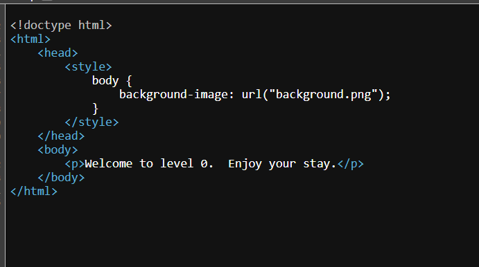

# Level 0 - A little something to get you started

**Difficulty:** Trivial  
**Category:** Web  
**Flags:** 1/1

---

## 🧠 Thought Process

When I first started the challenge, I was greeted with a welcome message:

> _"Welcome to level 0. Enjoy your stay."_

It didn’t look like there was much to interact with, so I decided to inspect the page further.

---

## 🖱️ Step 1: Check the Welcome Screen

I looked at the initial screen just to see if there was anything obvious:


Nothing stood out, so I right-clicked and selected **"View Page Source"** to dig deeper.

---

## 🔍 Step 2: View Source Code



Inside the source, I saw something interesting:

```html
<!doctype html>
<html>
    <head>
        <style>
            body {
                background-image: url("background.png");
            }
        </style>
    </head>
    <body>
        <p>Welcome to level 0.  Enjoy your stay.</p>
    </body>
</html>
```

This line stood out:

```
background-image: url("background.png");
```

## 🚪 Step 3: Try Accessing the Background Image Directly

So I typed this into the browser/URL:

```
/background.png
```

And surprisingly, it wasn’t an image at all — it just displayed the flag as plain text.

Here’s a screenshot of the flag:


## 🏁 Captured Flag

```
^FLAG^72255da2e24aef064315ba428679af0546aa1feb444da7938c0f61fff62414b0$FLAG$
```

## ✅ Summary

A perfect warm-up level. The key idea was to:

- Check the source code of the page.
- Notice the reference to an asset (background.png).
- Access that asset directly via the browser.
