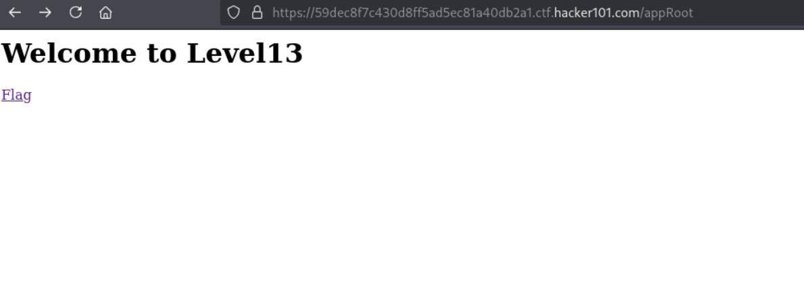
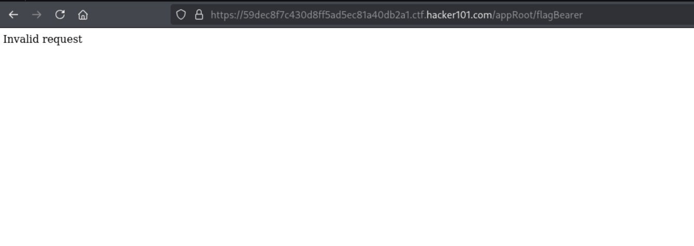
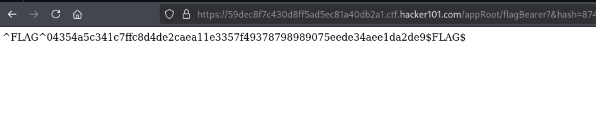

# Intentional Exercise

**Difficulty:** Moderate  
**Category:** Android  
**Flags:** 1/1  
**Status:** ✅ Completed

---

## 🧠 Thought Process

This Android challenge required reverse engineering an APK file to understand how it generates authentication hashes for accessing protected endpoints.

---

## 🔍 Step 1: Check the Hints

The first hint was clear:
> **Flag0 -- Not Found**  
> *Check the manifest*

So I downloaded the APK file and opened it in Android Studio to examine the manifest file.

---

## 📱 Step 2: Analyze the Android Manifest

Looking at the manifest file, I found multiple activities connected to it. The most interesting one was `MainActivity`, which revealed an important URL endpoint:

```
/appRoot
```

---

## 🌐 Step 3: Explore the Web Interface

I accessed the `/appRoot` endpoint in my browser:



This page contained a link labeled "Flag" which led to another endpoint.

---

## 🔗 Step 4: Follow the Flag Link

Clicking the Flag link took me to `/flagBearer`:



This page seemed to be the target, but I needed to find the right way to access the flag.

---

## 🔍 Step 5: Source Code Analysis

I went back to examine the source code more carefully and discovered several key pieces:

1. **Secret Key**: `s00p3rs3cr3tk3y`
2. **URL Construction Logic**: The code was building a URL with query parameters
3. **Hash Parameter**: Found `&hash=` in the URL construction

---

## 🧪 Step 6: Testing URL Parameters

I started building the URL step by step:

1. First tried adding `?` - no change
2. Then added `&hash=` - got "invalid hash" error


This confirmed I needed to generate a valid hash.

---

## 🔐 Step 7: Hash Generation

From analyzing the code, I determined that the hash needed to be generated from:
- **str1**: The secret key (`s00p3rs3cr3tk3y`)
- **str2**: The endpoint path (`/flagBearer`)

Using an online SHA-256 generator (https://www.movable-type.co.uk/scripts/sha256.html), I generated the hash for the concatenated string:

**Input**: `s00p3rs3cr3tk3y/flagBearer`  
**SHA-256 Hash**: `8743a18df6861ced0b7d472b34278dc29abba81b3fa4cf836013426d6256bd5e`

---

## 🎯 Step 8: Final URL Construction

The complete URL with the valid hash:

```
https://59dec8f7c430d8ff5ad5ec81a40db2a1.ctf.hacker101.com/appRoot/flagBearer?&hash=8743a18df6861ced0b7d472b34278dc29abba81b3fa4cf836013426d6256bd5e
```

---

## 🏁 Step 9: Capture the Flag

Accessing the URL with the correct hash revealed the flag:



---

## 🔑 Key Learnings

1. **Android Manifest Analysis**: Always check the manifest file for important endpoints and configuration
2. **Source Code Review**: Look for hardcoded secrets and URL construction logic
3. **Hash Authentication**: Understanding how the application validates requests through hash-based authentication
4. **String Concatenation**: The hash was generated from `secretKey + endpoint` rather than just the secret key alone

---

## 🛠️ Tools Used

- **Android Studio**: For APK analysis and source code examination
- **Web Browser**: For testing endpoints
- **Online SHA-256 Generator**: For hash generation
- **Burp Suite**: Initially attempted but not required for this solution

---

## ✅ Summary

This challenge demonstrated the importance of thorough source code analysis when reverse engineering Android applications. The key was understanding how the application constructed authenticated URLs using a secret key and endpoint path to generate SHA-256 hashes for validation.