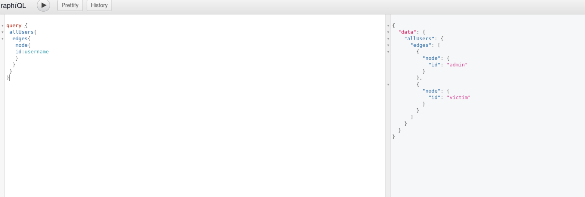
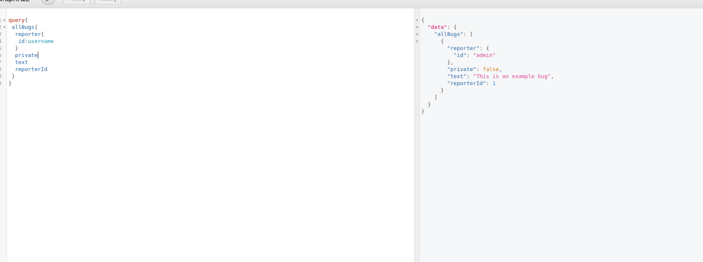

# BugDB v2

**Difficulty:** Easy  
**Category:** Web, GraphQL  
**Flags:** 1/1  
**Status:** ✅ Completed

---

## 🧠 Overview

BugDB v2 is an updated version of the original GraphQL challenge. The key to solving this challenge was understanding what changed between versions and adapting our queries accordingly. The hint "What has changed since last version?" was crucial for approaching this challenge.

---

## 🔍 Step 1: Testing Previous Queries

First, I attempted to run the exact same queries from BugDB v1 to see what had changed:

```graphql
query {
  __schema {
    types {
      name
    }
  }
}
```

After running the same introspection and field queries from the previous challenge, I discovered that many fields that existed in v1 were no longer available in v2. This indicated that the schema had been modified.

---

## 🔍 Step 2: Adapted User Query

Since the previous user query structure didn't work, I had to adapt it to the new schema:

```graphql
query {
  allUsers {
    edges {
      node {
        id
        username
      }
    }
  }
}
```

**What changed:**
- Some field names or structures were modified
- The query needed to be adjusted to match the new schema structure

This revealed the existing users in the system:



---

## 🔍 Step 3: Exploring Bug Data

Next, I tested a direct approach to query all bugs, which wasn't possible or structured the same way in v1:

```graphql
query {
  allBugs {
    reporter {
      id
      username
    }
    private
    text
    reporterId
  }
}
```

**What this does:**
- `allBugs` - Direct access to all bugs (new or modified endpoint)
- `reporter` - Gets reporter information for each bug
- `private` - Boolean indicating if the bug is private
- `text` - The bug report content
- `reporterId` - ID of the person who reported the bug

This query revealed more information about the changes in the system:



---

## 🔍 Step 4: Comprehensive Data Query

Finally, I crafted a comprehensive query that combined both user and bug data:

```graphql
{
  user {
    edges {
      node {
        id
        username
      }
    }
  }
  allBugs {
    text
    private
    reporter {
      id
    }
    reporterId
    id
  }
}
```

**What this does:**
- Combines both user and bug queries in a single request
- Gets all user information from the `user` endpoint
- Gets all bug information from the `allBugs` endpoint
- Includes all relevant fields for both data types

This comprehensive query revealed the flag hidden in the bug reports.

---

## 🔄 Key Changes from v1 to v2

### Schema Modifications
1. **Field Removal** - Some fields from v1 were removed or renamed
2. **Query Structure Changes** - The way data is accessed was modified
3. **New Endpoints** - `allBugs` became more accessible
4. **Field Relationships** - Some nested relationships were restructured

### Security "Improvements"
Despite being labeled as v2, the core security issues remained:
- **Still no proper authorization** on sensitive data
- **Introspection likely still enabled** (though schema changed)
- **Information disclosure** through unrestricted queries
- **No access controls** on private bug reports

---

## 🛠️ Attack Vector Analysis

### Version Comparison Strategy
The key insight was to:
1. **Test existing queries** from v1 to see what broke
2. **Identify removed/changed fields** through error messages
3. **Adapt queries** to the new schema structure
4. **Explore new endpoints** that might be available

### GraphQL Schema Evolution
This challenge demonstrates:
- **Schema versioning** doesn't automatically fix security issues
- **Field-level changes** can reveal new attack vectors
- **Backward compatibility** testing can expose vulnerabilities
- **Version differences** provide clues about system changes

---

## 🎯 Flag Discovery

The flag was discovered by:
1. **Recognizing schema changes** between versions
2. **Adapting queries** to the new structure
3. **Exploring new endpoints** like `allBugs`
4. **Comprehensive data extraction** using combined queries

The flag appeared in the bug report text, similar to v1, but required different query structures to access.

---

## 🛠️ Tools & Techniques Used

- **GraphQL Introspection** - Schema discovery and comparison
- **Query Adaptation** - Modifying v1 queries for v2 schema
- **Error Analysis** - Using error messages to understand changes
- **Comprehensive Querying** - Combining multiple data sources

---

## 🔑 Key Learnings

### GraphQL Versioning
1. **Schema Evolution** - Understanding how GraphQL schemas change over time
2. **Backward Compatibility** - Testing how old queries work with new schemas
3. **Field Migration** - Recognizing when fields are moved or renamed
4. **Endpoint Changes** - Identifying new or modified query endpoints

### Security Implications
1. **Version Upgrades** don't automatically fix security issues
2. **Schema changes** can introduce new vulnerabilities
3. **Field restructuring** may expose previously hidden data
4. **New endpoints** require security review

---

## ✅ Summary

BugDB v2 required:
- **Comparative analysis** between v1 and v2 schemas
- **Query adaptation** to work with the modified structure
- **Exploration of new endpoints** like `allBugs`
- **Understanding of GraphQL schema evolution**

The core vulnerability remained the same - lack of proper authorization on sensitive data - but the attack path required adaptation to the new schema structure. The hint "What has changed since last version?" was essential for understanding the approach needed to solve this challenge.