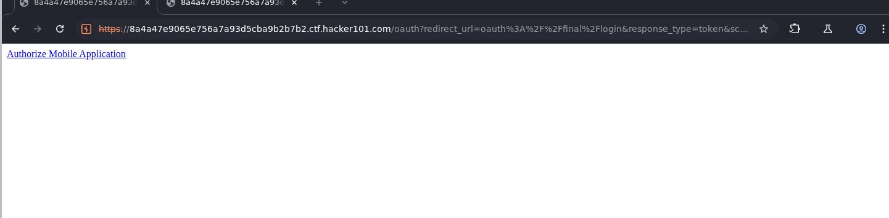
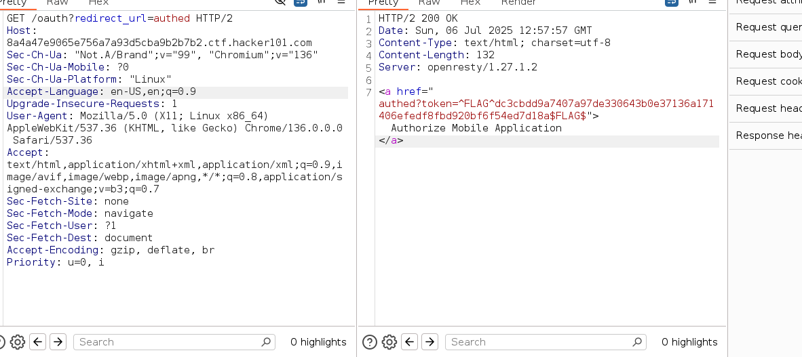
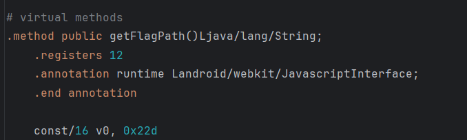
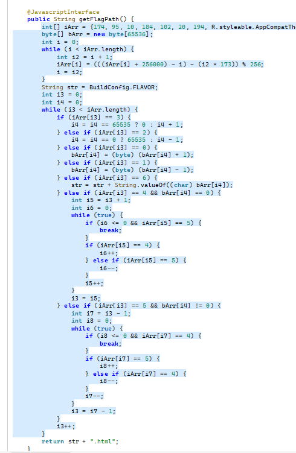

# Oauthbreaker

**Difficulty:** Moderate  
**Category:** Android/Mobile  
**Flags:** 1/2

---

## 🧠 Overview

This Android CTF challenge involves reverse engineering an APK file to find two flags. The first flag is obtained through API manipulation, while the second requires understanding and executing obfuscated code that generates a dynamic path.

---

## 🔧 Tools Used

- **Android Studio** - For running and debugging the APK
- **Burp Suite** - For intercepting and manipulating HTTP requests
- **JADX** - For decompiling and reverse engineering the APK
- **Online Java Compiler** - For executing the deobfuscated code

---

## 🚩 Flag 1: API Manipulation

### Step 1: Initial Analysis
After installing the APK, I checked the hint which mentioned examining the manifest file. Following the same pattern as previous Android challenges, I opened the APK in Android Studio and examined the manifest.

### Step 2: Code Analysis
Reading through the code, I discovered that the application constructs URLs by concatenating base URLs with additional path components, similar to previous challenges.

### Step 3: URL Discovery
When running the APK, I found the following URL being used:



### Step 4: Burp Suite Interception
I decided to use Burp Suite to intercept and analyze the HTTP requests. The code contained references to authentication mechanisms and other parameters.

### Step 5: Request Manipulation
By sending the intercepted request through Burp Suite and experimenting with different parameters, I was able to retrieve the first flag:



**First Flag Captured! 🎉**

---

## 🚩 Flag 2: Code Deobfuscation Challenge

### Step 1: WebAppInterface Analysis
Examining the `WebAppInterface.java` file, I found code that indicated a second flag could be obtained by generating a specific path:



This code suggested that some computation was needed to determine the correct flag path.

### Step 2: APK Decompilation
After struggling to understand the obfuscated logic, I decided to decompile the entire APK using JADX (https://github.com/skylot/jadx). This revealed the underlying algorithm used to generate the flag path.

### Step 3: Code Extraction and Analysis
I extracted the relevant deobfuscation code:



### Step 4: Java Implementation
I created a Java program to execute the deobfuscation algorithm:

```java
class Main {
    public static void main(String[] args) {
        int[] iArr = {174, 95, 10, 184, 102, 20, 194, 29, 205, 126, 42, 213, 137, 49, 223, 141, 59, 239, 155, 70, 244, 162, 82, 253, 173, 94, 10, 182, 100, 18, 192, 33, 201, 43, 212, 133, 48, 222, 142, 57, 233, 154, 70, 247, 160, 83, 251, 169, 87, 5, 179, 97, 21, 190, 108, 26, 200, 121, 36, 212, 127, 45, 221, 142, 58, 235, 148, 71, 240, 158, 76, 250, 173, 85, 7, 178, 96, 16, 187, 107, 28, 200, 33, 207, 131, 43, 223, 136, 54, 228, 151, 63, 237, 155, 73, 247, 165, 83, 7, 179, 94, 12, 186, 106, 21, 195, 31, 205, 125, 46, 218, 133, 51, 231, 144, 65, 236, 154, 74, 245, 165, 86, 2, 179, 91, 9, 183, 101, 19, 193, 35, 204, 122, 40, 214, 132, 50, 224, 147, 63, 234, 154, 69, 243, 163, 84, 0, 171, 95, 8, 182, 103, 18, 192, 28, 202, 122, 37, 211, 129, 49, 226, 142, 63, 232, 153, 68, 242, 160, 80, 251, 171, 92, 8, 180, 98, 16, 190, 29, 200, 38, 209, 129, 50, 222, 137, 61, 233, 148, 68, 239, 157, 77, 254, 170, 86, 9, 177, 99, 14, 188, 108, 23, 199, 36, 213, 126, 47, 218, 138, 53, 227, 147, 68, 240, 156, 79, 247, 165, 83, 1, 175, 97, 12, 188, 103, 21, 195, 36, 208, 129, 42, 221, 134, 52, 226, 144, 62, 239, 154, 74, 245, 163, 83, 4, 176, 97, 10, 184, 107, 23, 194, 32, 203, 123, 44, 216, 131, 49, 223, 141, 65, 234, 152, 70, 244, 167, 79, 3, 172, 93, 8, 184, 99, 17, 193, 30, 207, 123, 38, 212, 132, 47, 223, 144, 60, 237, 149, 67, 241, 159, 83, 251, 169, 87, 5, 185, 98, 16, 190, 26, 200, 36, 213, 128, 48, 219, 137, 57, 234, 150, 71, 243, 158, 76, 252, 167, 87, 8, 180, 95, 13, 193, 106, 24, 198, 121, 33, 207, 131, 47, 218, 138, 53, 227, 147, 68, 240, 156, 79, 247, 165, 87, 2, 178, 93, 11, 185, 105, 26, 198, 31, 205, 123, 47, 216, 134, 52, 226, 144, 62, 236, 154, 77, 246, 167, 82, 0, 174, 94, 9, 185, 106, 22, 193, 33, 204, 122, 42, 213, 133, 54, 226, 141, 59, 233, 151, 75, 244, 162, 80, 254, 172, 90, 11, 182, 102, 17, 191, 32, 204, 125, 41, 212, 130, 50, 221, 141, 62, 234, 149, 73, 245, 160, 80, 251, 169, 89, 10, 182, 97, 21, 190, 26, 200, 35, 211, 132, 48, 220, 143, 55, 233, 148, 68, 239, 157, 77, 254, 170, 85, 9, 178, 96, 14, 188, 23, 203, 34, 208, 128, 43, 219, 140, 56, 227, 145, 63, 237, 155, 79, 248, 171, 84, 2, 179, 94, 14, 185, 103, 23, 200, 37, 209, 124, 42, 218, 133, 53, 230, 146, 67, 235, 153, 71, 245, 163, 81, 5, 174, 92, 10, 184, 102, 25, 193, 29, 203, 127, 43, 214, 132, 50, 224, 142, 62, 233, 151, 69, 243, 163, 84, 0, 171, 95, 7, 187, 103, 18, 192, 27, 203, 124, 40, 211, 129, 47, 221, 139, 57, 231, 155};
        byte[] bArr = new byte[65536];
        int i = 0;
        
        // Transform the array using the deobfuscation algorithm
        while (i < iArr.length) {
            int i2 = i + 1;
            iArr[i] = (((iArr[i] + 256000) - i) - (i2 * 173)) % 256;
            i = i2;
        }
        
        // Execute the Brainf*ck-like interpreter
        String str = "";
        int i3 = 0;
        int i4 = 0;
        while (i3 < iArr.length) {
            if (iArr[i3] == 3) {
                i4 = i4 == 65535 ? 0 : i4 + 1;
            } else if (iArr[i3] == 2) {
                i4 = i4 == 0 ? 65535 : i4 - 1;
            } else if (iArr[i3] == 0) {
                bArr[i4] = (byte) (bArr[i4] + 1);
            } else if (iArr[i3] == 1) {
                bArr[i4] = (byte) (bArr[i4] - 1);
            } else if (iArr[i3] == 6) {
                str = str + String.valueOf((char) bArr[i4]);
            } else if (iArr[i3] == 4 && bArr[i4] == 0) {
                int i5 = i3 + 1;
                int i6 = 0;
                while (true) {
                    if (i6 <= 0 && iArr[i5] == 5) {
                        break;
                    }
                    if (iArr[i5] == 4) {
                        i6++;
                    } else if (iArr[i5] == 5) {
                        i6--;
                    }
                    i5++;
                }
                i3 = i5;
            } else if (iArr[i3] == 5 && bArr[i4] != 0) {
                int i7 = i3 - 1;
                int i8 = 0;
                while (true) {
                    if (i8 <= 0 && iArr[i7] == 4) {
                        break;
                    }
                    if (iArr[i7] == 5) {
                        i8++;
                    } else if (iArr[i7] == 4) {
                        i8--;
                    }
                    i7--;
                }
                i3 = i7 - 1;
            }
            i3++;
        }
        
        System.out.println("Generated path: " + str);
    }
}
```

### Step 5: Current Status - Troubleshooting

The code executes successfully and generates the path:
```
1749510184102201942920512642213137492231415923915570
```

However, when accessing:
```
https://8a4a47e9065e756a7a93d5cba9b2b7b2.ctf.hacker101.com/1749510184102201942920512642213137492231415923915570.html
```

The flag is not retrieved. 

### Possible Issues:
1. **File Extension**: The generated path might need a different file extension (`.php`, `.txt`, etc.)
2. **Path Format**: The path might need to be formatted differently (URL encoding, different structure)
3. **Authentication**: The request might need specific headers or authentication
4. **Algorithm Error**: There might be an error in the deobfuscation implementation

---

## 🔍 Next Steps for Flag 2

To resolve the second flag issue, I need to:

1. **Verify the algorithm implementation** - Double-check the deobfuscation logic
2. **Test different file extensions** - Try `.php`, `.txt`, `.jsp`, etc.
3. **Examine HTTP headers** - Check if specific headers are required
4. **Review the WebAppInterface code** - Look for additional clues about path format
5. **Test with Burp Suite** - Intercept the request and analyze the response

---

## 📚 Key Learnings

1. **Android reverse engineering** requires multiple tools and approaches
2. **Obfuscated code** can often be understood by running it with debug output
3. **API manipulation** through proxy tools is crucial for mobile app testing
4. **Persistence** is key when dealing with complex deobfuscation challenges

---

## 🛠️ Tools and Resources

- [JADX - Dex to Java decompiler](https://github.com/skylot/jadx)
- [Burp Suite - Web application security testing](https://portswigger.net/burp)
- [Android Studio - Official IDE for Android development](https://developer.android.com/studio)

---

*Challenge Status: 1/2 flags captured. Working on resolving the second flag path issue.*