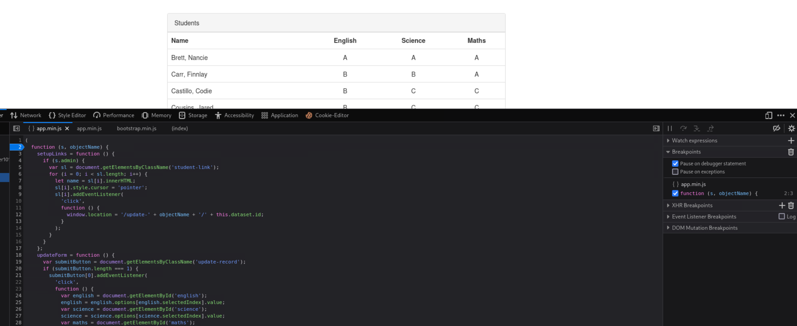
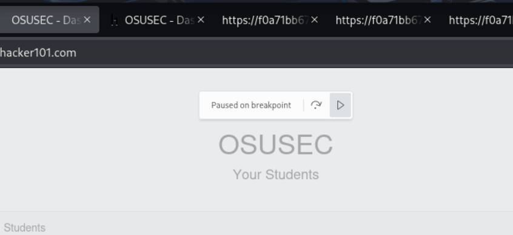
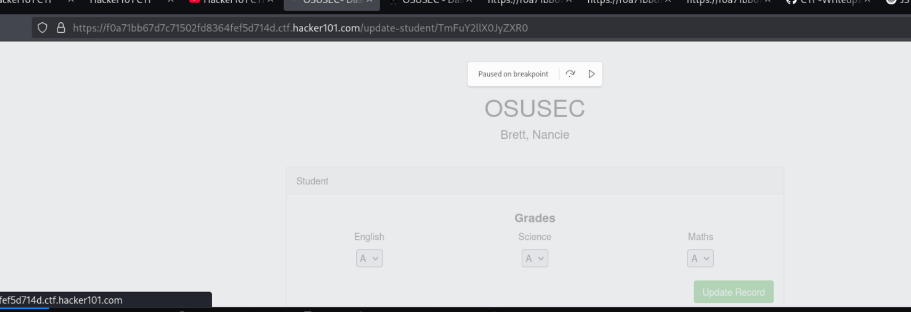
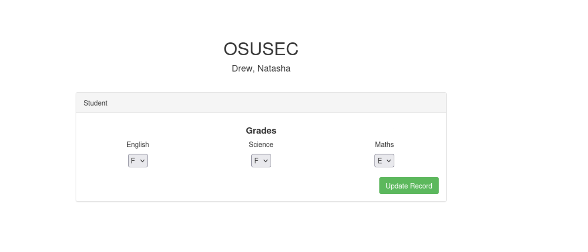
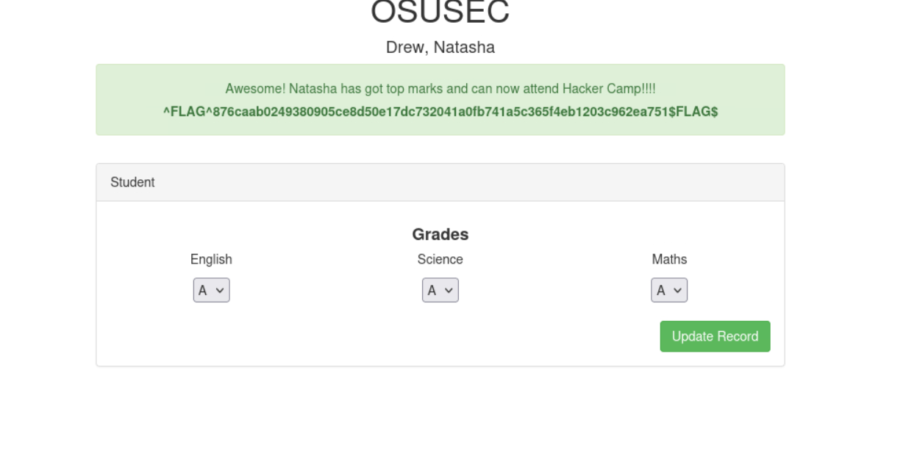

# OSU CTF

**Difficulty:** Moderate  
**Category:** Web  
**Flags:** 1/1

---

## 🧠 Overview

This challenge involves exploiting a web application with multiple vulnerabilities including SQL injection, client-side authentication bypass, and insecure direct object references. The goal is to modify a student's grades in what appears to be a university grading system.

---

## 🔓 Step 1: SQL Injection Authentication Bypass

The first step was to bypass the login mechanism using SQL injection. I used a classic SQLi payload in both the username and password fields:

```sql
admin' or '1'='1
```

This payload works by:
- Closing the original SQL query with the single quote
- Adding an `OR` condition that always evaluates to true (`'1'='1'`)
- Effectively bypassing the authentication check

**Result:** Successfully logged into the application as an admin user.

---

## 🔧 Step 2: Client-Side Authentication Bypass

After logging in, I needed to enable admin privileges on the client side. Here's how I accomplished this:

### Setting Up Breakpoints
1. Opened Browser Developer Tools (F12)
2. Navigated to the **Sources** tab
3. Located `app.min.js` file
4. Set a breakpoint at line 2



### Modifying Admin Status
1. Refreshed the page to trigger the breakpoint
2. Opened the **Console** tab
3. Executed the following JavaScript command:
   ```javascript
   staff.admin = true
   ```
4. The console returned `true`, confirming the admin status was set
5. Resumed execution by clicking the continue button



**Result:** Successfully enabled admin privileges in the client-side application.

---

## 🎯 Step 3: Exploring the Student Database

With admin privileges enabled, I could now access the student management interface. The URL structure changed to include student identifiers, and I could see various student records.

Clicking on "Brett" revealed her student profile and exposed an interesting pattern in the URL structure.



The URL contained what appeared to be an encoded identifier: `TmFuY2llX0JyZXR0`

---

## 🔍 Step 4: Base64 Decoding and Analysis

Suspecting this string was Base64 encoded, I used CyberChef to decode it:


**Discovery:** The Base64 string `TmFuY2llX0JyZXR0` decoded to `Nancie_Brett`

This revealed the pattern: the encoded identifier follows the format `FirstName_LastName`.

---

## 🎭 Step 5: Targeting Natasha Drew

Based on the challenge description mentioning "Natasha," I needed to access Natasha Drew's profile. Following the discovered pattern:

### Encoding Process:
1. **Target:** `Natasha_Drew`
2. **Base64 Encoding:** `Natasha_Drew` → `TmF0YXNoYV9EcmV3`
3. **URL Construction:** Modified the URL to include the new encoded identifier

### Accessing Natasha's Profile:
Successfully accessed Natasha Drew's admin panel:



---

## 🏆 Step 6: Grade Modification and Flag Capture

In Natasha's admin panel, I found her current grades displayed. To complete the challenge, I modified all her grades to "A":



**Flag Captured! 🎉**

---

## 🔐 Vulnerabilities Exploited

1. **SQL Injection** - Authentication bypass using `admin' or '1'='1`
2. **Client-Side Authentication** - Modified JavaScript variables to gain admin privileges
3. **Insecure Direct Object References (IDOR)** - Accessed other users' data by manipulating encoded identifiers
4. **Insufficient Access Controls** - No server-side validation of admin privileges

---

## 🛠️ Tools and Techniques Used

- **Browser Developer Tools** - For JavaScript debugging and manipulation
- **CyberChef** - For Base64 encoding/decoding operations
- **SQL Injection** - Classic authentication bypass technique
- **Client-Side Manipulation** - Modifying JavaScript variables at runtime

---

## 📚 Key Learning Points

1. **Multi-layered Exploitation** - This challenge required combining multiple attack vectors
2. **Client-Side Security is No Security** - Admin privileges controlled by client-side JavaScript
3. **Pattern Recognition** - Understanding URL/identifier patterns is crucial for IDOR attacks
4. **Encoding/Decoding Skills** - Base64 is commonly used for obfuscation in web applications

---

## 🎯 Attack Chain Summary

```
SQL Injection → Client-Side Admin Bypass → Pattern Discovery → Base64 Decoding → IDOR Exploitation → Grade Modification → Flag
```

---

## 💡 Remediation Recommendations

1. **Use parameterized queries** to prevent SQL injection
2. **Implement server-side authorization** checks
3. **Use unpredictable identifiers** instead of predictable patterns
4. **Validate all user inputs** on the server side
5. **Implement proper session management** with secure tokens

---

**Challenge Status: ✅ Completed**
