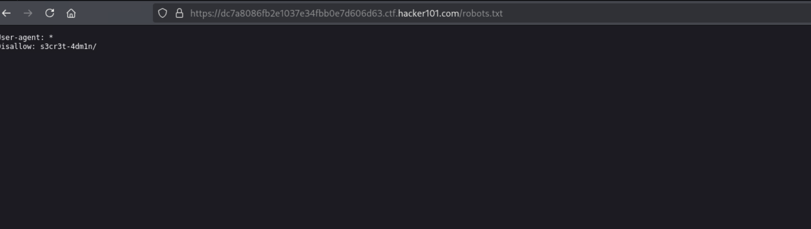
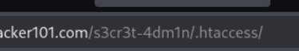
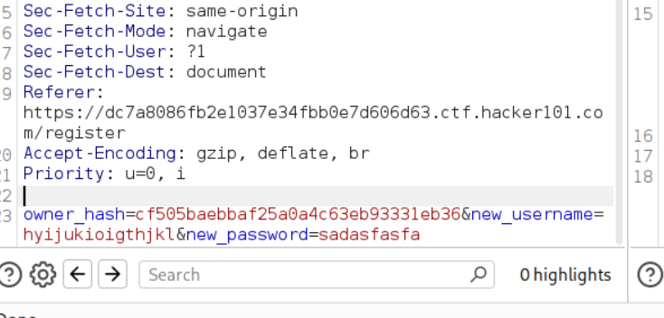
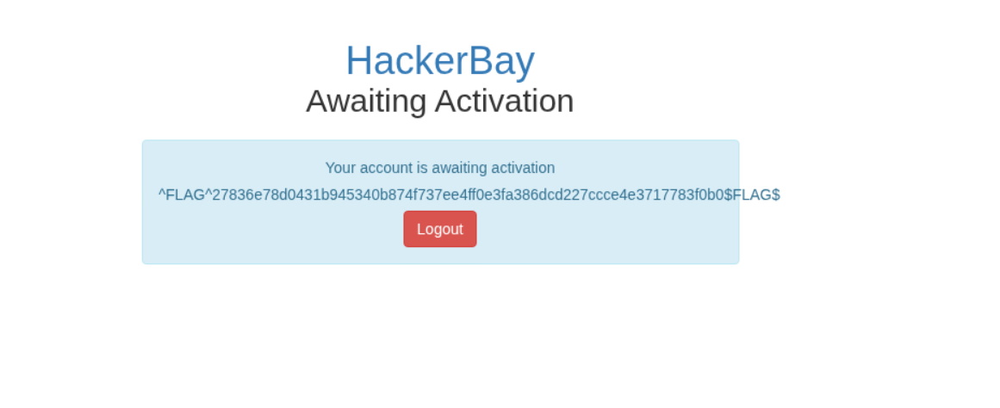

# Grayhatcon CTF

**Difficulty:** Moderate  
**Category:** Web  
**Flags:** 1/4  
**Status:** 🔄 Work in Progress

---

## 🧠 Overview

This web challenge involves bypassing IP-based access controls to access a restricted admin directory. The challenge requires understanding various IP spoofing techniques and HTTP header manipulation to circumvent the `.htaccess` restrictions.

---

## 🔍 Step 1: Initial Reconnaissance

### Directory Discovery
First, I performed directory enumeration using dirsearch and discovered that `robots.txt` exists on the target server.

### Robots.txt Analysis
Accessing `robots.txt` revealed:


This disclosed the existence of a secret admin directory: `s3cr3t-4dm1n/`

---

## 🚫 Step 2: Access Restriction Discovery

### Initial Access Attempt
When attempting to access the `/s3cr3t-4dm1n/` directory, I encountered a **403 Forbidden** error:



This indicated that access controls were in place preventing direct access to the admin directory.

---

## 🔧 Step 3: Further Reconnaissance

### .htaccess Discovery
Using dirsearch, I discovered that the `.htaccess` file was accessible:



### .htaccess Analysis
The server allowed me to download the `.htaccess` file, which contained the following access control rules:

```apache
Order Deny,Allow
Deny from all
Allow from 8.8.8.8
Allow from 8.8.4.4
```

**Analysis:** The configuration denies access from all IPs except:
- `8.8.8.8` (Google DNS)
- `8.8.4.4` (Google DNS)

---

## 🎯 Step 4: IP Spoofing Attempts

### X-Forwarded-For Header
I attempted to bypass the IP restriction using the `X-Forwarded-For` header:

```bash
curl https://dc7a8086fb2e1037e34fbb0e7d606d63.ctf.hacker101.com/s3cr3t-4dm1n/ \
  -H "X-Forwarded-For: 8.8.4.4"
```

**Result:** Still received 403 Forbidden error.

### Current Status
The basic IP spoofing attempt failed. This suggests that either:
1. The server is not configured to trust the `X-Forwarded-For` header
2. Additional headers are required
3. A different IP spoofing technique is needed

---

## 🔄 Next Steps and Alternative Approaches

### Additional Headers to Try:
1. **X-Real-IP**: Another common header for IP forwarding
   ```bash
   curl -H "X-Real-IP: 8.8.8.8" [URL]
   ```

2. **X-Originating-IP**: Sometimes used by mail servers and proxies
   ```bash
   curl -H "X-Originating-IP: 8.8.8.8" [URL]
   ```

3. **X-Remote-IP**: Alternative IP header
   ```bash
   curl -H "X-Remote-IP: 8.8.8.8" [URL]
   ```

4. **X-Client-IP**: Client IP header
   ```bash
   curl -H "X-Client-IP: 8.8.8.8" [URL]
   ```

### Combined Header Approach:
Try multiple headers simultaneously:
```bash
curl https://dc7a8086fb2e1037e34fbb0e7d606d63.ctf.hacker101.com/s3cr3t-4dm1n/ \
  -H "X-Forwarded-For: 8.8.8.8" \
  -H "X-Real-IP: 8.8.8.8" \
  -H "X-Originating-IP: 8.8.8.8" \
  -H "X-Remote-IP: 8.8.8.8" \
  -H "X-Client-IP: 8.8.8.8"
```

### Alternative IP Formats:
1. **IPv6 format**: Try converting the IPs to IPv6
2. **Decimal format**: Convert IP to decimal representation
3. **Hex format**: Convert IP to hexadecimal

### Proxy Chain Simulation:
```bash
curl -H "X-Forwarded-For: 192.168.1.1, 8.8.8.8" [URL]
```

---

## 🛠️ Tools and Techniques

- **dirsearch** - Directory enumeration
- **curl** - HTTP request manipulation
- **Burp Suite** - Web application testing (mentioned for 403 bypass attempts)

---

## 📚 Technical Notes

### .htaccess IP Restriction Bypass Methods:
1. **Header Manipulation** - Using various IP forwarding headers
2. **Proxy Spoofing** - Simulating requests through allowed proxies
3. **IPv6 Conversion** - Converting allowed IPs to different formats
4. **Double Encoding** - URL encoding the IP addresses

### Common IP Spoofing Headers:
- `X-Forwarded-For`
- `X-Real-IP`
- `X-Originating-IP`
- `X-Remote-IP`
- `X-Client-IP`
- `X-Forwarded-Host`
- `X-Remote-Addr`

---

## 🎯 Current Challenge Status

- ✅ **Reconnaissance Complete** - Found admin directory and access controls
- ✅ **.htaccess Analysis** - Understand IP restrictions (8.8.8.8, 8.8.4.4)
- ❌ **Initial Bypass Attempt** - X-Forwarded-For header unsuccessful
- 🔄 **Next Phase** - Try alternative IP spoofing techniques

---

## 💡 Lessons Learned So Far

1. **Always check robots.txt** - Can reveal hidden directories
2. **Enumerate accessible configuration files** - .htaccess, .env, etc.
3. **Understand access control mechanisms** - IP restrictions, user agents, etc.
4. **Multiple bypass techniques exist** - Don't stop at first failed attempt

---

## 🎯 Flag 2: Account Takeover via Owner Hash Manipulation

### Step 1: User Enumeration
I discovered that the application has a password reset functionality. Using this feature, I attempted to reset the password for the user "hunter" (who was mentioned as selling the Username/Password List).

### Step 2: Hash Extraction
When submitting a password reset request for the user "hunter" through Burp Suite, I captured the following response containing the account hash:

```
cf505baebbaf25a0a4c63eb93331eb36
```



### Step 3: Account Creation Exploit
I discovered that during the account creation process, I could manipulate the `owner_hash` parameter to create a sub-account under the "hunter" user.

**Exploit Payload:**
```
owner_hash=cf505baebbaf25a0a4c63eb93331eb36&new_username=[my_username]
```

By injecting the `owner_hash` parameter before the `new_username` parameter, I successfully created an account that was associated with the "hunter" user as a sub-account.

### Step 4: Flag Capture
After creating the sub-account under "hunter", I was able to access the second flag:



**Second Flag Captured! 🎉**

---

## 🔐 Vulnerabilities Exploited (Flag 2)

1. **Information Disclosure** - Password reset function leaked account hashes
2. **Insecure Direct Object References** - Account creation accepted arbitrary owner_hash values
3. **Insufficient Input Validation** - No validation of owner_hash parameter during account creation
4. **Privilege Escalation** - Created sub-account under target user to gain access

---

## 🛠️ Tools Used

- **Burp Suite** - For intercepting and modifying HTTP requests
- **dirsearch** - Directory enumeration
- **curl** - HTTP request manipulation

---

## 📚 Key Learning Points

1. **Password Reset Functions** can leak sensitive information like user hashes
2. **Parameter Manipulation** during account creation can lead to privilege escalation
3. **Hash-based Authorization** systems need proper validation
4. **Information Disclosure** in one function can be chained with other vulnerabilities

---

## 🎯 Current Challenge Status

- ✅ **Flag 1** - Still working on .htaccess bypass
- ✅ **Flag 2** - Account takeover via owner hash manipulation
- ❌ **Flag 3** - Not yet discovered
- ❌ **Flag 4** - Not yet discovered

---

**Challenge Status: 🔄 In Progress (1/4 flags captured)**

*Flag 1 (.htaccess bypass) still needs different IP spoofing techniques. Flags 3 and 4 require further enumeration and exploitation.*