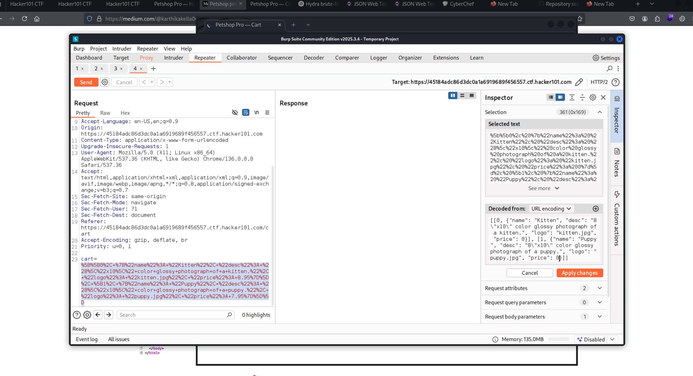
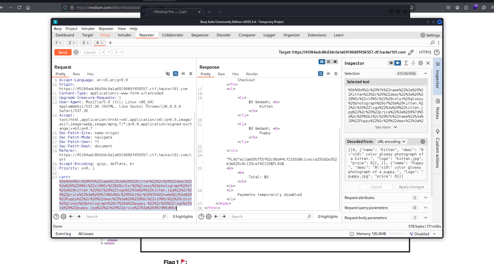
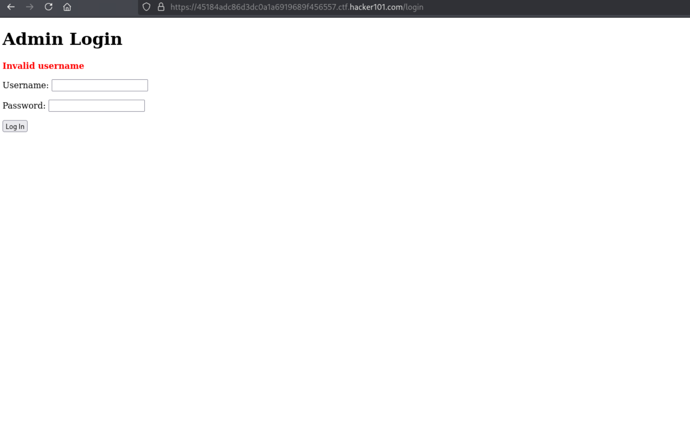

# Petshop Pro
**Difficulty:** Easy  
**Category:** Web  
**Flags:** 1/3 (In Progress)

---

## 🧠 Thought Process
When I first accessed the Petshop Pro application, I immediately examined the shopping cart functionality based on the hint about checkout appearing "out of place." The application appeared to be an e-commerce platform selling pets with a shopping cart system, user authentication, and administrative capabilities.

The hints provided clear direction:
1. *"Something looks out of place with checkout"*
2. *"It's always nice to get free stuff"*
3. *"There must be a way to administer the app"*

This suggested three main attack vectors:
1. **Price manipulation** or checkout bypass vulnerabilities
2. **Administrative panel** discovery and authentication bypass
3. **Cross-Site Scripting (XSS)** for the final flag

---

## 🔍 Step 1: Initial Reconnaissance
I started by exploring the application's functionality, focusing on the shopping cart and checkout process. The application allowed users to add pets (kittens and puppies) to their cart and proceed through a checkout process.

Key observations:
- Shopping cart functionality with pet selection
- Checkout process with potential price manipulation
- Administrative login functionality
- Image editing capabilities

---

## 🚩 Step 2: First Flag - Price Manipulation via Request Tampering
Following the hint about checkout looking "out of place," I investigated the checkout process with items in my cart. Initially, checking out without any items didn't reveal anything suspicious.

However, when I added a kitten and puppy to my cart and intercepted the checkout request with Burp Suite, I discovered something interesting in the request parameters.

**Discovery Process:**
1. Added kitten and puppy to shopping cart
2. Proceeded to checkout while intercepting with Burp Suite
3. Analyzed the request parameters and found manipulatable price values
4. Modified the request to alter the total cost

The intercepted request revealed that price information was being passed as client-side parameters, making it vulnerable to tampering. By modifying these values, I could potentially get the items for free or at a reduced price.

After sending the modified request, I successfully completed the checkout and obtained the first flag.

### 🔬 Technical Explanation: Client-Side Price Manipulation

This vulnerability occurs when e-commerce applications trust client-side data for critical operations like pricing. Common issues include:

1. **Client-Side Price Storage:** Prices stored in hidden form fields or client-side variables
2. **Lack of Server-Side Validation:** No verification of price integrity on the backend
3. **Direct Parameter Acceptance:** Server accepts price values directly from client requests
4. **Missing Business Logic Validation:** No checks against legitimate product prices

This allows attackers to modify prices, apply unauthorized discounts, or even get products for free.

---

## 🔐 Step 3: Second Flag - Administrative Panel Discovery and Authentication
The second hint indicated: *"There must be a way to administer the app"*

I began searching for administrative functionality using both automated and manual approaches.

**Discovery Methods:**
1. **Manual URL Guessing:** Tried common admin paths like `/admin`, `/login`, `/administrator`
2. **Directory Enumeration:** Considered using tools like dirsearch for comprehensive discovery

I successfully discovered the administrative login page at `/login`.

**Authentication Bypass Attempts:**
1. **Brute Force Attack:** Attempted to brute force both username and password fields
2. **Tool Selection:** Initially tried Burp Suite but found it too slow for this task
3. **Hydra Alternative:** Considered switching to Hydra for faster brute force attacks
4. **SQL Injection Testing:** Attempted common SQL injection payloads but found the application had protection against basic injections

**Note:** While brute forcing worked in this CTF environment, this approach would be problematic in real-world scenarios due to:
- Rate limiting mechanisms
- IP-based blocking
- Account lockout policies
- Intrusion detection systems

**Status:** Flag 2 requires successful authentication to the admin panel. The brute force approach is time-consuming but feasible in this CTF context.

---

## 🖼️ Step 4: Unauthorized Access Discovery
During my exploration, I discovered an interesting endpoint that allows unauthorized access to administrative functions:

**URL:** `/edit?id=0`

This endpoint allows editing of images/content even without admin authentication, representing a significant authorization bypass vulnerability.

### 🔬 Technical Explanation: Insecure Direct Object Reference (IDOR)

This vulnerability demonstrates an **Insecure Direct Object Reference (IDOR)** where:
1. **Missing Access Controls:** No verification of user permissions before allowing access
2. **Direct Object Access:** Direct access to resources via URL parameters
3. **Insufficient Authorization:** Authentication bypass for administrative functions
4. **Parameter Manipulation:** Ability to access different resources by changing ID values

---

## 🎯 Step 5: Third Flag - Cross-Site Scripting (XSS) Approach
For the final flag, the approach involves exploiting Cross-Site Scripting vulnerabilities:

**Planned Attack Vector:**
1. **Comment XSS:** Inject malicious scripts into comment fields
2. **Image Upload XSS:** Embed XSS payloads in image metadata or descriptions
3. **Stored XSS:** Create persistent XSS that triggers when admin views the content

**Process:**
1. Add XSS payload to comments or image descriptions
2. Save the malicious content
3. Navigate back to trigger the XSS
4. Capture the flag when the payload executes

**Status:** This approach requires further testing and payload refinement.

---

## 🏁 Captured Flags
- **Flag 1:** ✅ Obtained through price manipulation in checkout process
- **Flag 2:** 🔄 In progress - requires admin authentication bypass
- **Flag 3:** 🔄 In progress - requires XSS exploitation

---

## ✅ Summary
This challenge demonstrates several common web application vulnerabilities:

### Discovered Vulnerabilities:
1. **Client-Side Price Manipulation:** Trust in client-side data for critical business logic
2. **Insecure Direct Object Reference:** Unauthorized access to administrative functions
3. **Weak Authentication:** Susceptible to brute force attacks
4. **Potential XSS:** Comment and image upload functionality may be vulnerable

### Security Implications:
- **Financial Loss:** Price manipulation can lead to significant revenue loss
- **Data Breach:** Administrative access bypass can expose sensitive information
- **Account Takeover:** Weak authentication enables unauthorized access
- **Cross-Site Scripting:** XSS can lead to session hijacking and data theft

### Root Causes:
- **Insufficient Input Validation:** Client-side data trusted without server-side verification
- **Missing Access Controls:** No proper authorization checks for administrative functions
- **Weak Authentication Mechanisms:** Passwords susceptible to brute force
- **Inadequate Output Encoding:** Potential XSS due to insufficient sanitization

---

## 🛠️ Tools Used
- **Burp Suite** - For request interception and modification
- **Hydra** - For brute force authentication attacks
- **Manual Testing** - For discovering IDOR and XSS vulnerabilities
- **Browser Developer Tools** - For analyzing client-side behavior

---

## 🔧 Prevention Recommendations
1. **Server-Side Validation:** Always validate prices and business logic on the server
2. **Proper Access Controls:** Implement role-based access control for administrative functions
3. **Strong Authentication:** Use complex passwords and implement rate limiting
4. **Input Sanitization:** Properly sanitize and validate all user inputs
5. **Output Encoding:** Encode all user-generated content to prevent XSS

---

## 🎯 Key Learning Points
- E-commerce applications are particularly vulnerable to price manipulation attacks
- Client-side data should never be trusted for critical business operations
- IDOR vulnerabilities can provide unauthorized access to administrative functions
- Multiple attack vectors often exist in a single application
- CTF environments allow for aggressive testing that wouldn't be appropriate in production

---

## 📋 Next Steps
1. Complete brute force attack on admin panel for Flag 2
2. Develop and test XSS payloads for Flag 3
3. Document successful exploitation techniques
4. Analyze additional attack vectors for comprehensive coverage