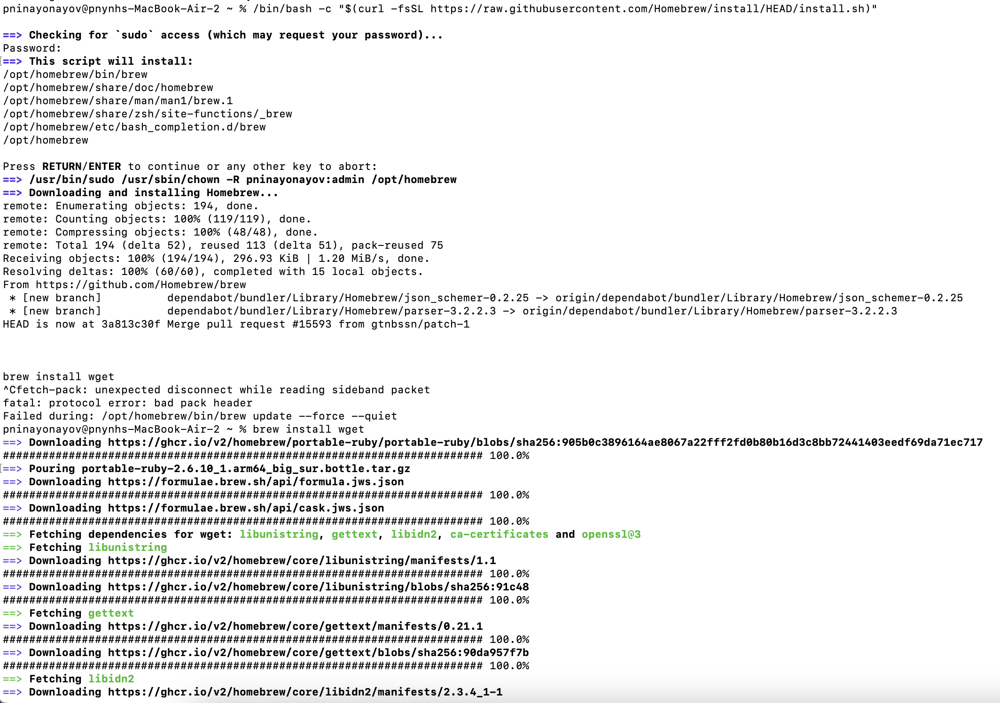
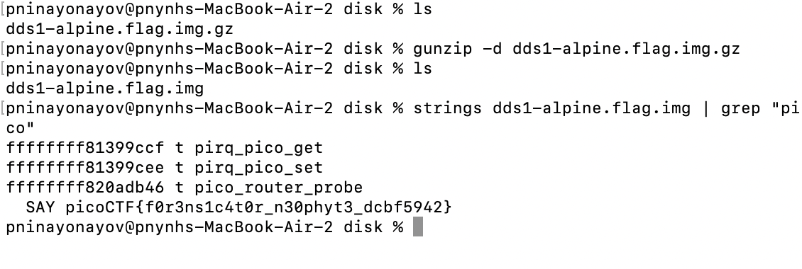
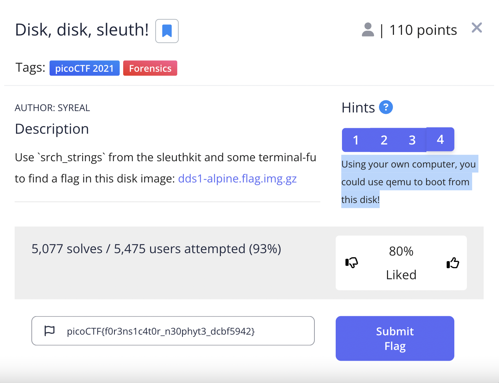
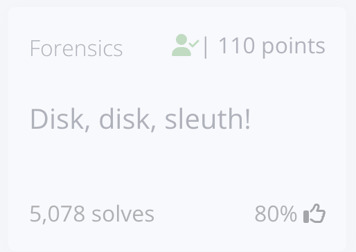

## Disk, disk, sleuth!
This is the write-up for the challenge "who is this" challenge in PicoCTF

### The challenge

Use `srch_strings` from the sleuthkit and some terminal-fu to find a flag in this disk image: dds1-alpine.flag.img.gz

### Hint

Have you ever used `file` to determine what a file was?

Relevant terminal-fu in picoGym: https://play.picoctf.org/practice/challenge/85

Mastering this terminal-fu would enable you to find the flag in a single command: https://play.picoctf.org/practice/challenge/48

Using your own computer, you could use qemu to boot from this disk!

### How to solve it

The challenge commenced with the task of downloading wget onto my Mac using the Terminal.

Once wget had successfully made its way into my arsenal, it was time to tackle the next challenge: unzipping the downloaded file. 

Then I search by the string "pico" and found the flag:)

the flag is: picoCTF{f0r3ns1c4t0r_n30phyt3_dcbf5942}

