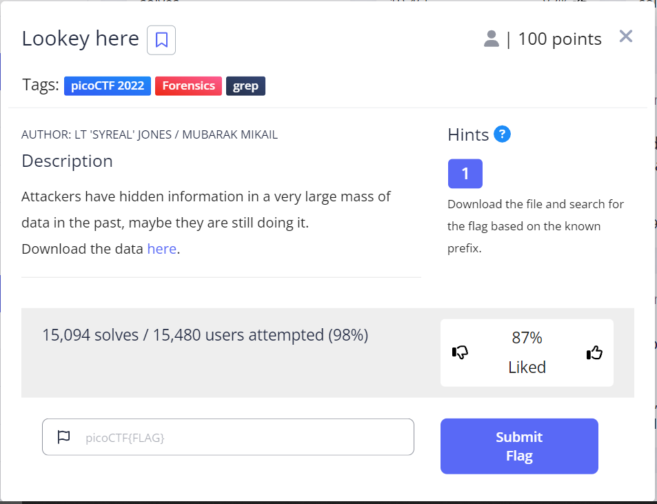
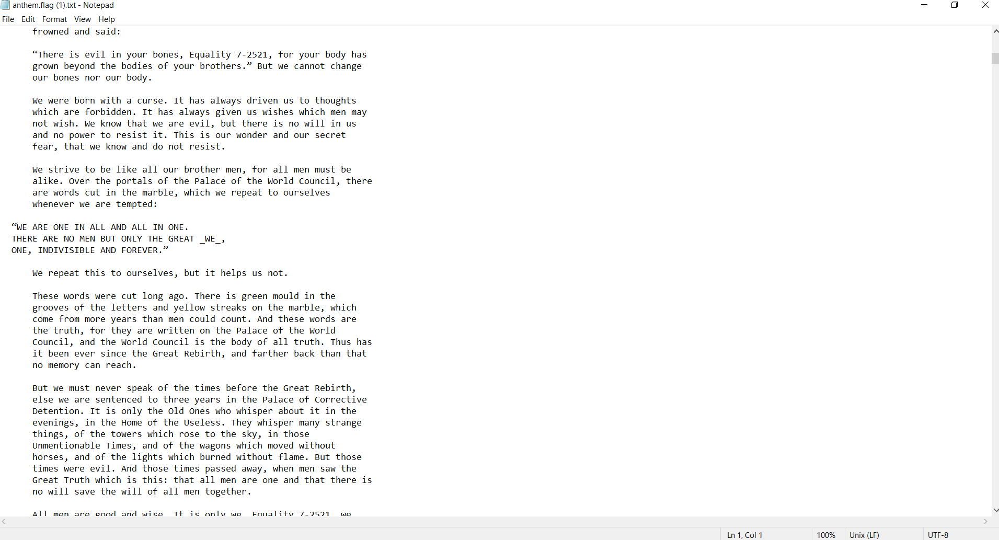
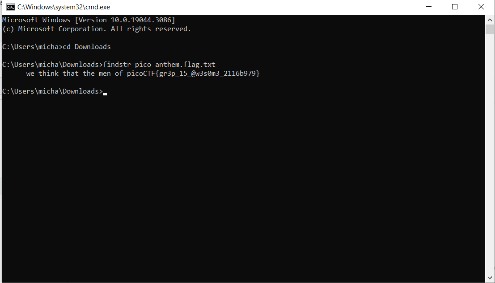
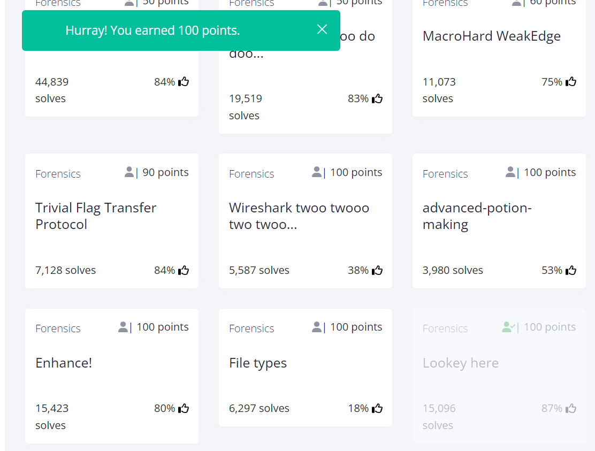

# Lookey here
This is the write-up for the challenge "Lookey here" challenge in PicoCTF

#The challenge
Attackers have hidden information in a very large mass of data in the past, maybe they are still doing it.
Download the data <a href="https://artifacts.picoctf.net/c/126/anthem.flag.txt" download target="_blank">here</a>

##Hints
1. Download the file and search for the flag based on the known prefix.

## Initial look
I have downloaded the above link file. I have found out that its a large txt file.

I opened the terminal, and i searched with a findstr command the key in the file anthem.flag.txt.  
findstr pico anthem.flag.txt.

The flag is: 'picoCTF{gr3p_15_@w3s0m3_2116b979}'

