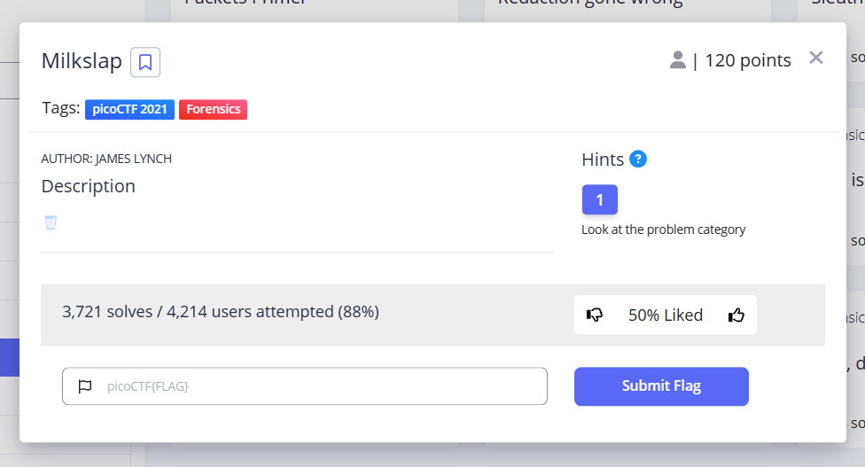
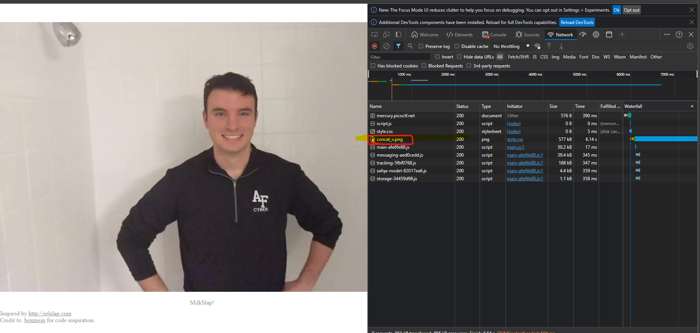
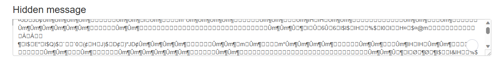
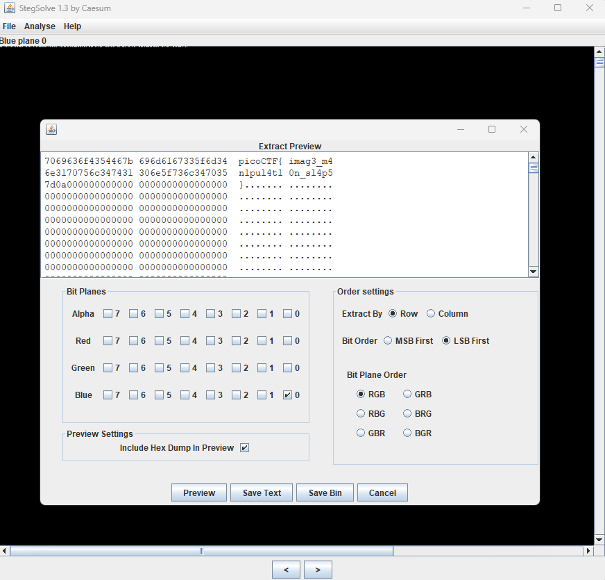

# Milkslap

This is the write-up for the "Milkslap" challenge in PicoCTF.

## The Challenge


## Hints
- Look at the problem category
## Initial Look
plays an animation of a person standing in a shower getting a glass of milk
splashed in his face as you move the mouse over the picture.

# How to solve it

- First I viewed the html content and found 2 links that are not helping
We can see that the image div isn't containing any links, so I viewed the other files
```html
<!doctype html>

<html lang="en">
<head>
  <meta charset="UTF-8" />
  <meta name="viewport" content="width=400" />
  <title>🥛</title>
  <link rel="stylesheet" href="style.css" />

</head>
<body>
  <div id="image" class="center"></div>
  <div id="foot" class="center">
    <h1>MilkSlap!</h1>
    Inspired by <a href="http://eelslap.com">http://eelslap.com</a> <br>
    Credit to: <a href="https://github.com/boxmein">boxmein</a> for code inspiration.
  </div>
  <script src="script.js">


</script>
</body>
</html>

```
- The JavaScript code recalculates the position of the background based on the mouse cursor’s location over the page
- we can see no URL for the image in line: var image = document.getElementById("image");
- so I looked in the CSS file
```javascript

var currentX = 0;
var tweenedPageX = 0;
var background_y = 0;
var frame_num = 0;
var background_max = 46800;
var image = document.getElementById("image");
var image_bcr = image.getBoundingClientRect();
var image_right_coord = 0;
var image_left_coord = 0;
var mouse_depth = 0;
var frame_ht = 720;
var mousepct = 0;
var frameinterval =  0.016;
var totalX = window.outerWidth;

function animate(e){
  image_right_coord = image_bcr.right;
  image_left_coord = image_bcr.left;
  currentX = e.x;
  mouse_depth = Math.max(image_right_coord - currentX, 0);

  mousepct = mouse_depth / image_bcr.width;  
  frame_num = Math.round(mousepct / frameinterval);

  background_y = -1 * frame_ht * (frame_num + 1);
  image.style.backgroundPositionY = background_y.toString() + "px";
}

function touch_animate(e){
  image_right_coord = image_bcr.right;
  image_left_coord = image_bcr.left;
  currentX = e.touches[0].clientX;
  mouse_depth = Math.max(image_right_coord - currentX, 0);

  mousepct = mouse_depth / image_bcr.width;
  
  frame_num = Math.round(mousepct / frameinterval);
  
  background_y = -1 * frame_ht * (frame_num + 1);
  image.style.backgroundPositionY = background_y.toString() + "px";
}

image.onmousemove = animate;
image.ontouchmove = touch_animate;

```

- so i looked in the css file and found url(concat_v.png),yet I can't download or open
```css
/* source: milkslap-milkslap.scss */
body {
  margin: 0;
  padding: 0;
  overflow: hidden; }

a {
  color: inherit; }

.center {
  width: 1080px;
  height: 720px;
  margin: 0 auto; }

#image {
  height: 720px;
  margin-top: 5%;
  margin-bottom: 20px;
  background-image: url(concat_v.png);
  background-position: 0 0; }

#foot {
  margin-bottom: 5px;
  color: #999999; }
  #foot h1 {
    font-family: serif;
    font-weight: normal;
    font-size: 1rem;
    text-align: center; }

```
- Finally, I checked the Network tab and found the image there.



- it's a very tall PNG image containing the frames used in the animation
- the link to image `http://mercury.picoctf.net:29522/concat_v.png`
- After downloading the image I tried different tools to find the message, which failed



- but finally, I got a result using Stegsolve




The flag is: `picoCTF{imag3_m4n1pul4t10n_sl4p5}`
