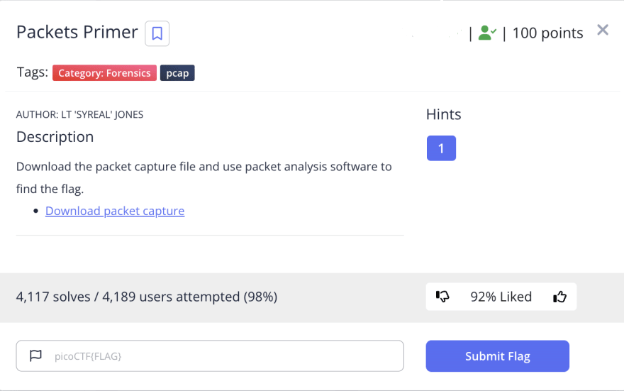
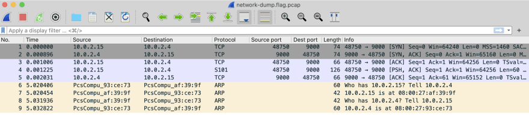
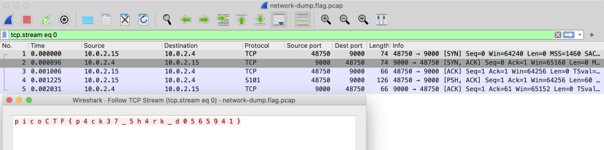

# Packets Primer

This is the write-up for the challenge "Packets Primer" challenge in PicoCTF

# The challenge

## Description
Download the packet capture file and use packet analysis software to find the flag.
Download packet capture



## Hints
1. Wireshark, if you can install and use it, is probably the most beginner friendly packet analysis software product.

## Initial look
file named "network-dump.flag" contain packet capture
# How to solve it
We have been provided with a file named "network-dump.flag.pcap" for analysis. To examine its contents, we can open it using a network protocol analyzer tool 
such as Wireshark. By doing so, we can inspect the captured network traffic and gather more details about the file.
Upon opening the "network-dump.flag.pcap" file in Wireshark, we can observe various details about the captured network traffic. 
These details include:(what i get in Wireshark):


After opening the "network-dump.flag.pcap" file in Wireshark, I took a closer look at the captured network traffic by following the TCP stream. 
This feature in Wireshark allows us to reconstruct and view the complete conversation between the source and destination for a specific TCP connection. 
By following the TCP stream, I was able to uncover the flag that was hidden within the network communication.
When following the TCP stream, Wireshark displays the entire content of the TCP conversation in a readable format.
This includes both the request and response messages exchanged between the client and server. 
By inspecting the stream, I found the specific message or data that contained the flag.
The flag might have been embedded within one of the packets or spread across multiple packets within the TCP stream. 
By analyzing the stream's contents, I paid attention to any textual or encoded data that could potentially represent the flag.
In addition to analyzing the TCP stream, I also considered other important factors such as the source and destination IP addresses, port numbers, and timing information.
These details helped me correlate the captured network traffic with the TCP stream and identify the relevant packets or conversations
that could potentially contain the flag.
After careful examination, I successfully located the flag within the TCP stream, 
allowing me to extract the hidden information and fulfill the objective of the analysis


Voila!!! 😎

the flag is:
```bash
p4ck37_5h4rk_d0565941
```

The flag is `picoCTF{p4ck37_5h4rk_d0565941}`

