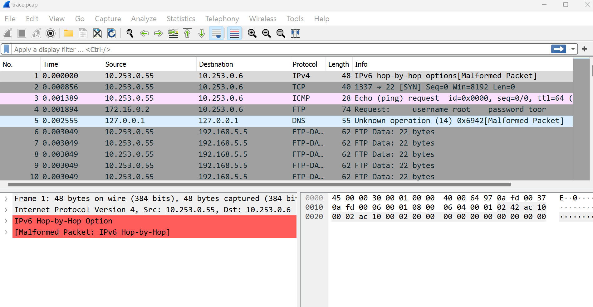
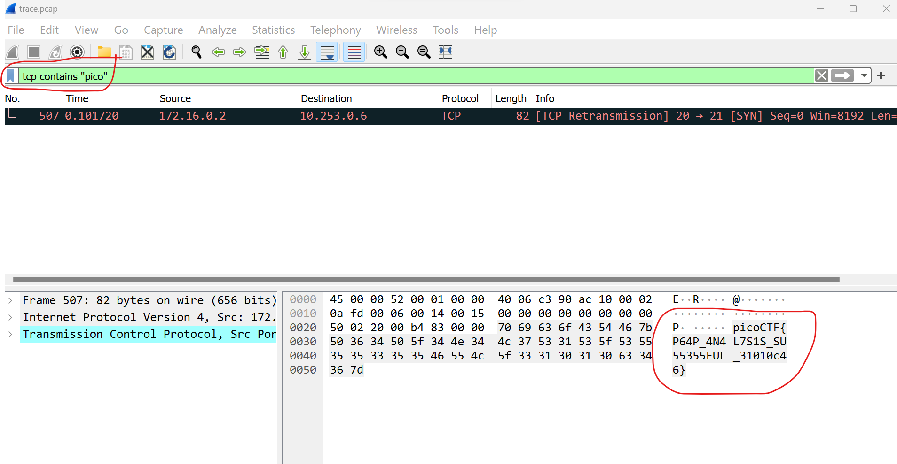

# PcapPoisoning
This is the write-up for the challenge "PcapPoisoning" challenge in PicoCTF

# The challenge
How about some hide and seek heh?
Download the file in "file" directory and find the flag

## Hints
None

## Solution
I have downloaded the above link file. I open this file and its opened in wireshark app

I searched with a search bar the words: tcp contains "pico"  and i found the message with the flag

### The flag is: 'picoCTF{P64P_4N4L7S1S_SU55355FUL_31010c46}'

