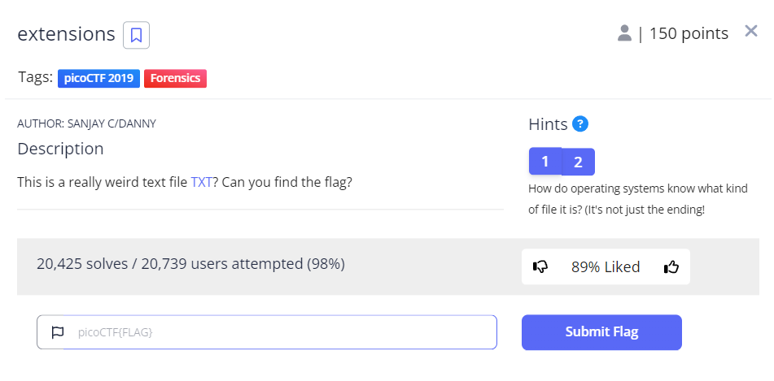
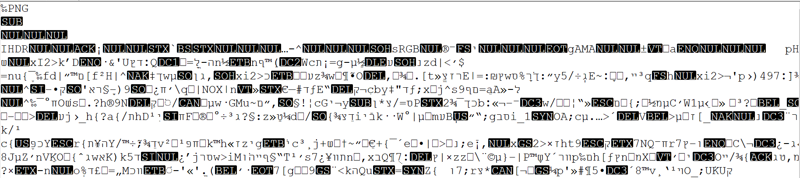

# Extentions

This is the write-up for the challenge "Extentions" challenge in PicoCTF

# The challenge

## Description
This is a really weird text file TXT? Can you find the flag?

## Hints
1. How do operating systems know what kind of file it is? (It's not just the ending!)
2.Make sure to submit the flag as picoCTF{XXXXX}

## Initial look
after we download a file we got flag.txt 
from the first clue we can understand that maybe txt isnt the file type we are looking for.
we should look for clue that may be written in the file

# How to solve it
when opening the file we got this jibrish :

we can see the first word that is written is PNG which is an optional type file
from the first clue we know that it is a possibilty that reading the file with different type
will give us the answer so lets change the file.txt to file.png and try to open it
we got : 

The flag is `picoCTF{now_you_know_about_extensions}`

Cheers 😄
