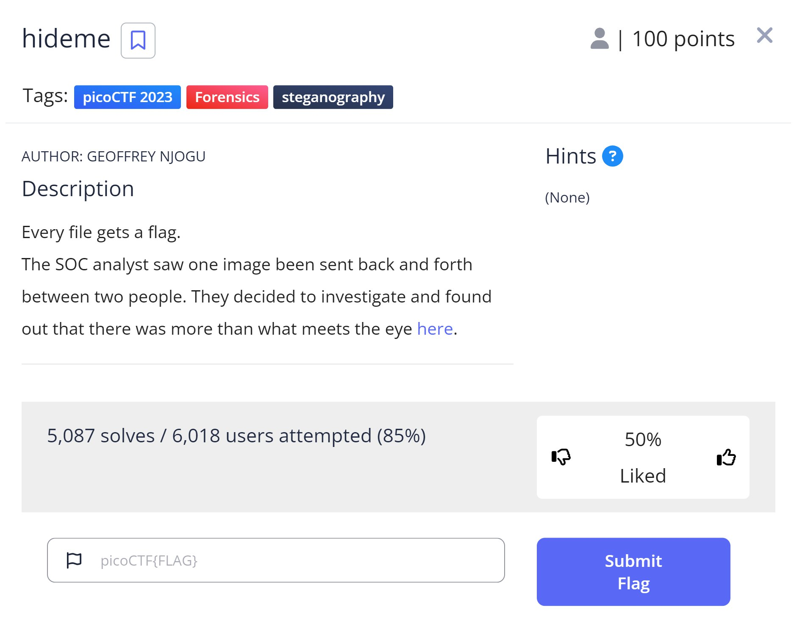
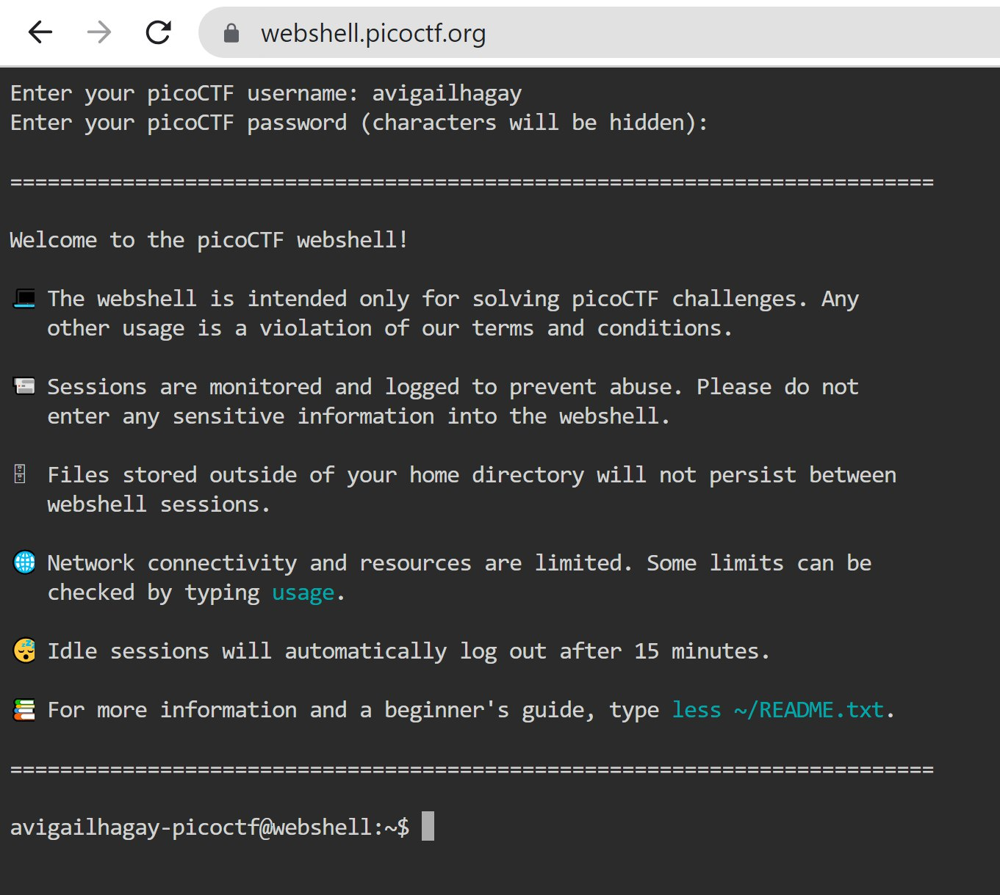
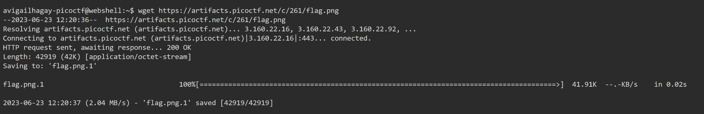
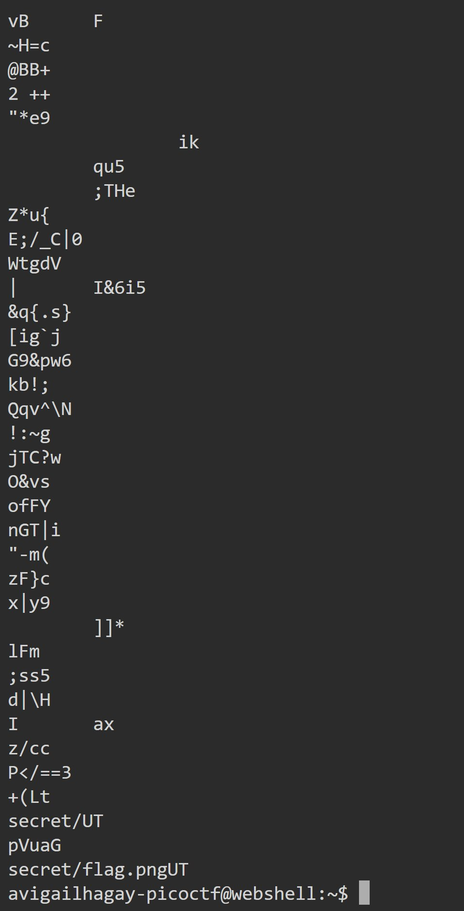
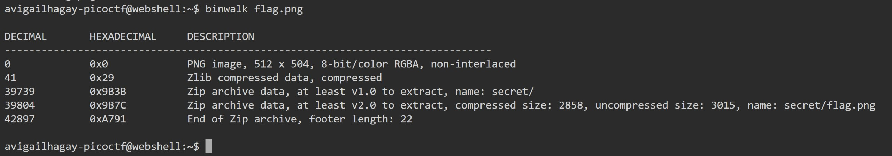
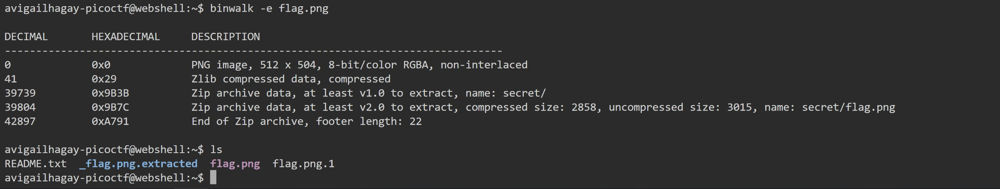
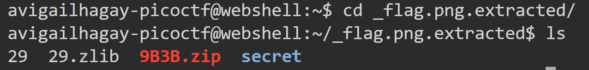
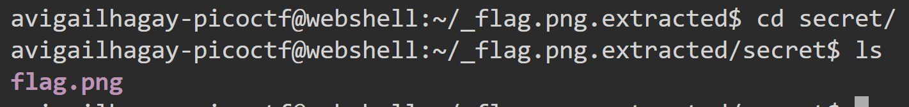
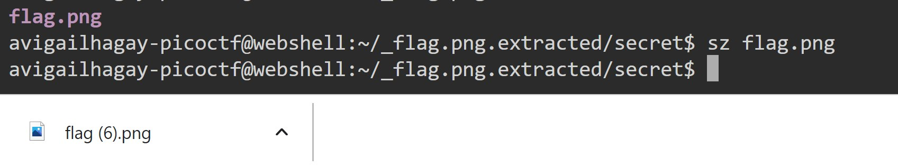

<h1 style="font-size: 48px;">"hideme" Challenge README</h1>
<h2 style="font-size: 20px;">Challenge Description :memo:</h2>
In the "hideme" challenge, the role of a Security Operations Center (SOC) analyst is assumed. An image file being frequently exchanged between two individuals has caught the analyst's attention. The task at hand is to investigate this image, as there seems to be more to it than meets the eye.

The image appears to be a normal PNG file, but upon closer inspection, a hidden file embedded within it is discovered. The goal of this challenge is to uncover this hidden file and extract the flag it contains.

To solve this challenge, various tools and techniques are employed, including:

- The `strings` command to analyze the image and look for hidden strings.
- The `binwalk` tool to confirm the presence of the hidden file and extract it.

#### Objective:

Find the flag hidden within the image file.

 

#### The image:
 

<h2 style="font-size: 20px;">Hint :bulb:</h2>
None.😢

<h2 style="font-size: 20px;">Challenge Goals :dart:</h2>
The primary goal of the "hideme" challenge is to uncover and extract a hidden flag within an image file. This involves the application of various digital forensics and steganography techniques. The challenge is successfully completed when the hidden flag is found and extracted.

<h2 style="font-size: 20px;">Challenge Solution &#10004;</h2>

#### Step 1: Accessing the Webshell

The initial step in solving the "hideme" challenge involved navigating to the provided URL, "https://webshell.picoctf.org/". This URL led to a webshell, a web-based interface that allows for command execution on the server. To gain access to the webshell, the picoCTF username and password were entered as credentials.
 

#### Step 2: Downloading the Image

The subsequent step involved obtaining the URL of the image referenced in the task description. This was accomplished by utilizing the browser's inspector tool. Once the URL was identified and copied, it was then pasted into the webshell. 
 

 The `wget` command was used within the webshell to download the image for further analysis.
 

#### Step 3: Analyzing the Image with Strings

In this step, the `strings` command was employed to analyze the downloaded image. The `strings` command is a utility that prints sequences of printable characters found in a binary file. In the context of this challenge, it was used to search for any hidden strings within the image file, providing a preliminary look into potential hidden data.

#### Step 4: Identifying a Hidden File Path

Upon executing the `strings` command, the output revealed a notable string: `secret/flag.pngUT`. This string suggests the presence of a hidden file path within the image. This observation led to the hypothesis that there might be secret files embedded within the image, warranting further investigation:
 

#### Step 5: Verifying the Hidden File with Binwalk

The next step involved using `binwalk`, a comprehensive tool designed for analyzing and extracting binary files. `binwalk` was utilized to confirm the presence of the hidden file within the image. Upon running `binwalk` on the image file, it was confirmed that a ZIP archive containing `secret/flag.png` was indeed embedded within the image. This provided further evidence supporting the initial hypothesis of hidden files within the image.
 

#### Step 6: Extracting the Hidden File

Following the verification of the hidden file, the `-e` option was used with `binwalk` to extract the embedded file. The `-e` option in `binwalk` is used for extraction, and in this case, it resulted in the creation of a new file named `flag.png`. This file represents the extracted hidden file from the original image.
 

#### Step 7: Navigating to the Flag Image

After the extraction of the hidden file, the `ls` and `cd` commands were used to navigate the file system. The `ls` command was used to list the contents of the current directory, while the `cd` command was used to change directories. Through these commands, the path was navigated to reach the location of the newly created `flag.png` file.
 
 

#### Step 8: Downloading the Flag Image and Revealing the Flag

The final step involved downloading the `flag.png` file. This was accomplished using the `sz` command, a utility for sending files over a serial connection. Once the `flag.png` file was successfully downloaded, it was opened to reveal the flag, marking the successful completion of the "hideme" challenge.
 

Upon opening the downloaded `flag.png` file, the hidden flag was revealed, Therefore i got the flag! :smile:

<h3 style="font-size: 15px;">The flag: picoCTF{Hiddinng_An_imag3_within_@n_ima9e_96539bea}</h3>
And that's it, I'm done! :tada::trophy:  
 
<h2 style="font-size: 20px;">Conclusion :mortar_board:</h2>
The "hideme" challenge was a practical exercise in digital forensics and steganography, involving the extraction of a hidden file from an image. The use of tools like `strings` and `binwalk` demonstrated their importance in uncovering hidden information.

The successful completion of the challenge, marked by the revelation of the flag, underscores the effectiveness of these techniques in cybersecurity. It also highlights the need for continuous learning and keen attention to detail in this field.

This challenge was a rewarding experience, providing an opportunity to apply and enhance my skills in a real-world context. It served as a reminder of the continuous learning journey that cybersecurity offers.

