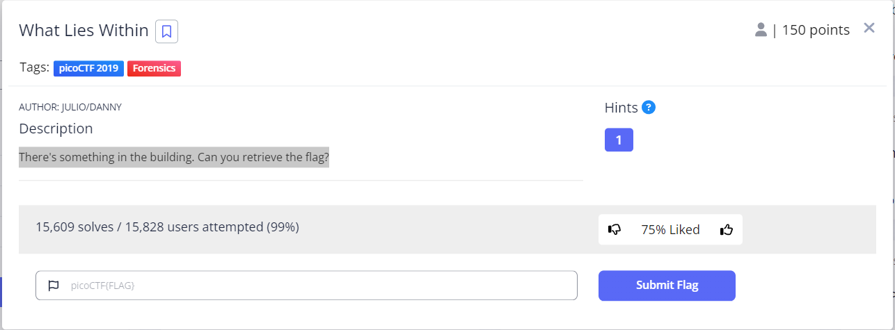
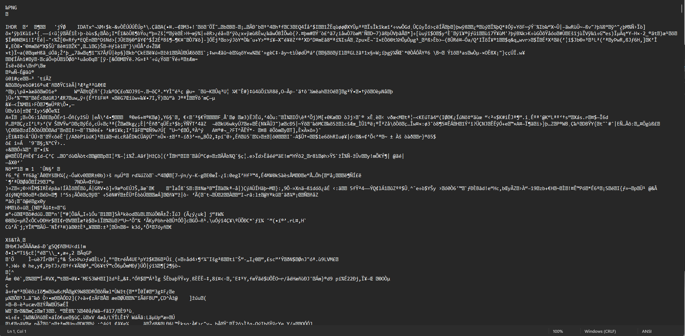
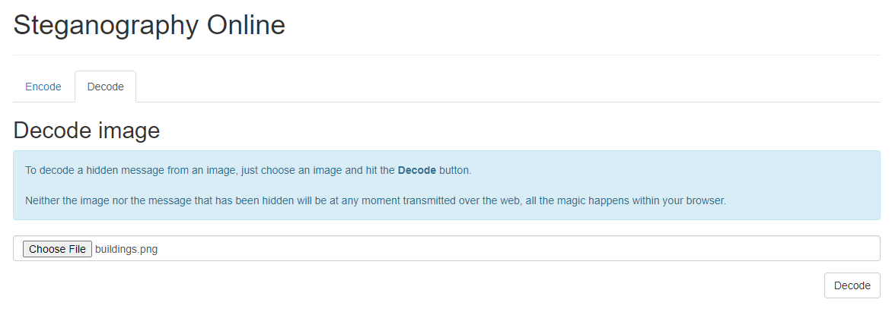
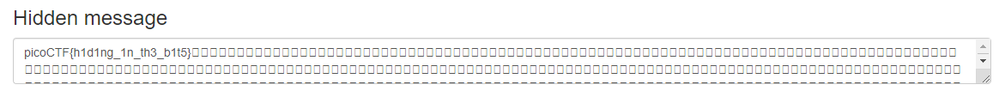
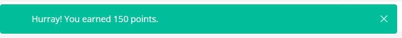

# what lies within
This is the write-up for the challenge "what lies within" challenge in PicoCTF

#The challenge
There's something in the building. Can you retrieve the flag? https://play.picoctf.org/practice/challenge/74?category=4&page=3 

##Hints
1. There is data encoded somewhere... there might be an online decoder.

## Initial look
The attached link is a link to download a picture of buildings

I opened the file using Notepad, but it was all unfamiliar letters (Jibrish). 

I looked for an online Steganography decoder, and found this site: 
https://stylesuxx.github.io/steganography/ 

Opened the decode tab, and added  the picture. 

Decoded the file and got the flag. 

Copied the flag to the Pico challenge, and got the points :)

  

 
The flag is: 'picoCTF{h1d1ng_1n_th3_b1t5}'

