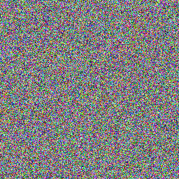
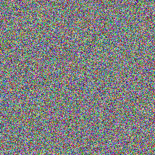
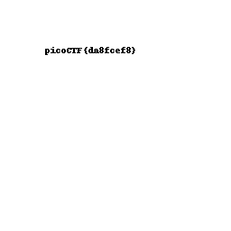

# Pixelated
This is the write-up for the challenge "Pixelated" challenge in PicoCTF

# The challenge

# Description
I have these 2 images, can you make a flag out of them
this is the images:

# Hints
1. Look at this site: https://en.wikipedia.org/wiki/Visual_cryptography - about "Visual cryptography"
2. Think of different ways you can "stack" images

# Solution
Add the two images together to get the flag. 
This approach can be seen in this code running in the file: code_solution.py

The flag is:

