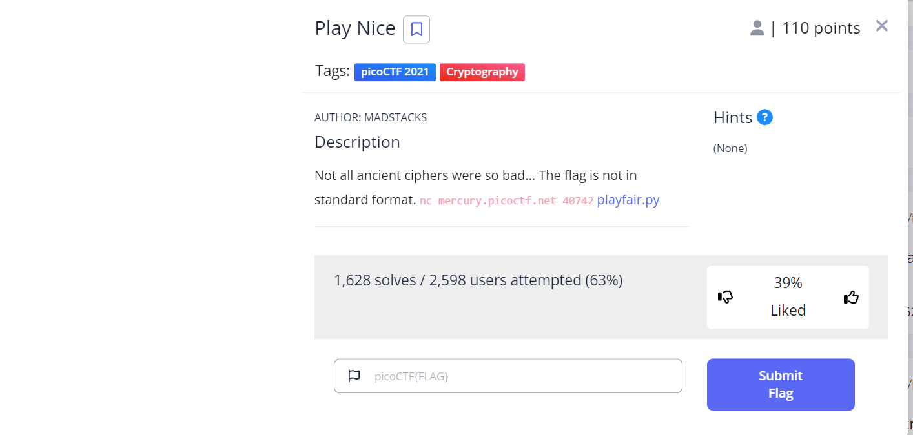
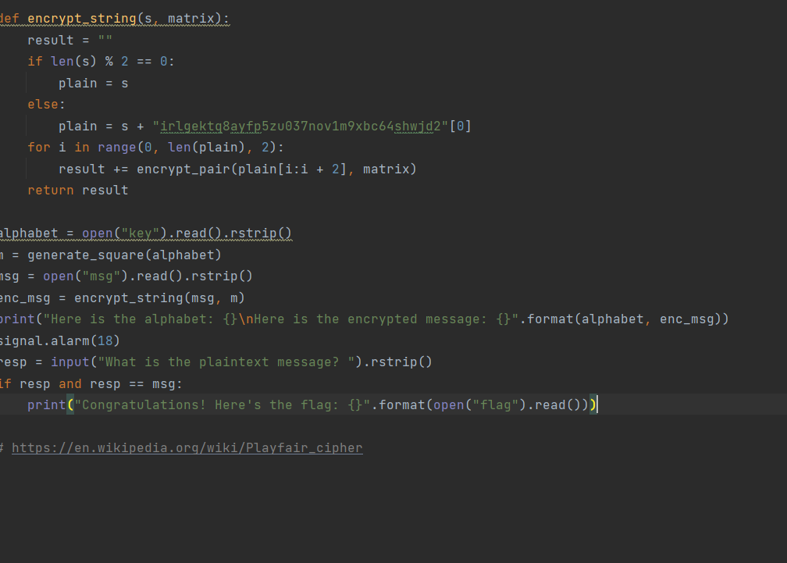

# Play Nice
This is the write-up for the challenge "play nice" challenge in PicoCTF

# The challenge
Not all ancient ciphers were so bad... The flag is not in standard format. nc mercury.picoctf.net 40742 playfair.py

## Hints
none

## Initial look

in looking on the code we got [code](playfair.py)  
first we need to run the code we get in terminal, and we get
that the alphabet is "irlgektq8ayfp5zu037nov1m9xbc64shwjd2" 
and to=he encrypted message is "h5aisqeusdi38obzy0j5h3ift7s2r2".
we also can see that the square size is 6

To rephrase the given statement:

The encrypt_string function appends a '0' to the end of the message if its length is odd. 
Afterward, it applies the encrypt_pair function to each pair of characters in the message.
To solve the problem, we can disregard the encrypt_string function and check the output message with and without the appended '0' at the end,
especially if it ends with a '0'.
function get_index, gets the index of letter in matrix.

The encrypt_pair function alters the characters in the message by following specific rules.
When two letters belong to the same row, they are shifted leftwards. Similarly, when two letters are in the same column, they are shifted downwards.
In case the two letters neither belong to the same row nor column, the column is interchanged.
## Solve
I created a program to find the massage [solve](playfair_my_soulotion.py)  .

I looped through the letters in enc_msg two at a time and got their index in matrix, stored in a and b. If a[0] == b[0],
then I would shift both of them left, if a[1] == b[1], I would shift them up and otherwise, I would switch b[1] and a[1]

The output of the code is the massage: xqyvhtg02lkplzo8eyhu25ktip2dkh

Running the program in terminal and inputting that value as plain text
it outputs "Congratulations! Here's the flag: 25a0ea7ff711f17bddefe26a6354b2f3".
  
I have searched in the output the most logical option of the key, and the key was:
## Flag
25a0ea7ff711f17bddefe26a6354b2f3

