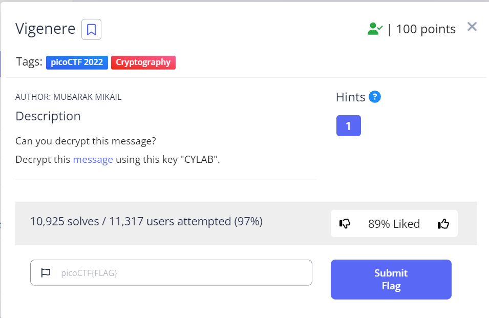
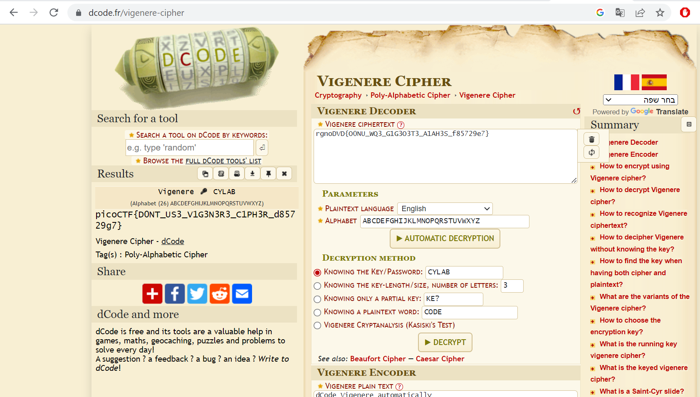

# Vigenere

This is the write-up for the challenge "Vigenere" challenge in PicoCTF

# The challenge

## Description
Can you decrypt this message?
Decrypt this message using this key "CYLAB"./

## Hints
1. https://en.wikipedia.org/wiki/Vigen%C3%A8re_cipher

## Initial look
The above link download basic text file with this encrypted message - "rgnoDVD{O0NU_WQ3_G1G3O3T3_A1AH3S_f85729e7}".

# How to solve it
According to the title and the hint, you can tell that the message was encrypted with vigenere cipher and we were told that the key is "CYLAB" so I found a [site](https://www.dcode.fr/vigenere-cipher) where you can put the message and the key and it decrypts the message.

We will note that on this site it is also possible to use picoCTF as a known plain-text word because the flags always start with this word and you can see on the encrypted message that it is also written in the same format.

The decoded message you get is the flag and it is - `picoCTF{D0NT_US3_V1G3N3R3_C1PH3R_d85729g7}`

End!
