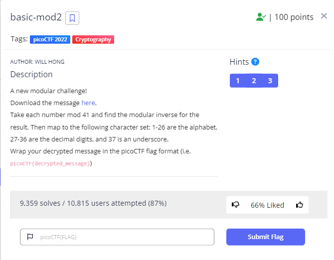
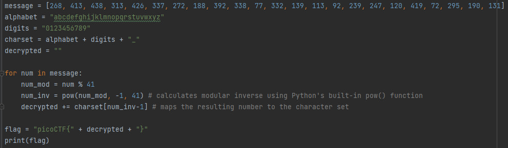
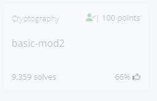

<h1 style="font-size: 48px;">"basic-mod2" Challenge README</h1>
<h2 style="font-size: 20px;">Challenge Description :memo:</h2>
The "basic-mod2" challenge is a cryptography-based challenge that requires the user to decrypt a message.
The challenge provides a list of integers that represent the encrypted message.

The user needs to implement the decryption algorithm and use it to recover the original message.

 

<h2 style="font-size: 20px;">Hint :bulb:</h2>
1. Do you know what the modular inverse is? 
2. The inverse modulo z of x is the number, y that when multiplied by x is 1 modulo z. 
3. It's recommended to use a tool to find the modular inverses.
<h2 style="font-size: 20px;">Challenge Goals :dart:</h2>
The main goal of this challenge is to educate users about modular arithmetic and modular inverse in cryptography. 
The challenge aims to demonstrate how these concepts can be used to encrypt and decrypt messages securely.
And highlights the importance of using strong encryption methods and the dangers of relying on simple and easily breakable encryption schemes.
<h2 style="font-size: 20px;">Challenge Instructions :scroll:</h2>
Open the challenge website in a web browser. 
Read the challenge description and the provided message.<r>
Implement the decryption algorithm using the instructions provided. 
Decrypt the message and wrap it in the picoCTF flag format (i.e., picoCTF{decrypted_message}). 
Submit the flag to the challenge website to complete the challenge.
<h2 style="font-size: 20px;">Challenge Solution &#10004;</h2>
The message provided in the challenge is encoded using a simple modulo arithmetic scheme. 
Each number in the message needs to be divided by 41, and its modular inverse needs to be calculated. 
The modular inverse of a number 'a' is another number 'b' such that (a * b) % m = 1, where m is the modulus.

The decryption algorithm can be easily implemented in any programming language,  <b>here's my solution in Python:</b> 
 

After running the code I got that the decrypted message is "1nv3r53ly_h4rd_8a05d939". Therefore i got the flag! :smile:

<h3 style="font-size: 15px;">The flag: picoCTF{1nv3r53ly_h4rd_8a05d939}</h3>
And that's it, I'm done! :tada::trophy:  
 
<h2 style="font-size: 20px;">Conclusion :mortar_board:</h2>
In real-world scenarios, using weak encryption schemes can compromise the security of sensitive information. It is essential to understand basic cryptographic principles and use strong encryption algorithms and key management practices to protect sensitive information. The "base-mod2" challenge is a valuable learning tool for users to understand the risks and limitations of weak encryption schemes and to encourage the use of strong encryption practices.
