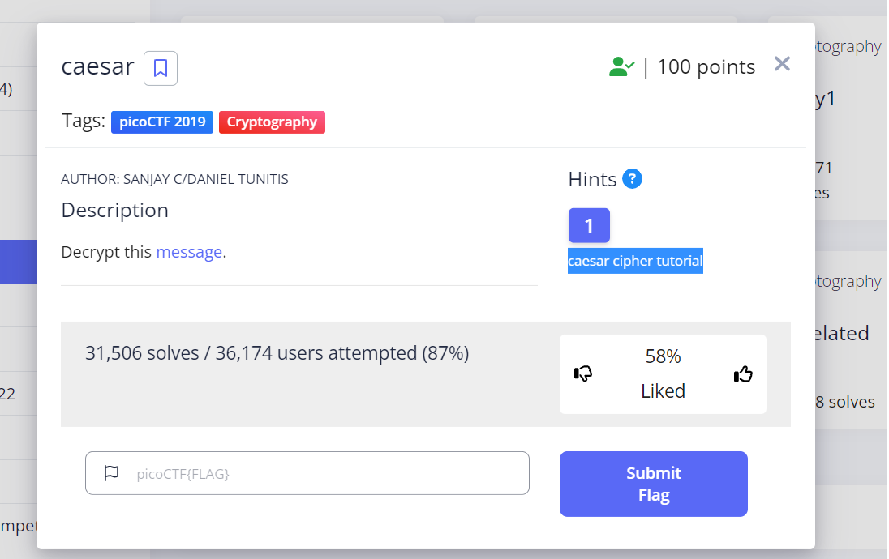
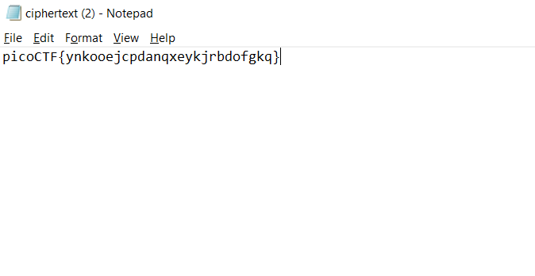
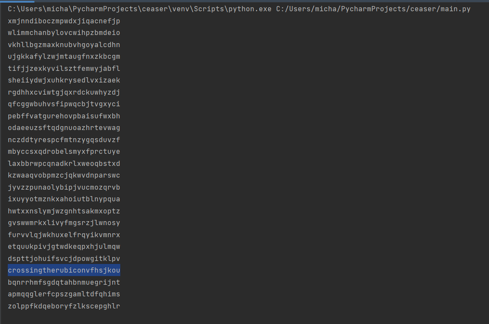
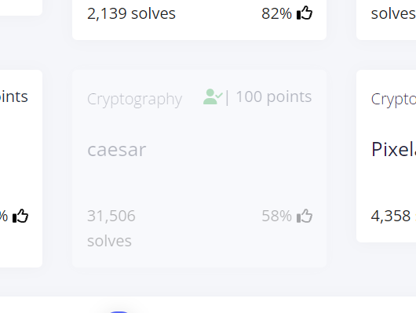

# caesar
This is the write-up for the challenge "caesar" challenge in PicoCTF

# The challenge
Decrypt this message? picoCTF{ynkooejcpdanqxeykjrbdofgkq}

## Hints
1. caesar cipher tutorial link (https://privacycanada.net/classical-encryption/caesar-cipher/)

## Initial look
The message i downloaded was in .txt format.

I have looked at the hint.

I have written a python code that deciphers a caesar message in a brute force way.
[code-is-here](code)  
The output of the code:

  
I have searched in the output the most logical option of the key, and the key was:
## Flag
'picoCTF{crossingtherubiconvfhsjkou}'

