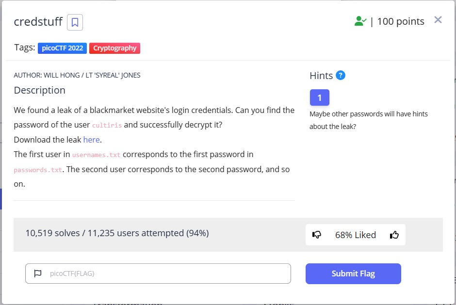
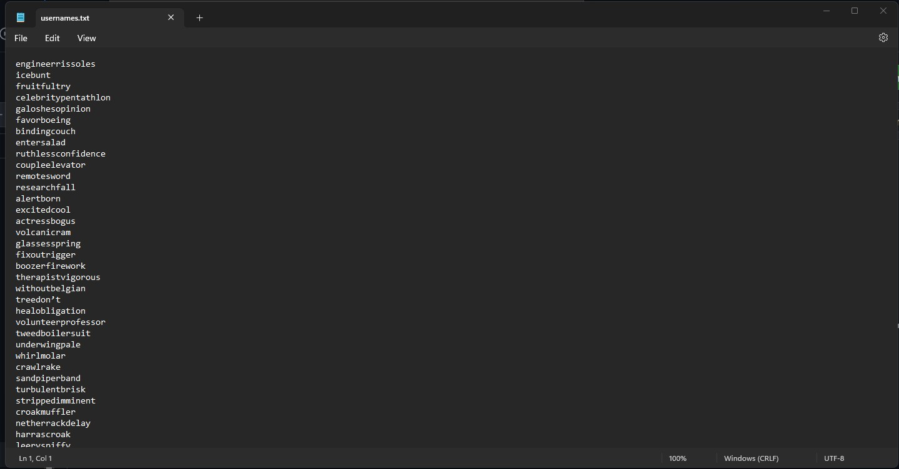
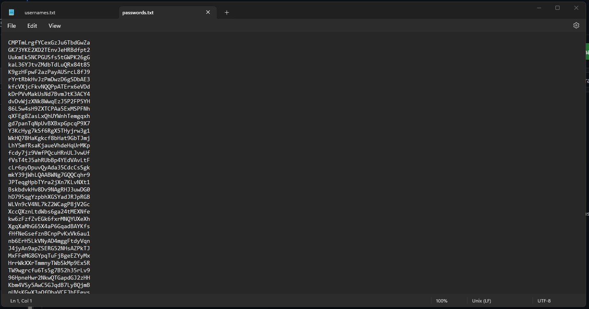
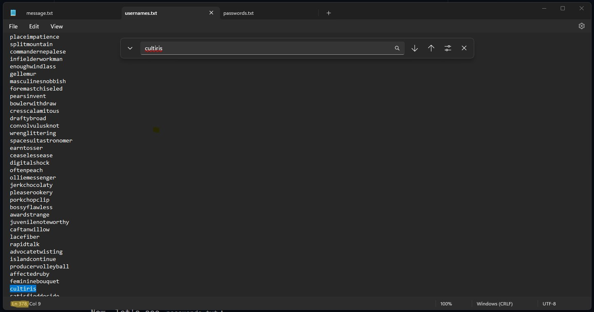
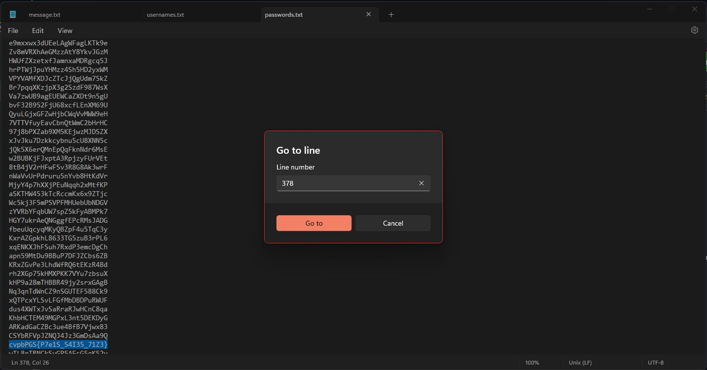
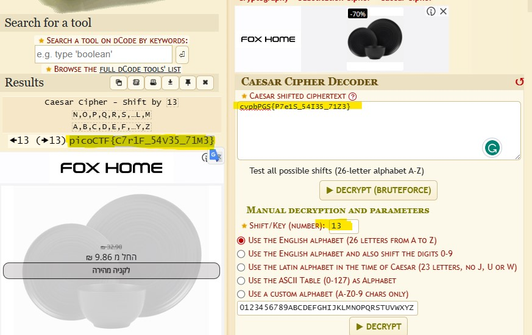

# credstuff

This is the write-up for the challenge "findme" challenge in PicoCTF

# The challenge

# Hints
Maybe other passwords will have hints about the leak?

# Initial look
We have been provided with a .tar file. If we extract it we get 2 file, usernames.txt and passwords.txt. Here we have to find out the password of the user cultiris. So let's take a look at the files:

### username.txt:

### passwords.txt:

# How to solve it

as the challenge says that the first user in usernames.txt corresponds to the first password in passwords.txt. The second user corresponds to the second password, and so on.

so i opened to the usernames.txt and searched for the username cultiris, i got the username iin line 378

then i used the goto method to go to line 378 in the passwords.txt and to get the password from there.

as we can see that the password `cvpbPGS{P7e1S_54I35_71Z3}` is encrypted so i substracted the the letter `c : 3` from the letter `p : 16` and i got 13,
so i used Caesar Cipher with key 13 to decryot the message.

the flag is : `picoCTF{C7r1F_54V35_71M3}`
