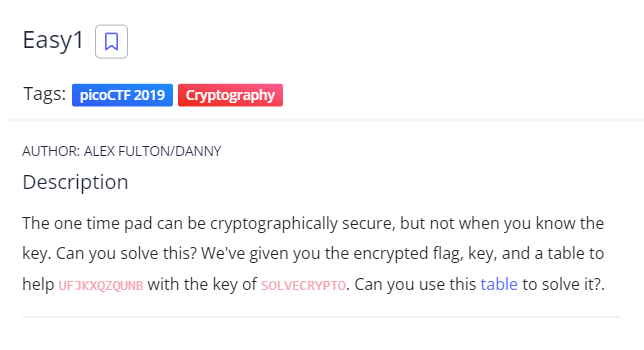

# easy1

This is the write-up for the challenge "easy1" challenge in PicoCTF

# The challenge

## Description
The one time pad can be cryptographically secure, but not when you know the key. 
Can you solve this? We've given you the encrypted flag, key, 
and a table to help UFJKXQZQUNB with the key of SOLVECRYPTO. 
Can you use this table to solve it?.

## Hintsgit 
1.Submit your answer in our flag format. 
For example, if your answer was 'hello', you would submit 'picoCTF{HELLO}' as the flag.
2.Please use all caps for the message.

## Initial look
weve got only cipher and a key so we will search a popular
decryption that working with this requierments.

# How to solve it
the answer is vigenere cipher , we will use online tool -dcode website
enter the cipher UFJKXQZQUNB and the key SOLVECRYPTO 
from that we will get the decryption CRYPTOISFUN
we will wrap it with picoCTF{} like the hint says

The flag is `picoCTF{CRYPTOISFUN}`

Cheers 😄