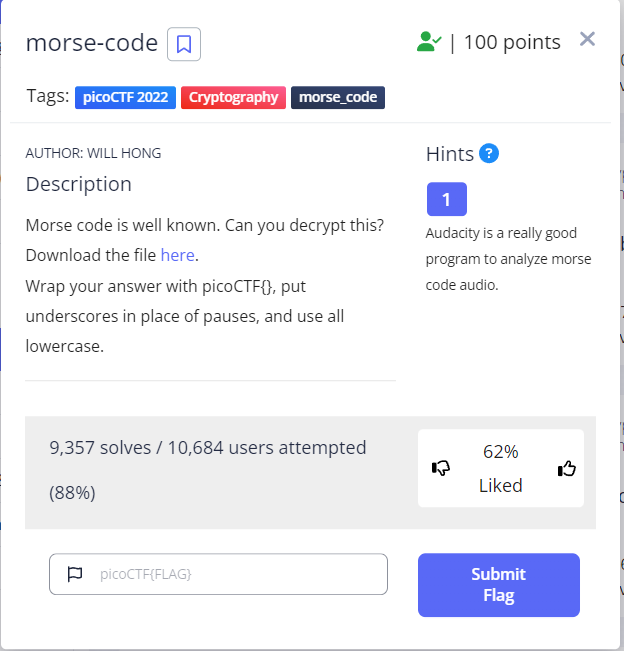
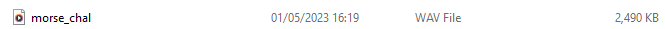
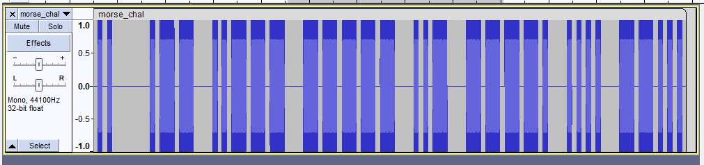
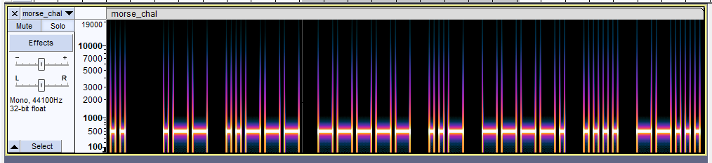
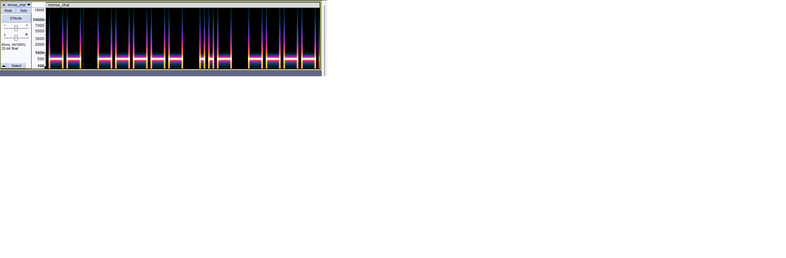
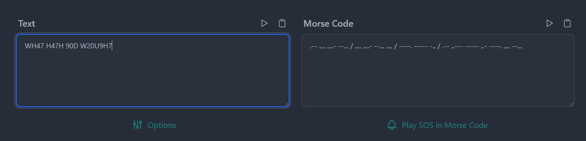

# morse-code
This is the write-up for the challenge "morse-code" challenge in PicoCTF

# The challenge
Morse code is well known. Can you decrypt this?

## Hints
1. Audacity is a really good program to analyze morse code audio.

## Initial look
The challenge provided a .wav file

After downloading Audacity I imported the .wav file into it and I got a llok of the audio

I searched the web and found that it's easier to spot morse code diffrences 
using a built-in filter called "Spectogram plot". After apllying the filter I could see the signals 

In order to spot spaces I zoomed in

I found a morse decoder site https://morsedecoder.com  
I typed in the '.' and '-' according to the length of each spectogram 

I copied the text I got and added '_' instead of the spaces
 
The flag is: 'picoCTF{WH47_H47H_90D_W20U9H7}'

