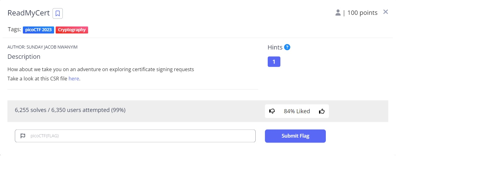
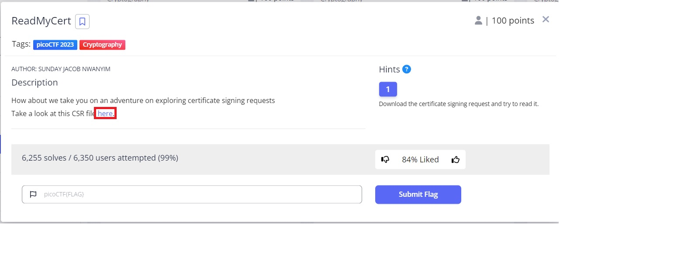
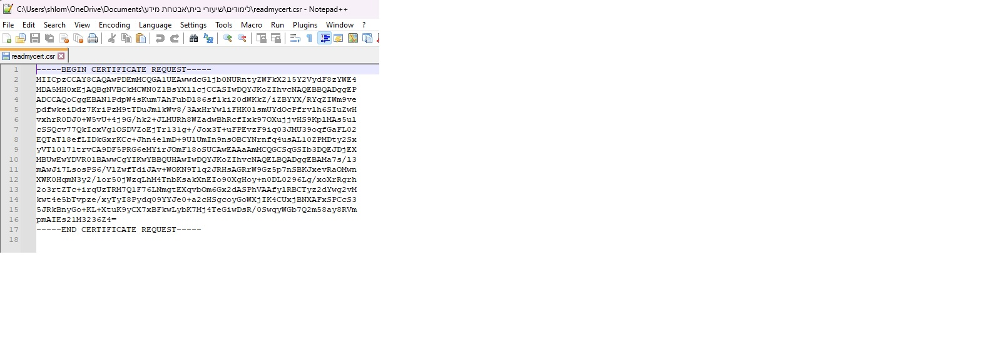
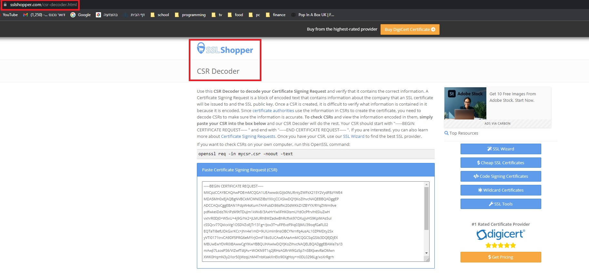
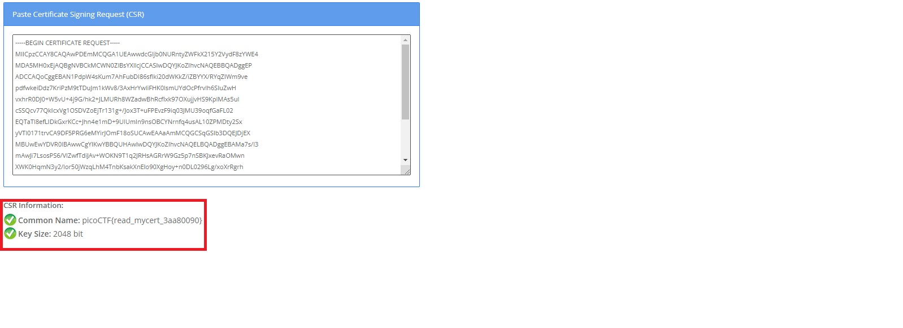
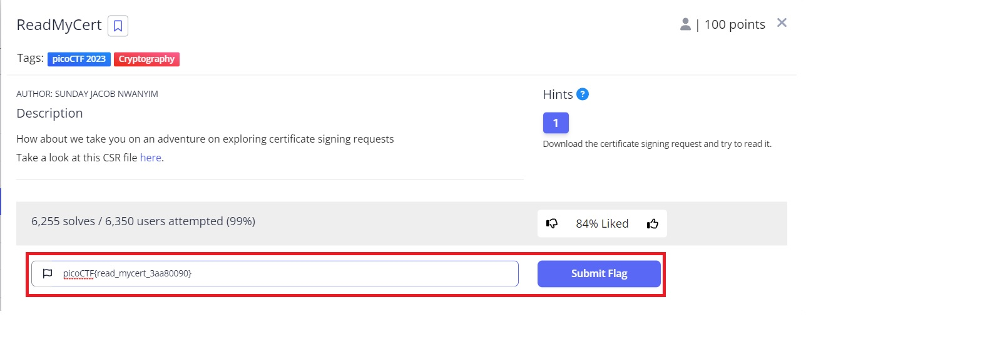
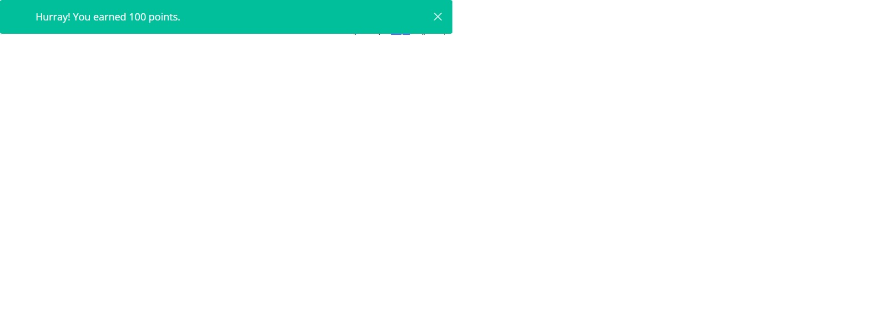

# Read My Cert
This is the write-up for the challenge "ReadMyCert" challenge in PicoCTF

#The challenge
https://play.picoctf.org/practice/challenge/367?category=2&page=3

##Hints
Download the certificate signing request and try to read it.

Started by downloading the CSR file in the link they gave. 

Opened the file "readmycert.csr" using Notepad++. 

Searched on google how to decode a CSR certificate and found a site called SSL-Shopper (https://www.sslshopper.com/csr-decoder.html), that has a CSR Decoder. 

Pasted the contents of the CSR (from Notepad++), and received the flag "picoCTF{read_mycert_3aa80090}". 

Copied the flag and pasted in PicoCTF task and submitted the flag. 

Received a message indicating I earned 100 points! :). 

And this is the end of the task. 

