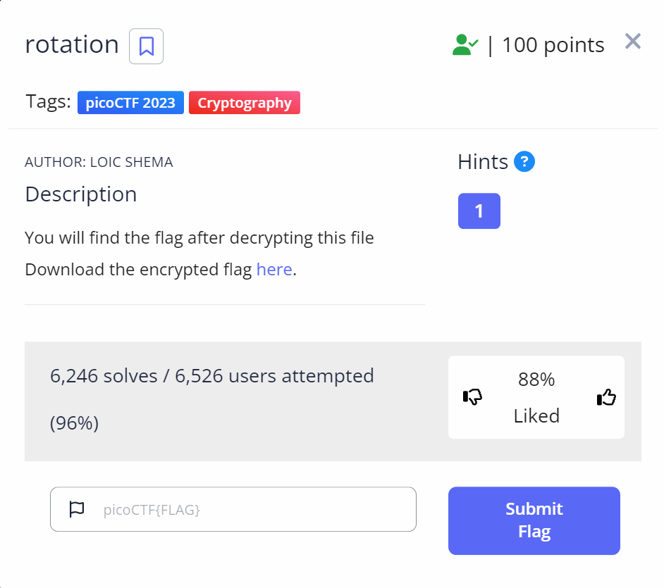

# rotation
This is the write-up for the challenge "rotation" challenge in PicoCTF

# The challenge

# Description
Find the flag being held on this server to get ahead of the competition https://artifacts.picoctf.net/c/390/encrypted.txt

picture of done:

# Hints
1.Sometimes rotation is right

# Initial look
file named "encrypted.txt" contain encrypted text

# How to solve it
The encrypted text appears to be in the same format as the structure of the flag,
i.e. text{text} = picoCTF{text} and the length was also the same,
so I understood that each letter is replaced by another letter as in the Caesar cipher.
So I searched on Google for a site that decodes the Caesar cipher and i found: https://www.dcode.fr/caesar-cipher
I entered the encrypted text and got the flag:

The flag is: picoCTF{r0tat1on_d3crypt3d_429af00f}

And I'm done  😄
