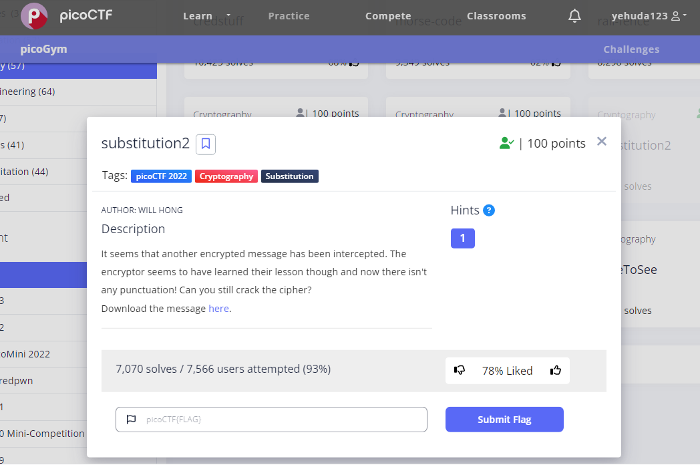
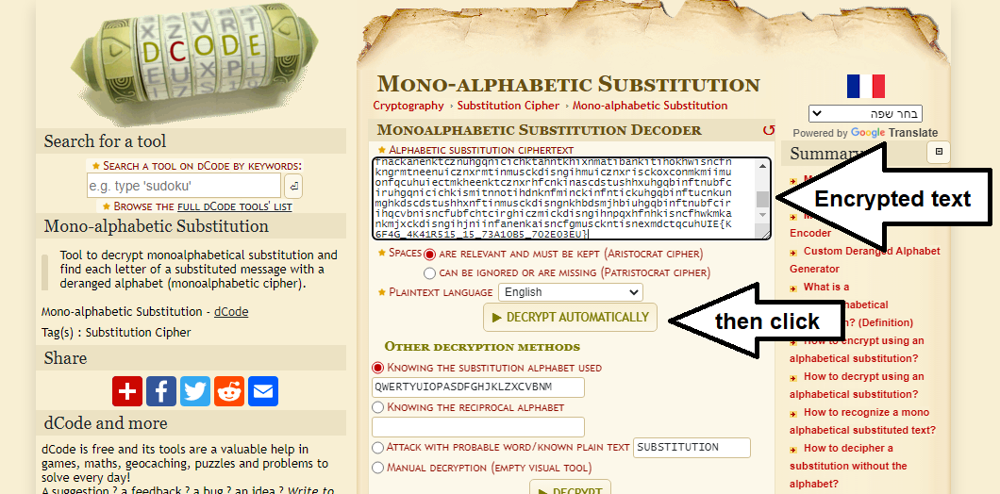
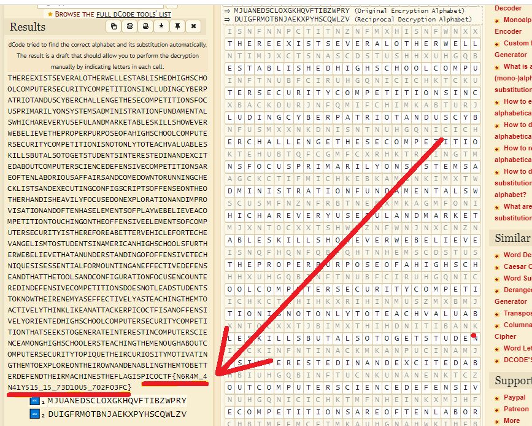

# substitution2
This is the write-up for the challenge "substitution2" challenge in PicoCTF

# The challenge

# Description
Find the flag being held on this server to get ahead of the competition https://artifacts.picoctf.net/c/113/message.txt

picture of finish it:

# Hints
1.Try refining your frequency attack, maybe analyzing groups of letters would improve your results?

# Initial look
file named "message.txt" contain encrypted text

# How to solve it
Based on the challenge description, it can be inferred that the given cipher is a substitution cipher.
Upon examining the text, there is reason to believe that it might be a Caesar cipher.
To decrypt it, an online decoder such as https://www.dcode.fr/monoalphabetic-substitution can be utilized.

We see the decoded text by the site we used and it can be noticed that at the end of the decoded text there is the flag.

here is how:
First, i paste the encrypted text in the site and click "DECRYPT AUTOMATICALLY"

then i can see the flag in the end of the decrypted text:

The flag is PICOCTF{N6R4M_4N41Y515_15_73D10U5_702F03FC}

And that's it, I'm done  😄
