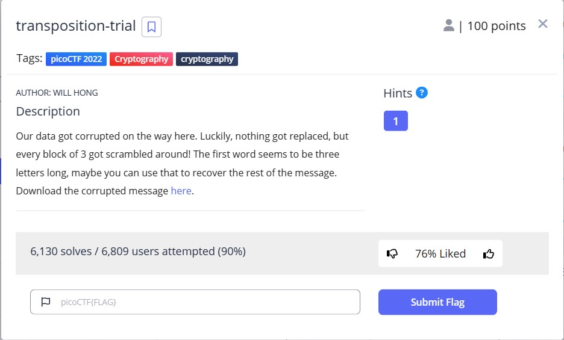

# Transposition Trial

This is the write-up for the "transposition-trial" challenge in PicoCTF.

## The Challenge


## Hints
- Split the message up into blocks of 3 and see how the first block is scrambled.

## Initial Look
After downloading and reading the message.txt file, the message is:
`heTfl g as iicpCTo{7F4NRP051N5_16_35P3X51N3_V9AAB1F8}7% `

# How to solve it

I started by splitting the message into blocks of 3 and wrote a Python code that generates all possible rearrangements of the letters within each block.

```python
import itertools

# Open and read the message file
f = open("message.txt", "r", encoding="UTF-8")
txt = f.read()

# Define the block size
n = 3

# Split the message into blocks of size 3
txt3gram = [txt[i:i+n] for i in range(0, len(txt), n)]

# Print the original blocks and their possible rearrangements
for block in txt3gram:
    print(f'Original: "{block}"')
    print("Possible rearrangements:")
    for permutation in itertools.permutations(block):
        rearranged_block = "".join(permutation)
        print(f'"{rearranged_block}"')
    print()


```
The result for the first block is:
```
Original: "heT"
Possible rearrangements:
"heT"
"hTe"
"ehT"
"eTh"
"The"
"Teh"
```
From the possible rearrangements, we can observe that the only readable rearrangement is "The". This suggests that the decryption rule involves swapping the first and third letters, then swapping the second and third letters. I wrote another code to apply this rule.

```python

# Open and read the message file
f = open("message.txt", "r", encoding="UTF-8")
txt = f.read()

# Define the block size
n = 3

# Split the message into blocks of size 3
txt3gram = [txt[i:i+n] for i in range(0, len(txt), n)]

# Initialize a list to store the decoded letters
decode_lst = []

# Rearrange the positions of the letters in each block
for i in range(len(txt3gram)):
    decode_lst.append(txt3gram[i][2] + txt3gram[i][0] + txt3gram[i][1])

# Join the decoded letters to form the unscrambled message
unscrambled_message = ''.join(decode_lst)

# Print the unscrambled message
print(unscrambled_message)

```

The unscrambled message is : `The flag is picoCTF{7R4N5P051N6_15_3XP3N51V3_109AB02E}`
