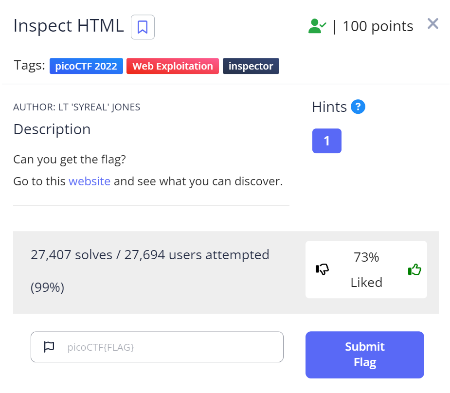
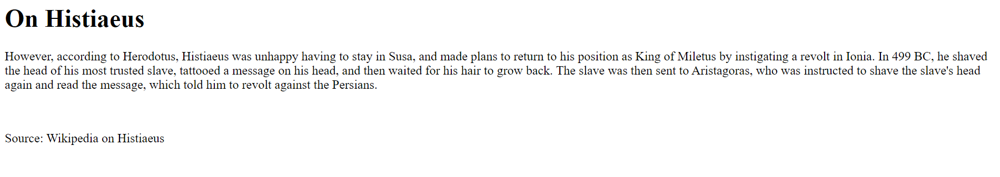
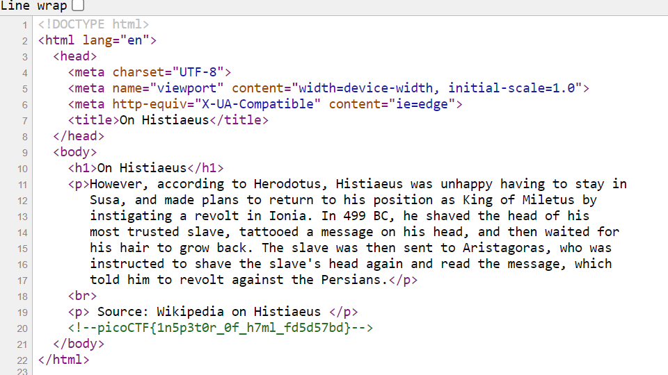

# Inspect HTML

This is the write-up for the challenge "Inspect HTML" challenge in PicoCTF

# The challenge

## Description
Find the flag in HTML tag http://saturn.picoctf.net:55825/

## Hints
What is the web inspector in web browsers?

## Initial look
I click on the site and it brings me to a page with a section on Histius from Wikipedia

# How to solve it

I have looked at the hint, I clicked on the option to see the code HTML that this webpage is written, and I saw the following code:

I noticed the flag listed in line 20 in the comment. I copied this flag and the puzzle was solved

The flag is `picoCTF{1n5p3t0r_0f_h7ml_fd5d57bd}`

I can change the code, and delete the comment by downloading the !--

