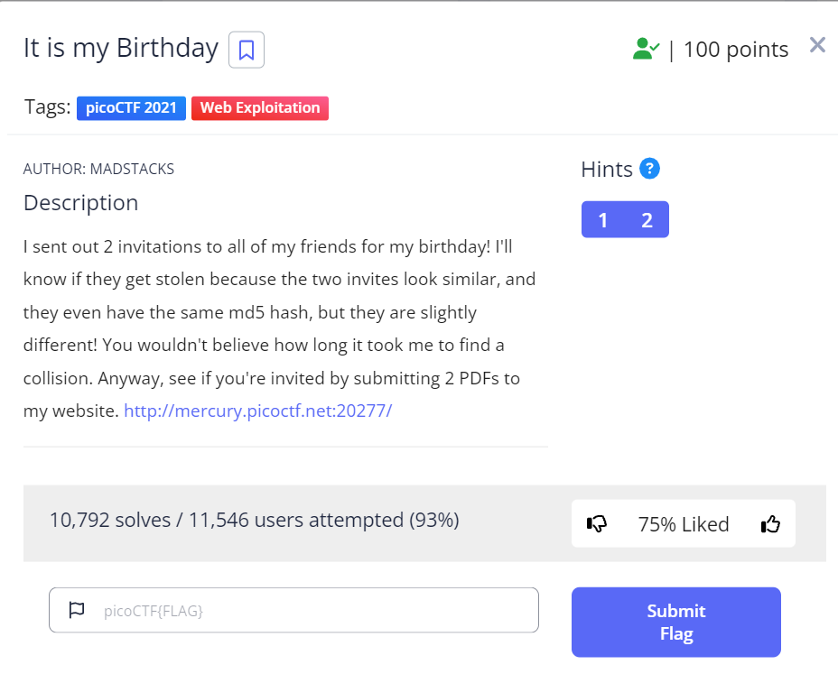
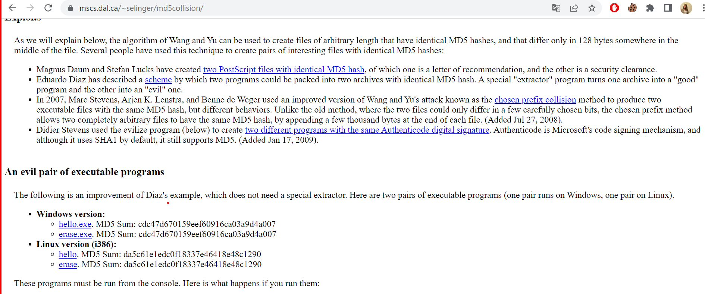

# It is my Birthday

This is the write-up for the challenge "It is my Birthday" challenge in PicoCTF

# The challenge

## Description
I sent out 2 invitations to all of my friends for my birthday! I'll know if they get stolen because the two invites look similar, and they even have the same md5 hash, but they are slightly different! You wouldn't believe how long it took me to find a collision. Anyway, see if you're invited by submitting 2 PDFs to my website. http://mercury.picoctf.net:20277/

## Hints
1. Look at the category of this problem.
2. How may a PHP site check the rules in the description?

## Initial look
The above link takes you to a basic HTML page where you can select 2 files from your computer and another button to upload those files.

# How to solve it
Upon conducting a search for "MD5 collision," I stumbled upon [this](https://www.mscs.dal.ca/~selinger/md5collision/) website that offered two executable files, named "hello" and "erase," 
which had an identical MD5 hash.

I download these files and then modified their extensions to ".pdf."

Then, I uploaded the modified files to the website, and it promptly redirected me to a PHP page.
I discovered that the flag was hidden in a comment located at the end of the PHP script, 
just before the HTML segment on line 37.

The flag is `picoCTF{c0ngr4ts_u_r_1nv1t3d_da36cc1b}`

End!
