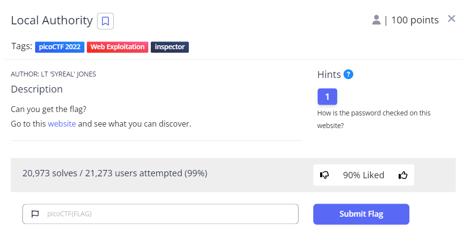
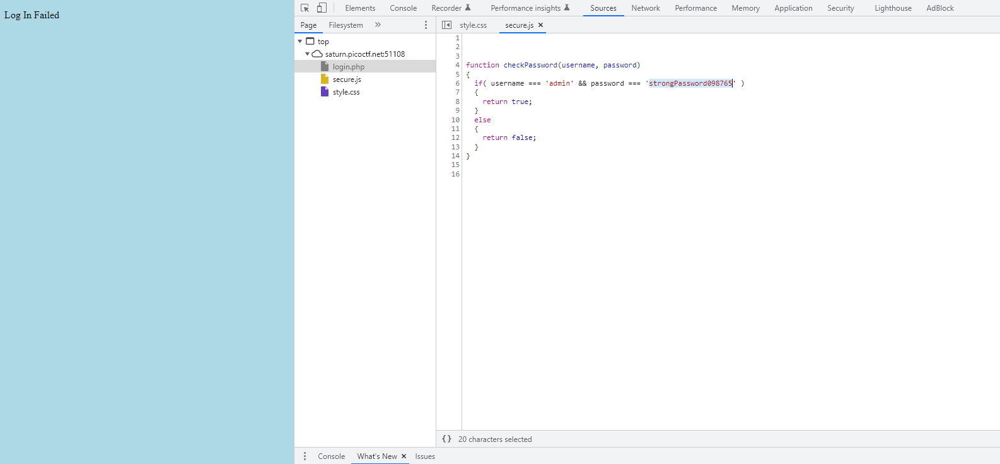

# Local Authority

This is the write-up for the challenge "Local Authority" challenge in PicoCTF

# The challenge

## Description
find the Flag being held on this server http://saturn.picoctf.net:51108/

## Hints
1. How is the password checked on this website?

## Initial look
The above link brings you to a basic HTML page where you can log in by filling in two fields - username and password.
# How to solve it

First I looked at the hint. it gave me the impression that in need to check how is password is validated
in the html main website there is post method and type submit for the username and password so in order to go to client side
I tried to log in with random username and password, and then I was transferred to this failed login page were there is
client side validation for the password:

I got back to the form location and enter the parameters the "if" method requested and I got the flag.

The flag is `picoCTF{j5_15_7r4n5p4r3n7_05df90c8}`

Cheers 😄
