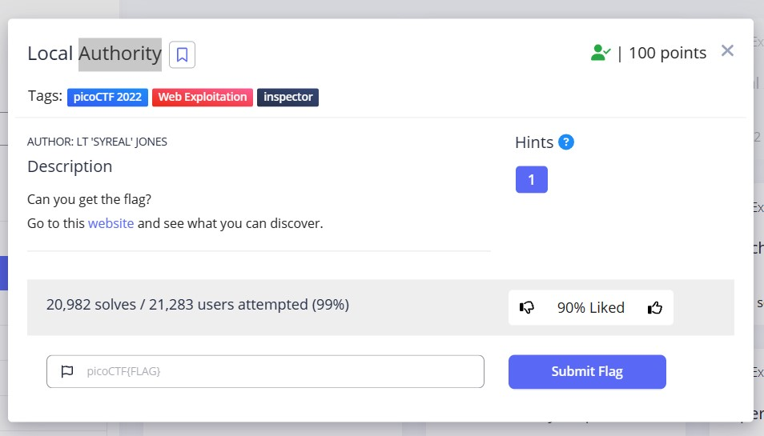
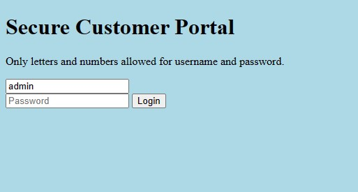
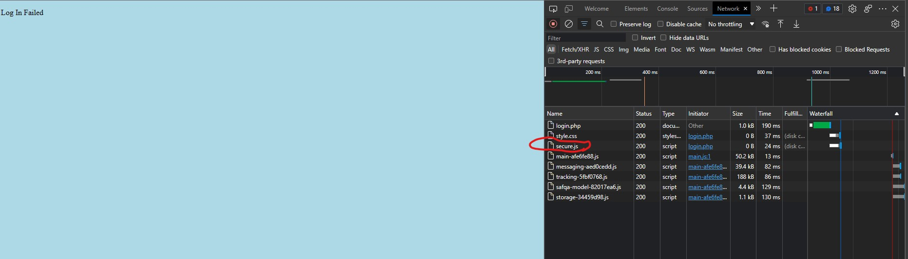
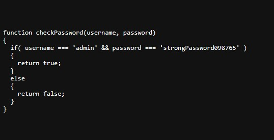
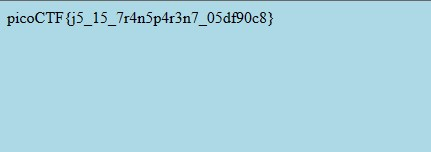

# Includes
This is the write-up for the challenge "Local Authority" challenge in PicoCTF

# The challenge

## Description
Can you get the flag?
Go to this <a href = "http://saturn.picoctf.net:51108/">website</a> and see what you can discover.

# Hints
How is the password checked on this website?

# Initial look
The above link brings you to a basic HTML page where there is login form

# How to solve it

first opened the inspector and looked int the files for a js file, but there was none. 
so i tried to enter wrong user name and password

i was redirected to another page with a message login failed, and in the network tab a file named secured.js showed up
when i opened it, there was a function that compares with the real password and user name 

then i loged in using that username and password and i was redirected to anothe page that shows the flag

the flag is : `picoCTF{j5_15_7r4n5p4r3n7_05df90c8}`
