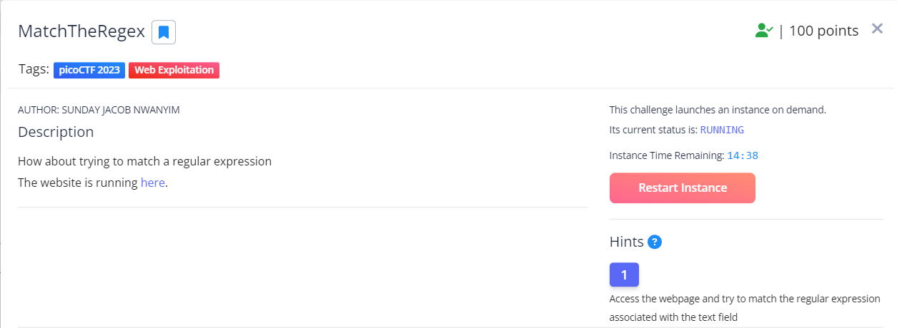
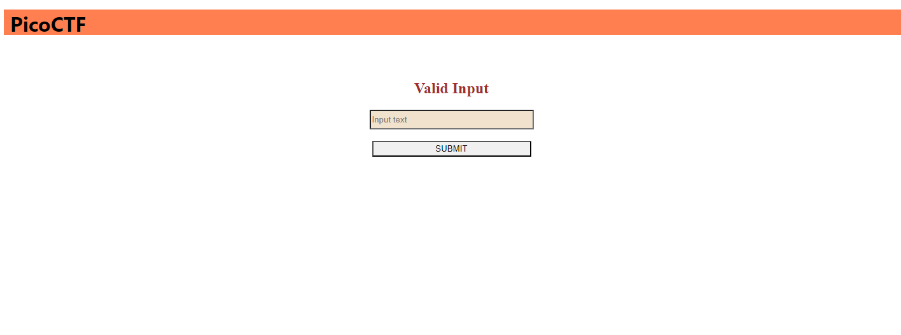
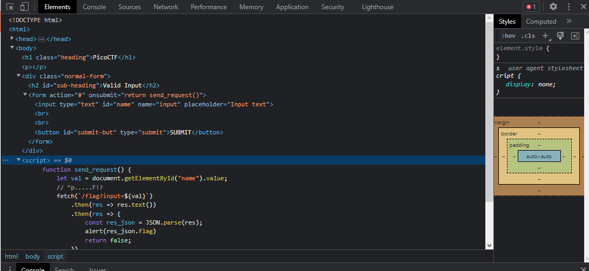
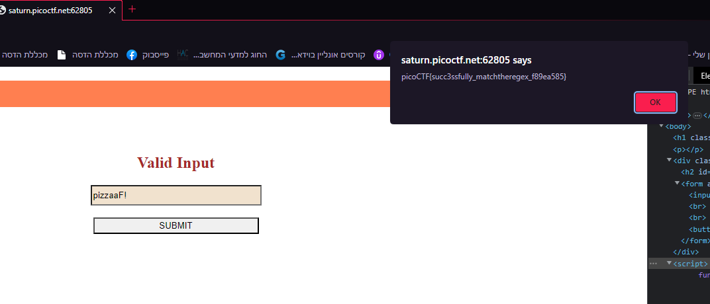

# where are the robots
This is the write-up for the challenge "where the robots" challenge in PicoCTF

# The challenge
How about trying to match a regular expression (The challenge opens up as an instance)

## Hints
1. Access the webpage and try to match the regular expression associated with the text field

## Initial look
The instance link brings you to a basic Html page where it says "Valid Input" and has an input box under

First I used the inspect element tool and looked at the HTML code. 
I noticed there was a script tag there, I opened it and saw a fetch request to a server. 
In the script there was a wierd comment "^p.....F!?", it reminded me a REGEX so I tried to match it in the input. 

I used the input "pizzaaF!" and submitted the answer and got the flag! 

 
The flag is: 'picoCTF{succ3ssfully_matchtheregex_f89ea585}'

