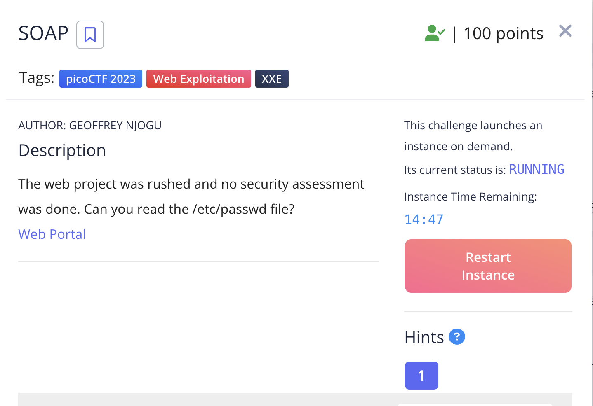
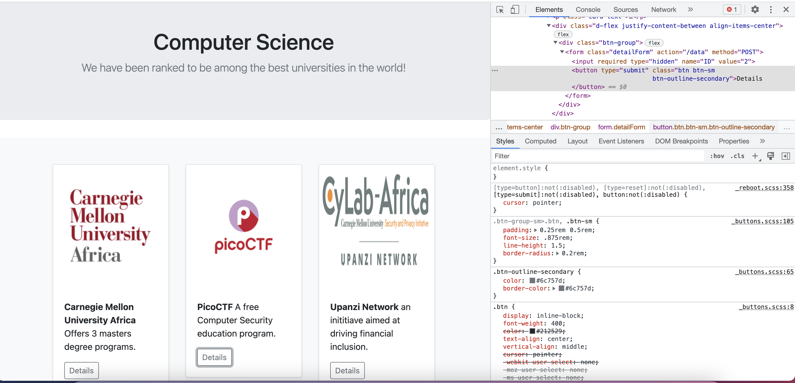
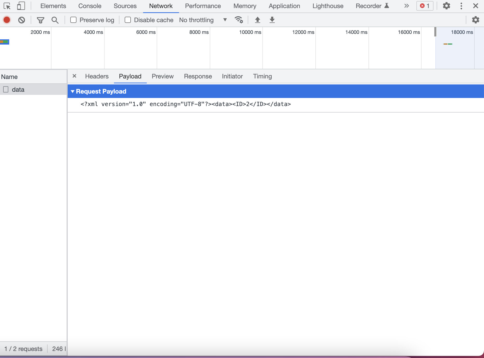
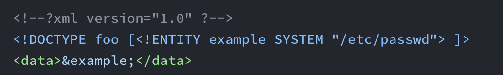
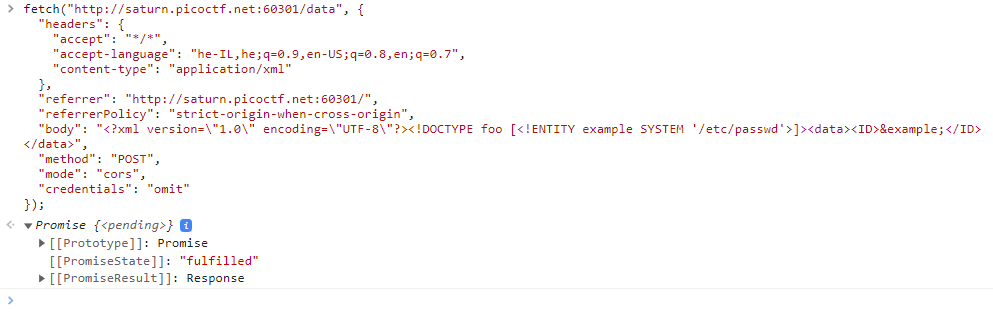
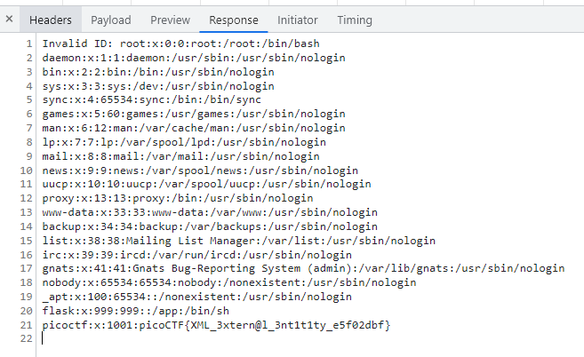

<h1 style="font-size: 36px;">SOAP</h1>
This is the write-up for the challenge "SOAP" challenge in PicoCTF
<h1>The challenge</h1>
<h2 style="font-size: 20px;">Description</h2>

The web project was rushed and no security assessment was done. Can you read the /etc/passwd file?

<h2 style="font-size: 20px;">Hint</h2>
XML external entity Injection.

<h1>How to solve it</h1>
I clicked on the "Details" button, but nothing happened. To investigate the issue, I opened the developer tools in my Chrome browser and looked at the HTTP request on the page. I found that action = “/data”.
 
 

After examining the payload of the request, I used the "copy as fetch" feature in the console to copy the request. Then, I modified the request and resent it.
 
 

I added the following before the data tag and replaced the "2" value with "&example" in the data tag.

After I resent the modified request, I received the following response:
 
 

 
The flag is: picoCTF{XML_3xtern@l_3nt1t1ty_e5f02dbf}
 
:))
