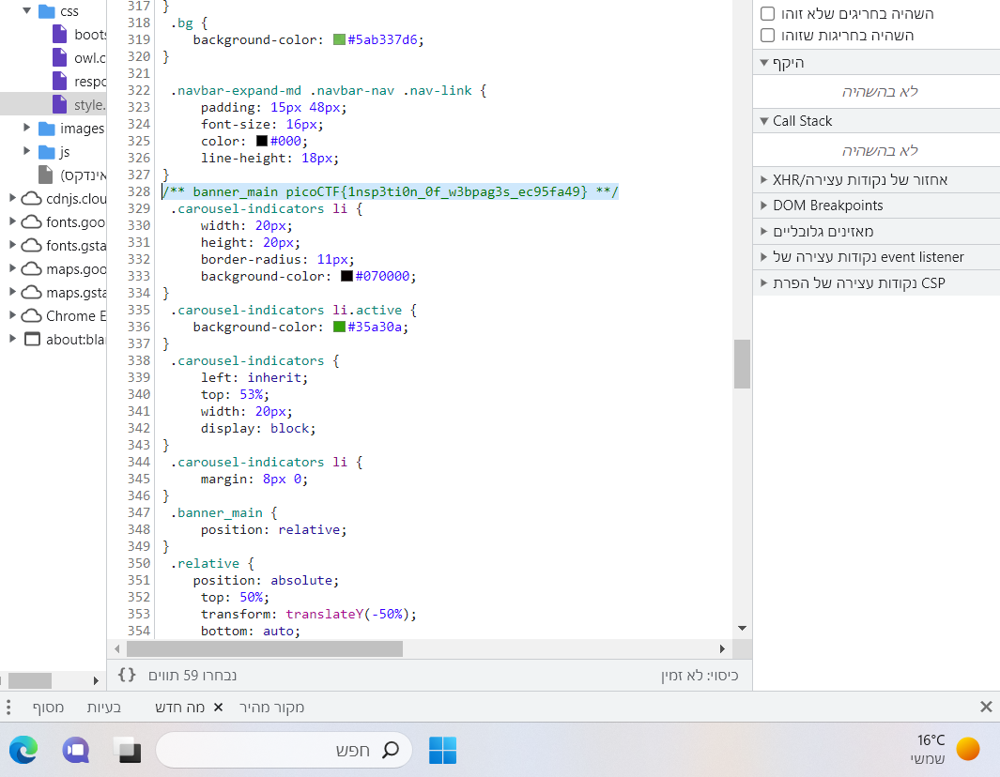

# Search source 

This is the write-up for the challenge "Search source" challenge in PicoCTF

# The challenge

## Description
The developer of this website mistakenly left an important artifact in the website source, can you find it?
The website is http://saturn.picoctf.net:52523/

## Hints
1. How could you mirror the website on your local machine so you could use more powerful tools for searching?

## Initial look
You can see a site for registering for yoga training courses

# How to solve it
from the description i know that the flag is hidden in the source code . 
so I started first with inspecting the website and search for key names like "flag" or "pico"
in the javascript files and html bur didn't found one .

I looked at the hint, so I understood that I need to use search
tool to find the flag in the code source

so I did the next steps :

     1. wget -r http://saturn.picoctf.net:52523/

     this for pulling the code for the website

     2. grep -r pico *

     for search recursively for a "pico" in every file in the code source

     and i get 

     scc/style.css:/** banner_main picoCTF{1nsp3ti0n_0f_w3bpag3s_ec95fa49} **/

The flag is `picoCTF{1nsp3ti0n_0f_w3bpag3s_ec95fa49}`

