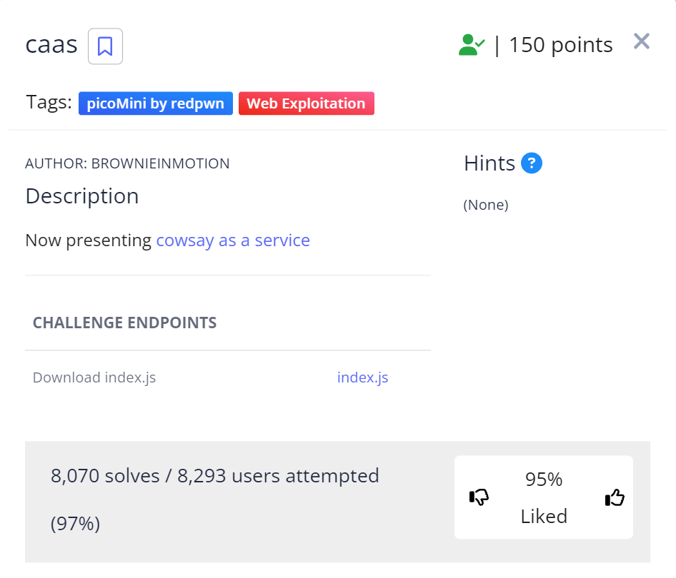

# caas
This is the write-up for the challenge "caas" challenge in PicoCTF

# The challenge
"caas" 

# Description
Find the flag being held on this server to get ahead of the competition https://caas.mars.picoctf.net/

picture of done:

# Hints
0

# Initial look
a text with link: https://caas.mars.picoctf.net/cowsay/{message}

# How to solve it
I entered the link: https://caas.mars.picoctf.net/cowsay/{message}
And I added the message "Hello world", I saw that there is no content that hints at the key,
so I searched on Google and it was suggested to write the command "ls" to see the list of files.
I added and indeed saw the list of files, I noticed a file called "falg.txt" which is similar to flag.
I understood that it was a text file, I searched on Google how to display the contents of the file
and I found the command "cat" I added the command with the name of the file and I got the key

here is how:

The flag: picoCTF{moooooooooooooooooooooooooooooooooooooooooooooooooooooooooooo0o}

And I'm done  😄
