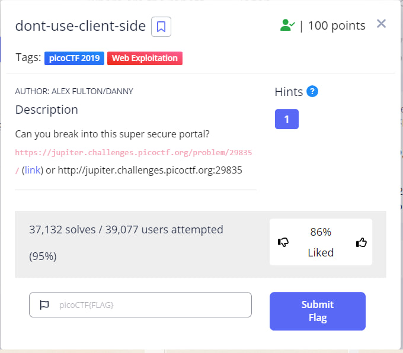
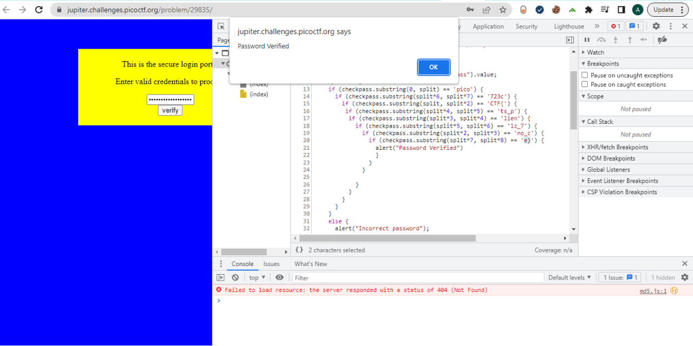

<h1 style="font-size: 48px;">"dont-use-client-side" Challenge README</h1>
<h2 style="font-size: 20px;">Challenge Description</h2>

The "dont-use-client-side" challenge is a web-based challenge that requires the user to break into a secure portal by finding the correct password. 
The web page contains a form that prompts the user to enter a password and click on a button to verify the password.
The password verification logic is implemented in a client-side JavaScript function that runs in the user's browser.

<h2 style="font-size: 20px;">Hint</h2>
never trust the client.

<h2 style="font-size: 20px;">Challenge Goals</h2>
The main goal of this challenge is to demonstrate the dangers of client-side password verification and highlight the importance of server-side password verification. 
The challenge aims to educate users about the risks of relying on client-side verification for secure password handling.

<h2 style="font-size: 20px;">Challenge Instructions</h2>
Open the challenge website in a web browser.
Enter a password and click on the "Verify Password" button.
If the entered password is correct, an alert will be displayed saying "Password Verified".
Challenge Solution
The JavaScript function that verifies the password is flawed and insecure, and can be easily bypassed. 
The function checks the password entered by the user by comparing substrings of the password to hardcoded values. 
An attacker can easily extract these hardcoded values from the JavaScript code using the browser's developer tools and construct the correct password.

The correct password = flag is constructed by concatenating the substrings in the correct order, which are:

"pico"

"CTF{"

"lien"

"ts_p"

"lz_7"

"no_c"

"723c"

"e}"

<h3 style="font-size: 15px;">The flag: picoCTF{no_clients_plz_7723ce}</h3>

And we broke this super secure portal! :smile:
<h2 style="font-size: 20px;">Conclusion</h2>
In real-world scenarios, client-side password verification is a bad practice and should be avoided. 
Passwords should be verified on the server-side using a secure and robust password verification mechanism. 
The "dont-use-client-side" challenge is a valuable learning tool for users to understand the risks and limitations of client-side password verification.
