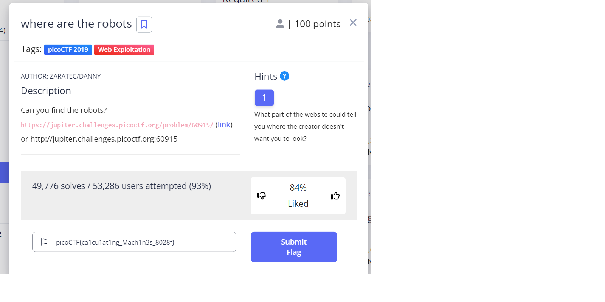
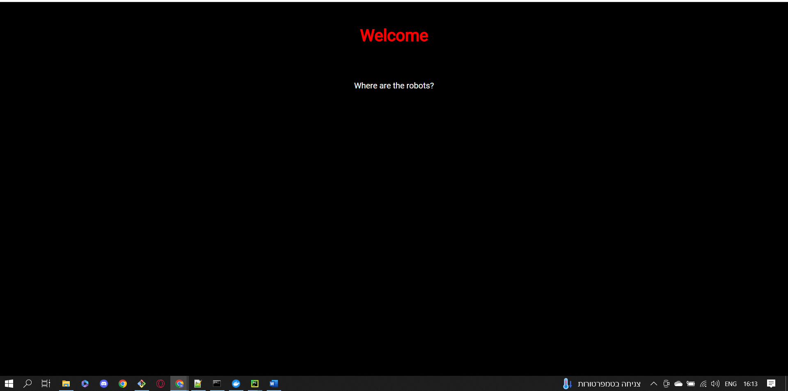
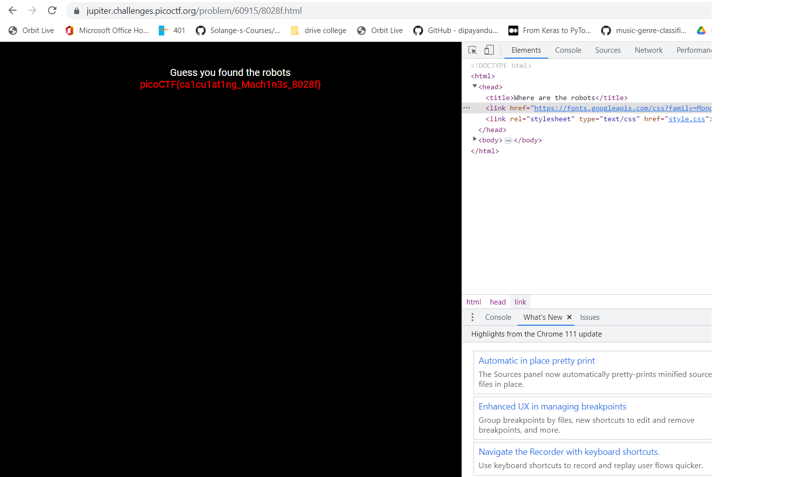

# where are the robots
This is the write-up for the challenge "where the robots" challenge in PicoCTF

# The challenge
Can you find the robots? https://jupiter.challenges.picoctf.org/problem/60915/ (link) or http://jupiter.challenges.picoctf.org:60915

## Hints
1. What part of the website could tell you where the creator doesn't want you to look?

## Initial look
The above link brings you to a basic Html page where it says welocme where are the robots?

I have looked at the hint.

First I started looking for hints in the page source, but I found nothing. 
Then, i looked in sources(html and css) that are in inspect element, but i didnt find anything again. 

I used the hint and the answer is: the creators dont want you to look in the robots.txt file. 
Traditionally search engines like google use webcrawler, they pull everything that is publicly availebale
in the index page. However some things you may not want to be indexed. I appended robots.txt and it showed me 
the following format:
User-agent: * 
Disallow: /8028f.html
  
I appended the /8028f.html to the url and i found the key. 

 
The flag is: 'picoCTF{ca1cu1at1ng_Mach1n3s_8028f}'
