# Who are you?
This is the write-up for the challenge "Who are you?" challenge in PicoCTF

#The challenge
Who are you? https://play.picoctf.org/practice/challenge/142?category=1&page=1 => http://mercury.picoctf.net:52362/
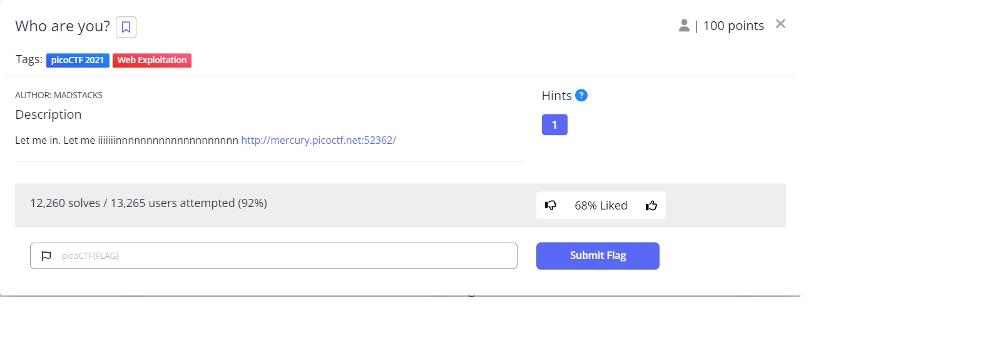

##Hints
1. It ain't much, but it's an RFC https://tools.ietf.org/html/rfc2616

## Initial look
The site entered says only users who use pico browser are allowed on this site.
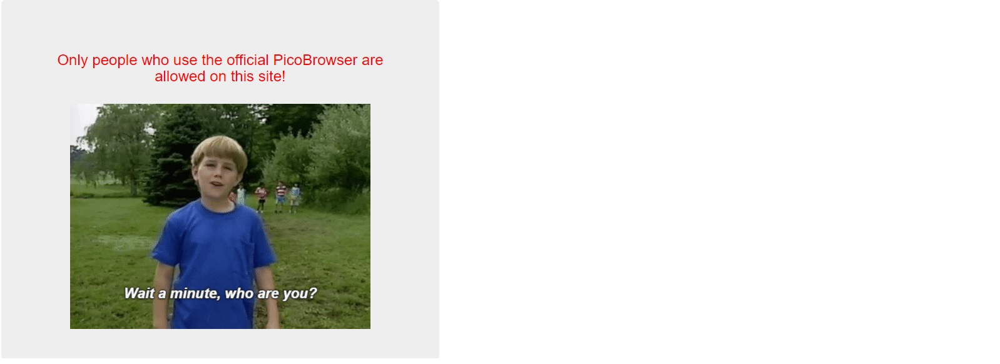

The first thing I did was inspect everything I can in the site (F12), Entered the Network section and looked at the Response tab. 
I found the response in there. 
I also looked in the Headers tab and saw the Headers there. 
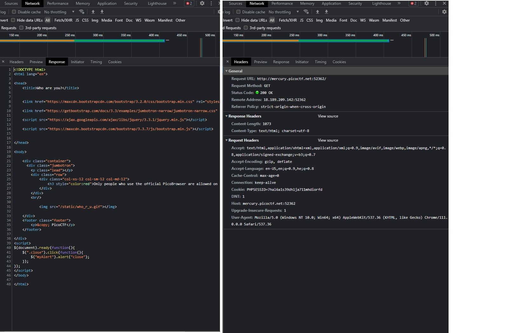

I searched a way to change Headers and found a tool called "Burp Suite", downloaded it and installed on my PC. 
In the app I opened the Proxy tab, turned intercept on, and opened browser. 
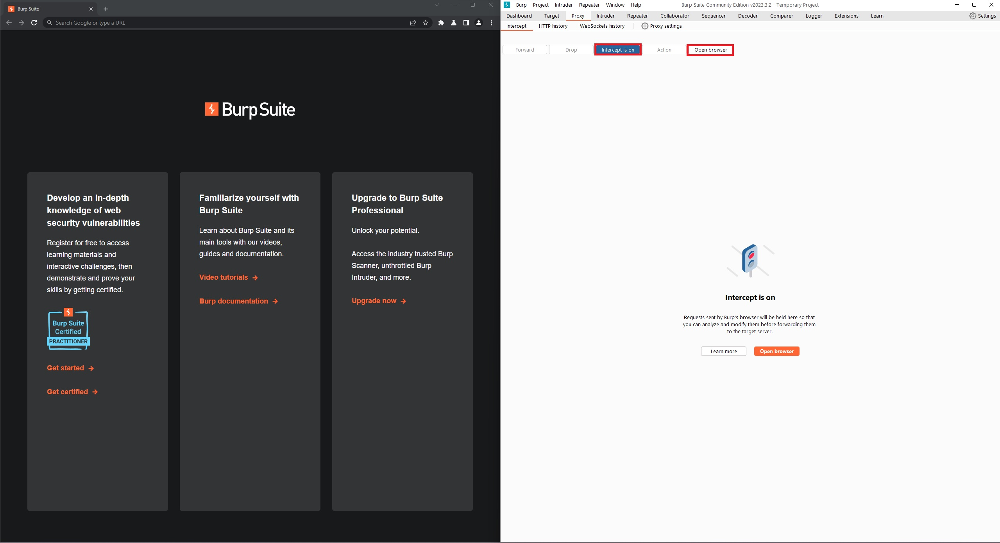

In the browser I opened the challenge link, the site wont fully load because intercept is on. 
went back to Burp Suite, right clicked and sent to repeater. also turned intercept off. 
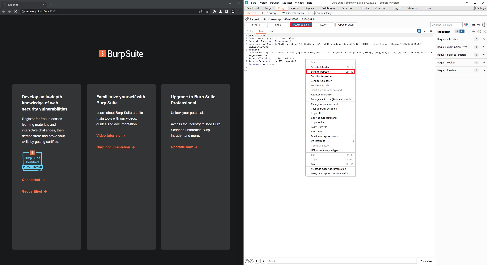

Headed back to the Repeater section and pressed Send to get a response. 
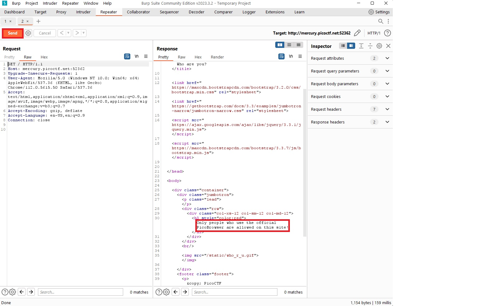

Changed the User-Agent Header to PicoBrowser and pressed Send again. 
Got a different message now - "I don&#39;t trust users visiting from another site.". 
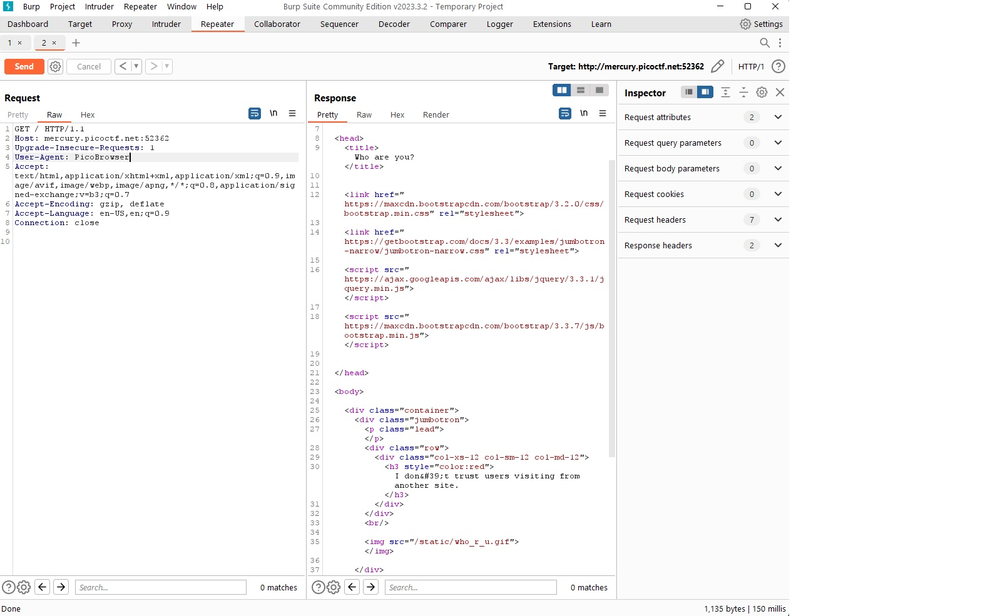

Searched on google and found there is a Header called "Referer", changed it to the same link as the "Host" link. 
Pressed Send and got a different message - "Sorry, this site only worked in 2018.". 
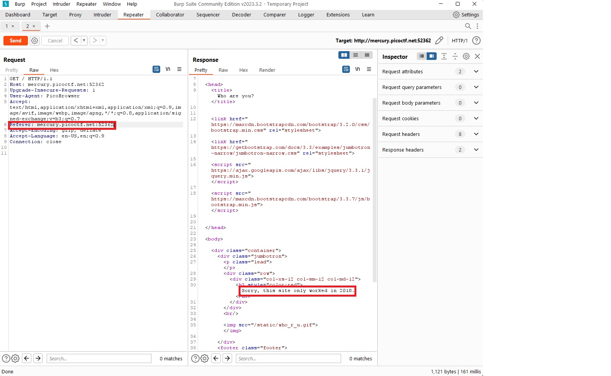

Searched on google how to define date Header. 
The template is like this: Date: <day-name>, <day> <month> <year> <hour>:<minute>:<second> GMT. 
So I added the Header Date: Mon, 1 Jan 2018 01:01:01 GMT. 
Pressed Send and got a new Response - "I don&#39;t trust users who can be tracked.". 
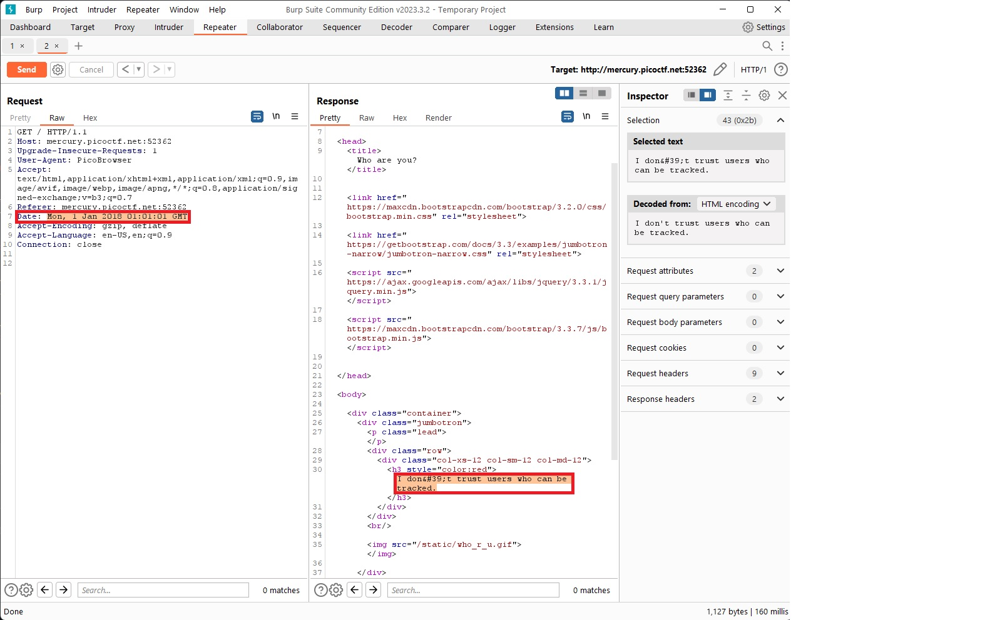  

Searched on google if there is a tracking Header. 
Found there is a Header called DNT which means Do No Track. The options are 0 - allow tacking, 1 - disallow tracking or null. 
So I added the Header and set the value to 1 and pressed Send, got a new Response - "This website is only for people from Sweden.". 
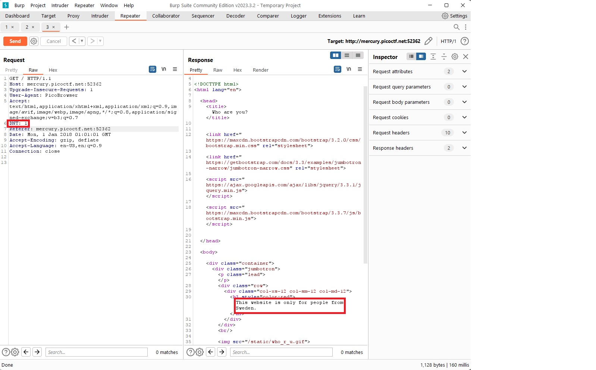  

Searched on google how to change the location. Found there is a Header called X-Forwarded-For. 
Searched for a Swedish IP address. Added The header and the IP and pressed Send, and got a new Response - "You&#39;re in Sweden but you don&#39;t speak Swedish?". 
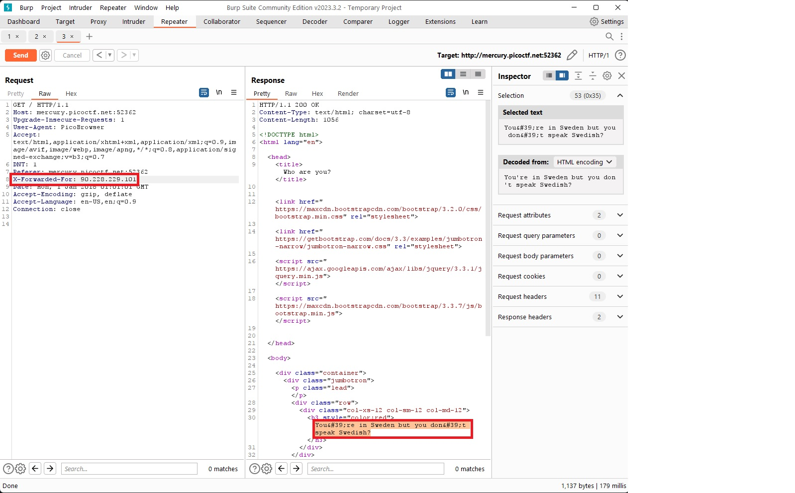
  
Searched on google what is the AcceptLanguage in Sweden, changed it to sv-sv and pressed Send, got a new Response - "What can I say except, you are welcome". 
The site says - "picoCTF{http_h34d3rs_v3ry_c0Ol_much_w0w_0c0db339}". 
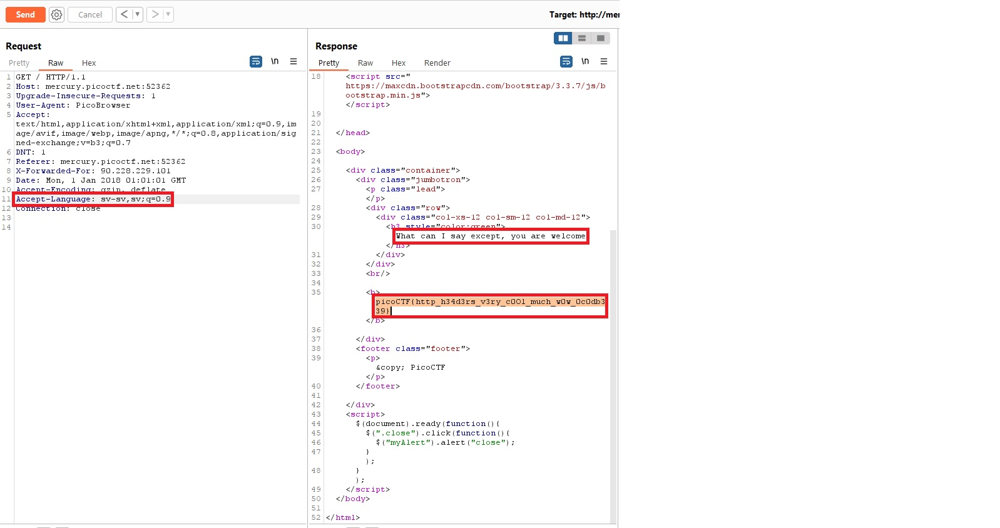

And thats it :)
